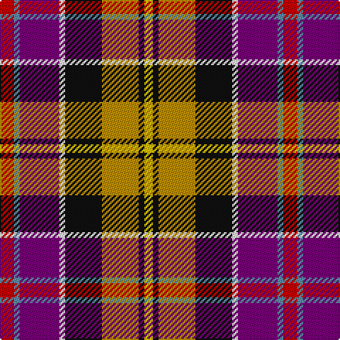

In pattern [RBBWKYKY](/stripes/rbbwkyky/).

This was sourced from register-of-tartans.  It is a [8 stripe tartan](/stripes/stripes8/).

Original link https://www.tartanregister.gov.uk/tartanDetails.aspx?ref=820

## Attestations

This cloth appears in 2 source records; the oldest owns this page.

- 01/01/1746 — Culloden (register-of-tartans, [record](https://www.tartanregister.gov.uk/tartanDetails.aspx?ref=820))
- 1893 — Culloden - 1893 (O&R) (tartans-authority, [record](http://www.tartansauthority.com/tartan-ferret/display/1328/))

## Register references

External register numbers recorded for this tartan.

- Scottish Register of Tartans: [820](https://www.tartanregister.gov.uk/tartanDetails.aspx?ref=820)
- Scottish Tartans Authority (ITI): 1328
- Scottish Tartans World Register: 1328

## Thread count
R/10 B4 P28 W4 K26 DY26 K4 Y/6

## Palette
Each colour and the base-6 reference it is a variant of.

| Colour | Shade | Base |
|---|---|---|
| B | <code style="background-color:#5C8CA8;">#5C8CA8</code> `oklch(61.7% 0.067 235.0)` <small>#5C8CA8</small> | B <code style="background-color:#2A418A;">#2A418A</code> |
| DY | <code style="background-color:#BC8C00;">#BC8C00</code> `oklch(66.8% 0.137 84.1)` <small>#BC8C00</small> | Y <code style="background-color:#F2BF00;">#F2BF00</code> |
| K | <code style="background-color:#101010;">#101010</code> `oklch(17.3% 0.000 89.9)` <small>#101010</small> | K <code style="background-color:#000000;">#000000</code> |
| P | <code style="background-color:#780078;">#780078</code> `oklch(40.2% 0.185 328.4)` <small>#780078</small> | B <code style="background-color:#2A418A;">#2A418A</code> |
| R | <code style="background-color:#C80000;">#C80000</code> `oklch(52.3% 0.215 29.2)` <small>#C80000</small> | R <code style="background-color:#CC0000;">#CC0000</code> |
| W | <code style="background-color:#FCFCFC;">#FCFCFC</code> `oklch(99.1% 0.000 89.9)` <small>#FCFCFC</small> | W <code style="background-color:#F7F7F7;">#F7F7F7</code> |
| Y | <code style="background-color:#E8C000;">#E8C000</code> `oklch(81.9% 0.168 93.7)` <small>#E8C000</small> | Y <code style="background-color:#F2BF00;">#F2BF00</code> |

# Sample pattern

## Nearest tartans

The nearest existing variants by ΔTartan distance, with this tartan at the top so the swatches line up against it.

ΔTartan

Tartan

Sett

—

<a href="/ttd/edit/#slug=r5t2dp14w2k13lo13k2ly3~x2">Culloden</a> <a class="nn-out" href="/setts/s8/r5t2dp14w2k13lo13k2ly3~x2/" title="open its dictionary page">↗</a>

0.69

<a href="/ttd/edit/#slug=r5t2dp14w2k13y13k2ly3~x2">Culloden, Gold</a> <a class="nn-out" href="/setts/s8/r5t2dp14w2k13y13k2ly3~x2/" title="open its dictionary page">↗</a>

0.92

<a href="/ttd/edit/#slug=r24w3ly4dg18dp18y3t4~x2">Walter (Personal)</a> <a class="nn-out" href="/setts/s7/r24w3ly4dg18dp18y3t4~x2/" title="open its dictionary page">↗</a>

0.93

<a href="/ttd/edit/#slug=r24w3ly4dg18p18dy3t4~x2">Walter</a> <a class="nn-out" href="/setts/s7/r24w3ly4dg18p18dy3t4~x2/" title="open its dictionary page">↗</a>

0.94

<a href="/ttd/edit/#slug=r5t2m14w2k13ly13k2ly3~x2">Culloden (Old and Rare) District Tartan Tartan Number: 1328. Earliest known date: 1746 Worn by a member of Prince Charles' staff during the battle but it is not known with which family or district it was first connected. It was first illustrated in Old &amp; Rare in 1893 by D W Stewart whose son D C Stewart was a founder member of the Scottish Tartans Society. Now firmly established as a district tartan. See products available Copyright © Blair Urquhart, Comrie, 2015</a> <a class="nn-out" href="/setts/s8/r5t2m14w2k13ly13k2ly3~x2/" title="open its dictionary page">↗</a>

1.01

<a href="/setts/s12/r24w3ly4dg18dp18y3t4~x2/">Walter (Personal)</a>

1.08

<a href="/ttd/edit/#slug=dt8t1db1t1m12ly6k12w2~x4">Maryland</a> <a class="nn-out" href="/setts/s8/dt8t1db1t1m12ly6k12w2~x4/" title="open its dictionary page">↗</a>

1.15

<a href="/ttd/edit/#slug=k14ly3g18r15w2r3w2p14~x2">Wilson's, No 83</a> <a class="nn-out" href="/setts/s8/k14ly3g18r15w2r3w2p14~x2/" title="open its dictionary page">↗</a>

1.16

<a href="/ttd/edit/#slug=t3p10w3k3g19r14t3k2ly3~x2">Wilson's, No 110</a> <a class="nn-out" href="/setts/s9/t3p10w3k3g19r14t3k2ly3~x2/" title="open its dictionary page">↗</a>

1.17

<a href="/ttd/edit/#slug=db3w2g14r14k2db7k9ly2k2~x2">Black Hills</a> <a class="nn-out" href="/setts/s9/db3w2g14r14k2db7k9ly2k2~x2/" title="open its dictionary page">↗</a>

1.29

<a href="/ttd/edit/#slug=m4dt10m18ly3m3ly5r8dt9w4~x2">Khosla, Sarah and Jatin (Personal)</a> <a class="nn-out" href="/setts/s9/m4dt10m18ly3m3ly5r8dt9w4~x2/" title="open its dictionary page">↗</a>

## Neighbour map

Every grey dot is one of 14299 variants placed by the first two principal components of the ΔTartan feature space (44% of its variance). Red is this tartan; blue dots are its nearest — click one to open its page.

<svg viewBox="0 0 640 380" role="img" style="max-width:100%;height:auto;border:1px solid #e0e0e0;border-radius:4px;display:block" xmlns="http://www.w3.org/2000/svg"><image href="/nn/cloud.v1.png" width="640" height="380"/><a href="/setts/s8/r5t2dp14w2k13y13k2ly3~x2/"><circle cx="35.5" cy="144.5" r="4" fill="#3465a4"><title>Culloden, Gold</title></circle></a><a href="/setts/s7/r24w3ly4dg18dp18y3t4~x2/"><circle cx="94.0" cy="149.9" r="4" fill="#3465a4"><title>Walter (Personal)</title></circle></a><a href="/setts/s7/r24w3ly4dg18p18dy3t4~x2/"><circle cx="95.3" cy="151.1" r="4" fill="#3465a4"><title>Walter</title></circle></a><a href="/setts/s8/r5t2m14w2k13ly13k2ly3~x2/"><circle cx="31.4" cy="137.0" r="4" fill="#3465a4"><title>Culloden (Old and Rare) District Tartan Tartan Number: 1328. Earliest known date: 1746 Worn by a member of Prince Charles' staff during the battle but it is not known with which family or district it was first connected. It was first illustrated in Old &amp; Rare in 1893 by D W Stewart whose son D C Stewart was a founder member of the Scottish Tartans Society. Now firmly established as a district tartan. See products available Copyright © Blair Urquhart, Comrie, 2015</title></circle></a><a href="/setts/s12/r24w3ly4dg18dp18y3t4~x2/"><circle cx="67.3" cy="128.3" r="4" fill="#3465a4"><title>Walter (Personal)</title></circle></a><a href="/setts/s8/dt8t1db1t1m12ly6k12w2~x4/"><circle cx="68.6" cy="125.4" r="4" fill="#3465a4"><title>Maryland</title></circle></a><a href="/setts/s8/k14ly3g18r15w2r3w2p14~x2/"><circle cx="48.5" cy="154.1" r="4" fill="#3465a4"><title>Wilson's, No 83</title></circle></a><a href="/setts/s9/t3p10w3k3g19r14t3k2ly3~x2/"><circle cx="66.6" cy="123.3" r="4" fill="#3465a4"><title>Wilson's, No 110</title></circle></a><a href="/setts/s9/db3w2g14r14k2db7k9ly2k2~x2/"><circle cx="59.6" cy="162.7" r="4" fill="#3465a4"><title>Black Hills</title></circle></a><a href="/setts/s9/m4dt10m18ly3m3ly5r8dt9w4~x2/"><circle cx="62.2" cy="165.9" r="4" fill="#3465a4"><title>Khosla, Sarah and Jatin (Personal)</title></circle></a><circle cx="43.5" cy="144.5" r="5" fill="#c00000"/></svg>

ID: /setts/s8/r5t2dp14w2k13lo13k2ly3~x2/
