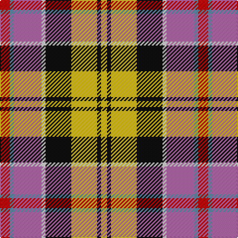

**Bands:** [RBRWKYKY](/stripes/rbrwkyky/) · **Stripes:** [R T M W K LY K LY](/stripes/stripes8/) R T M W K LY K LY

This was sourced from house-of-tartan.  It is a [8 band tartan](/bands/bands8/).

Original link http://www.house-of-tartan.scotland.net/house/TartanViewjs.asp?colr=Def&tnam=1328

## Thread count
R/10 B4 P28 LN4 K26 Y26 K4 Ya/6

## Palette
Each colour and its ΔE from the base-6 reference it is a variant of.

| Colour | Shade | Base | ΔE (OKLab) |
|---|---|---|---|
| B | <code style="background-color:#5C8CA8;">#5C8CA8</code> `#5C8CA8` | B <code style="background-color:#2A418A;">#2A418A</code> | 0.23 |
| K | <code style="background-color:#101010;">#101010</code> `#101010` | K <code style="background-color:#000000;">#000000</code> | 0.17 |
| LN | <code style="background-color:#E0E0E0;">#E0E0E0</code> `#E0E0E0` | W <code style="background-color:#F7F7F7;">#F7F7F7</code> | 0.07 |
| P | <code style="background-color:#B468AC;">#B468AC</code> `#B468AC` | R <code style="background-color:#CC0000;">#CC0000</code> | 0.21 |
| R | <code style="background-color:#C80000;">#C80000</code> `#C80000` | R <code style="background-color:#CC0000;">#CC0000</code> | 0.01 |
| Y | <code style="background-color:#E8C000;">#E8C000</code> `#E8C000` | Y <code style="background-color:#F2BF00;">#F2BF00</code> | 0.02 |
| Ya | <code style="background-color:#E8C000;">#E8C000</code> `#E8C000` | Y <code style="background-color:#F2BF00;">#F2BF00</code> | 0.02 |

# Sample pattern

## Nearest tartans

The nearest existing variants by ΔTartan distance.

1. [Culloden](/setts/s8/r5t2dp14w2k13lo13k2ly3~x2/) — ΔT 0.94
1. [Wilson's, No 110](/setts/s9/ly3k2t3r14g19k3w3p10t3~x2/) — ΔT 1.03
1. [Bruce of Kinnaird](/setts/s10/r24g22k2w6k2ly2k15y6r6w2~x2/) — ΔT 1.17
1. [Young Presidents Organisation Dress](/setts/s8/r6ly15do4db12g12dy4r25w5~x2/) — ΔT 1.19
1. [Barrington Municipality](/setts/s7/ly5lr3db6o8w5r17k2/) — ΔT 1.27
1. [Casey (Personal)](/setts/s7/r5t2p16k13ly13k2w3~x2/) — ΔT 1.28
1. [Unidentified No 14](/setts/s9/r22t6db10ly4r4w4dg22db8ly3/) — ΔT 1.30
1. [Gordon, dress 5](/setts/s13/w6db3w18k5w5dr10o17ly4o17dr10t10dr2t4~x2/) — ΔT 1.33
1. [Wilson's, No 121](/setts/s7/t4p3g1g9w1r8k1~x4/) — ΔT 1.34
1. [Mayo County Crest (Fashion)](/setts/s12/ly9y7db3r28db4y7db5t4db5g7db3w6~x2/) — ΔT 1.35

## Neighbour map

Every grey dot is one of 14313 variants placed by the first two principal components of the ΔTartan feature space (44% of its variance). Red is this tartan; blue dots are its nearest — click one to open its page.

<svg viewBox="0 0 640 380" role="img" style="max-width:100%;height:auto;border:1px solid #e0e0e0;border-radius:4px;display:block" xmlns="http://www.w3.org/2000/svg"><image href="/nn/cloud.v1.png" width="640" height="380"/><a href="/setts/s8/r5t2dp14w2k13lo13k2ly3~x2/"><circle cx="43.5" cy="144.3" r="4" fill="#3465a4"><title>Culloden</title></circle></a><a href="/setts/s9/ly3k2t3r14g19k3w3p10t3~x2/"><circle cx="66.6" cy="123.1" r="4" fill="#3465a4"><title>Wilson's, No 110</title></circle></a><a href="/setts/s10/r24g22k2w6k2ly2k15y6r6w2~x2/"><circle cx="65.2" cy="102.6" r="4" fill="#3465a4"><title>Bruce of Kinnaird</title></circle></a><a href="/setts/s8/r6ly15do4db12g12dy4r25w5~x2/"><circle cx="65.4" cy="156.2" r="4" fill="#3465a4"><title>Young Presidents Organisation Dress</title></circle></a><a href="/setts/s7/ly5lr3db6o8w5r17k2/"><circle cx="72.0" cy="136.4" r="4" fill="#3465a4"><title>Barrington Municipality</title></circle></a><a href="/setts/s7/r5t2p16k13ly13k2w3~x2/"><circle cx="62.7" cy="159.1" r="4" fill="#3465a4"><title>Casey (Personal)</title></circle></a><a href="/setts/s9/r22t6db10ly4r4w4dg22db8ly3/"><circle cx="87.9" cy="161.2" r="4" fill="#3465a4"><title>Unidentified No 14</title></circle></a><a href="/setts/s13/w6db3w18k5w5dr10o17ly4o17dr10t10dr2t4~x2/"><circle cx="29.7" cy="125.7" r="4" fill="#3465a4"><title>Gordon, dress 5</title></circle></a><a href="/setts/s7/t4p3g1g9w1r8k1~x4/"><circle cx="97.5" cy="149.9" r="4" fill="#3465a4"><title>Wilson's, No 121</title></circle></a><a href="/setts/s12/ly9y7db3r28db4y7db5t4db5g7db3w6~x2/"><circle cx="74.1" cy="113.0" r="4" fill="#3465a4"><title>Mayo County Crest (Fashion)</title></circle></a><circle cx="31.5" cy="136.8" r="5" fill="#c00000"/></svg>

ID: /setts/s8/r5t2m14w2k13ly13k2ly3~x2/
