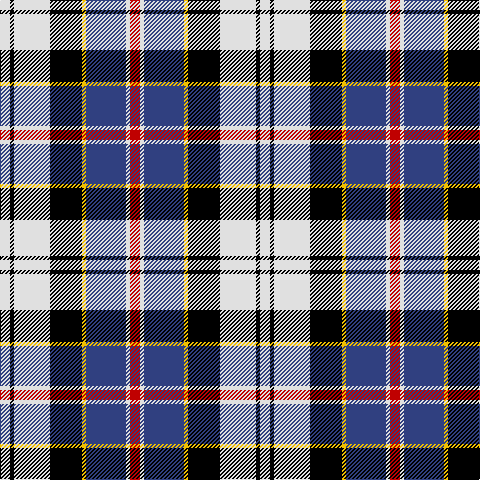

In pattern [RWBYKWKW](/patterns/rwbykwkw/).

This was sourced from weddslist.  It is a [8 stripes tartan](/stripes/stripes8/).

Original link http://www.weddslist.com/cgi-bin/tartans/pg.pl?source=sts

## Thread count
LN/10 K4 LN36 K32 Y4 B40 LN4 R/10

## Palette
Each colour and its ΔE from the base-6 reference it is a variant of.

| Colour | Shade | Base | ΔE (OKLab) |
|---|---|---|---|
| B | <code style="background-color:#304080;">#304080</code> `#304080` | B <code style="background-color:#2A418A;">#2A418A</code> | 0.02 |
| K | <code style="background-color:#000000;">#000000</code> `#000000` | K <code style="background-color:#000000;">#000000</code> | 0.00 |
| LN | <code style="background-color:#E0E0E0;">#E0E0E0</code> `#E0E0E0` | W <code style="background-color:#F7F7F7;">#F7F7F7</code> | 0.07 |
| R | <code style="background-color:#C00000;">#C00000</code> `#C00000` | R <code style="background-color:#CC0000;">#CC0000</code> | 0.03 |
| Y | <code style="background-color:#F0C000;">#F0C000</code> `#F0C000` | Y <code style="background-color:#F2BF00;">#F2BF00</code> | 0.00 |

# Sample pattern

## Nearest tartans

The nearest existing variants by ΔTartan distance.

1. [Ailsa Craig Trade Tartan Tartan Number: 1673. Earliest known date: 1972 Nothing See products available Copyright © Blair Urquhart, Comrie, 2015](/setts/s8/r5w2b20y2k16w18k2w5~b2c2c80-k101010-rc80000-we0e0e0-ye8c000~x2/) — ΔT 0.39
1. [Thom(p)son](/setts/s10/r1k1w2k2w2k1w4k1b9y1~b304080-k000000-rc00000-we0e0e0-yf0c000~x4/) — ΔT 0.76
1. [Davidson, Bride's](/setts/s7/r2b14k6g1w12g1w2~b304080-g008000-k000000-rc00000-we0e0e0~x4/) — ΔT 0.83
1. [Pengelly, The Cornish (Name)](/setts/s7/w5k26y4w24b8k3r4~b780078-k101010-rc80000-wcccccc-ye8c000~x2/) — ΔT 0.87
1. [Andreou Family (Personal)](/setts/s11/r1k2w8k2r1k2b8k2r1k2y1~b2c2c80-k101010-rc80000-we0e0e0-ye8c000~x4/) — ΔT 0.91
1. [Culloden Dress Ancient](/setts/s8/r6b2ba21w3g19w26g3w5~b2c4084-ba5a008c-g002814-rdc0000-we0e0e0~x2/) — ΔT 0.91
1. [MacTavish / Thom(p)son, dress](/setts/s6/r4b28k6w12k12y3~b5480b0-k000000-rc00000-we0e0e0-yf0c000~x2/) — ΔT 0.93
1. [Kile (Red line) (Personal)](/setts/s8/b18w3b3w3r3w3k5y12~b1c0070-k101010-r880000-wfcfcfc-yd8b000~x2/) — ΔT 0.94
1. [Kervegant, Suzanne (Personal)](/setts/s10/g6b11w8k4w8r4w8k27w4r4~b2c2c80-g006818-k101010-rdc0000-wc8c8c8~x2/) — ΔT 0.95
1. [Cameron Erracht, dress](/setts/s11/w2r1w2r2w9k9r1b10r2k2y2~b304080-k000000-rc00000-we0e0e0-yf0c000~x2/) — ΔT 0.95

## Neighbour map

Every grey dot is one of 15726 variants placed by the first two principal components of the ΔTartan feature space (44% of its variance). Red is this tartan; blue dots are its nearest — click one to open its page.

<svg viewBox="0 0 640 380" role="img" style="max-width:100%;height:auto;border:1px solid #e0e0e0;border-radius:4px;display:block" xmlns="http://www.w3.org/2000/svg"><image href="/nn/cloud.v1.png" width="640" height="380"/><a href="/setts/s8/r5w2b20y2k16w18k2w5~b2c2c80-k101010-rc80000-we0e0e0-ye8c000~x2/"><circle cx="118.7" cy="156.9" r="4" fill="#3465a4"><title>Ailsa Craig Trade Tartan Tartan Number: 1673. Earliest known date: 1972 Nothing See products available Copyright © Blair Urquhart, Comrie, 2015</title></circle></a><a href="/setts/s10/r1k1w2k2w2k1w4k1b9y1~b304080-k000000-rc00000-we0e0e0-yf0c000~x4/"><circle cx="129.4" cy="141.2" r="4" fill="#3465a4"><title>Thom(p)son</title></circle></a><a href="/setts/s7/r2b14k6g1w12g1w2~b304080-g008000-k000000-rc00000-we0e0e0~x4/"><circle cx="148.3" cy="144.9" r="4" fill="#3465a4"><title>Davidson, Bride's</title></circle></a><a href="/setts/s7/w5k26y4w24b8k3r4~b780078-k101010-rc80000-wcccccc-ye8c000~x2/"><circle cx="150.0" cy="165.9" r="4" fill="#3465a4"><title>Pengelly, The Cornish (Name)</title></circle></a><a href="/setts/s11/r1k2w8k2r1k2b8k2r1k2y1~b2c2c80-k101010-rc80000-we0e0e0-ye8c000~x4/"><circle cx="101.8" cy="146.4" r="4" fill="#3465a4"><title>Andreou Family (Personal)</title></circle></a><a href="/setts/s8/r6b2ba21w3g19w26g3w5~b2c4084-ba5a008c-g002814-rdc0000-we0e0e0~x2/"><circle cx="149.9" cy="144.5" r="4" fill="#3465a4"><title>Culloden Dress Ancient</title></circle></a><a href="/setts/s6/r4b28k6w12k12y3~b5480b0-k000000-rc00000-we0e0e0-yf0c000~x2/"><circle cx="145.1" cy="181.0" r="4" fill="#3465a4"><title>MacTavish / Thom(p)son, dress</title></circle></a><a href="/setts/s8/b18w3b3w3r3w3k5y12~b1c0070-k101010-r880000-wfcfcfc-yd8b000~x2/"><circle cx="118.4" cy="174.2" r="4" fill="#3465a4"><title>Kile (Red line) (Personal)</title></circle></a><a href="/setts/s10/g6b11w8k4w8r4w8k27w4r4~b2c2c80-g006818-k101010-rdc0000-wc8c8c8~x2/"><circle cx="105.2" cy="170.2" r="4" fill="#3465a4"><title>Kervegant, Suzanne (Personal)</title></circle></a><a href="/setts/s11/w2r1w2r2w9k9r1b10r2k2y2~b304080-k000000-rc00000-we0e0e0-yf0c000~x2/"><circle cx="85.3" cy="135.7" r="4" fill="#3465a4"><title>Cameron Erracht, dress</title></circle></a><circle cx="113.6" cy="156.9" r="5" fill="#c00000"/></svg>

ID: /setts/s8/r5w2b20y2k16w18k2w5~b304080-k000000-rc00000-we0e0e0-yf0c000~x2/
