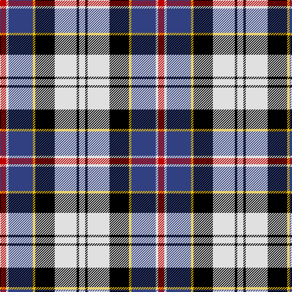

This page is one **sett** — a single exact thread-count. It belongs to the [tartan](/tartans/r5w2db20ly2k16w18k2w5/)
(the same proportion at any scale), whose colour order is pattern [RWBYKWKW](/stripes/rwbykwkw/).

Sourced from weddslist.  It is a [8 stripe tartan](/stripes/stripes8/).

Original link http://www.weddslist.com/cgi-bin/tartans/pg.pl?source=sts

## Also known as

This cloth is also recorded under:

- Ailsa, Craig

2 attestations — the source records this cloth was collapsed from (oldest owns this page)

<ul>
<li>undated — Ailsa, Craig (weddslist, <a href="http://www.weddslist.com/cgi-bin/tartans/pg.pl?source=sts">record</a>)</li>
<li>undated — Ailsa Craig Trade Tartan Tartan Number: 1673. Earliest known date: 1972 Nothing See products available Copyright © Blair Urquhart, Comrie, 2015 (house-of-tartan, <a href="http://www.house-of-tartan.scotland.net/house/TartanViewjs.asp?colr=Def&tnam=1673">record</a>)</li>
</ul>

## Thread count
R/10 LN4 B40 Y4 K32 LN36 K4 LN/10

## Palette

Palette: <strong>Tartan Register</strong> <small style="color:#888">(2 of 5 colours)</small>
<table><thead><tr><th>Colour</th><th>Threads</th><th>Shade</th><th>Base</th><th>OKLCh</th></tr></thead><tbody><tr><td>R/</td><td style="text-align:right;font-variant-numeric:tabular-nums">10</td><td><code style="background-color:#C00000;">#C00000</code> <small style="color:#888">#C00000</small></td><td>R <code style="background-color:#CC0000;">#CC0000</code></td><td><small style="color:#888">oklch(50.7% 0.208 29.2)</small></td></tr><tr><td>LN</td><td style="text-align:right;font-variant-numeric:tabular-nums">4</td><td><code style="background-color:#E0E0E0;">#E0E0E0</code> <small style="color:#888">#E0E0E0</small></td><td>W <code style="background-color:#F7F7F7;">#F7F7F7</code></td><td><small style="color:#888">oklch(90.7% 0.000 89.9)</small></td></tr><tr><td>B</td><td style="text-align:right;font-variant-numeric:tabular-nums">40</td><td><code style="background-color:#304080;">#304080</code> <small style="color:#888">#304080</small></td><td>B <code style="background-color:#2A418A;">#2A418A</code></td><td><small style="color:#888">oklch(39.4% 0.109 270.2)</small></td></tr><tr><td>Y</td><td style="text-align:right;font-variant-numeric:tabular-nums">4</td><td><code style="background-color:#F0C000;">#F0C000</code> <small style="color:#888">#F0C000</small></td><td>Y <code style="background-color:#F2BF00;">#F2BF00</code></td><td><small style="color:#888">oklch(82.7% 0.169 90.5)</small></td></tr><tr><td>K</td><td style="text-align:right;font-variant-numeric:tabular-nums">32</td><td><code style="background-color:#000000;">#000000</code> <small style="color:#888">#000000</small></td><td>K <code style="background-color:#000000;">#000000</code></td><td><small style="color:#888">oklch(0.0% 0.000 0.0)</small></td></tr><tr><td>LN</td><td style="text-align:right;font-variant-numeric:tabular-nums">36</td><td><code style="background-color:#E0E0E0;">#E0E0E0</code> <small style="color:#888">#E0E0E0</small></td><td>W <code style="background-color:#F7F7F7;">#F7F7F7</code></td><td><small style="color:#888">oklch(90.7% 0.000 89.9)</small></td></tr><tr><td>K</td><td style="text-align:right;font-variant-numeric:tabular-nums">4</td><td><code style="background-color:#000000;">#000000</code> <small style="color:#888">#000000</small></td><td>K <code style="background-color:#000000;">#000000</code></td><td><small style="color:#888">oklch(0.0% 0.000 0.0)</small></td></tr><tr><td>LN/</td><td style="text-align:right;font-variant-numeric:tabular-nums">10</td><td><code style="background-color:#E0E0E0;">#E0E0E0</code> <small style="color:#888">#E0E0E0</small></td><td>W <code style="background-color:#F7F7F7;">#F7F7F7</code></td><td><small style="color:#888">oklch(90.7% 0.000 89.9)</small></td></tr></tbody></table>

# Sample pattern

## Nearest tartans

The nearest existing variants by ΔTartan distance, with this tartan at the top so the swatches line up against it.

ΔTartan

Tartan

Sett

—

<a href="/ttd/edit/#slug=r5w2db20ly2k16w18k2w5~x2">Ailsa, Craig</a> <a class="nn-out" href="/setts/s8/r5w2db20ly2k16w18k2w5~x2/" title="open its dictionary page">↗</a>

0.76

<a href="/ttd/edit/#slug=r1k1w2k2w2k1w4k1db9ly1~x4">Thom(p)son</a> <a class="nn-out" href="/setts/s10/r1k1w2k2w2k1w4k1db9ly1~x4/" title="open its dictionary page">↗</a>

0.87

<a href="/ttd/edit/#slug=lb5k26ly4lb24dp8k3r4~x2">Pengelly, The Cornish (Name)</a> <a class="nn-out" href="/setts/s7/lb5k26ly4lb24dp8k3r4~x2/" title="open its dictionary page">↗</a>

0.91

<a href="/ttd/edit/#slug=r1k2w8k2r1k2db8k2r1k2ly1~x4">Andreou Family (Personal)</a> <a class="nn-out" href="/setts/s11/r1k2w8k2r1k2db8k2r1k2ly1~x4/" title="open its dictionary page">↗</a>

0.91

<a href="/ttd/edit/#slug=r6db2dp21w3dg19w26dg3w5~x2">Culloden Dress Ancient</a> <a class="nn-out" href="/setts/s8/r6db2dp21w3dg19w26dg3w5~x2/" title="open its dictionary page">↗</a>

0.93

<a href="/ttd/edit/#slug=r4t28k6w12k12ly3~x2">MacTavish / Thom(p)son, dress</a> <a class="nn-out" href="/setts/s6/r4t28k6w12k12ly3~x2/" title="open its dictionary page">↗</a>

0.94

<a href="/ttd/edit/#slug=db18w3db3w3r3w3k5ly12~x2">Kile (Red line) (Personal)</a> <a class="nn-out" href="/setts/s8/db18w3db3w3r3w3k5ly12~x2/" title="open its dictionary page">↗</a>

0.95

<a href="/ttd/edit/#slug=g6db11lb8k4lb8r4lb8k27lb4r4~x2">Kervegant, Suzanne (Personal)</a> <a class="nn-out" href="/setts/s10/g6db11lb8k4lb8r4lb8k27lb4r4~x2/" title="open its dictionary page">↗</a>

0.98

<a href="/ttd/edit/#slug=dg4db22dt6w10db3w6dp4dt3w4~x2">Sibbald Blue (2014)</a> <a class="nn-out" href="/setts/s9/dg4db22dt6w10db3w6dp4dt3w4~x2/" title="open its dictionary page">↗</a>

1.00

<a href="/ttd/edit/#slug=db10k2g2r2g2k2w2k2w4k1w2~x4">Highfield Dress (Name)</a> <a class="nn-out" href="/setts/s11/db10k2g2r2g2k2w2k2w4k1w2~x4/" title="open its dictionary page">↗</a>

1.03

<a href="/ttd/edit/#slug=r1k1lb2k2lb2k1lb4k1db9lo1~x4">Thompson Variant</a> <a class="nn-out" href="/setts/s10/r1k1lb2k2lb2k1lb4k1db9lo1~x4/" title="open its dictionary page">↗</a>

## Neighbour map

Every grey dot is one of 14299 variants placed by the first two principal components of the ΔTartan feature space (44% of its variance). Red is this tartan; blue dots are its nearest — click one to open its page.

<svg viewBox="0 0 640 380" role="img" style="max-width:100%;height:auto;border:1px solid #e0e0e0;border-radius:4px;display:block" xmlns="http://www.w3.org/2000/svg"><image href="/nn/cloud.v1.png" width="640" height="380"/><a href="/setts/s10/r1k1w2k2w2k1w4k1db9ly1~x4/"><circle cx="132.8" cy="138.8" r="4" fill="#3465a4"><title>Thom(p)son</title></circle></a><a href="/setts/s7/lb5k26ly4lb24dp8k3r4~x2/"><circle cx="152.6" cy="162.2" r="4" fill="#3465a4"><title>Pengelly, The Cornish (Name)</title></circle></a><a href="/setts/s11/r1k2w8k2r1k2db8k2r1k2ly1~x4/"><circle cx="105.0" cy="145.0" r="4" fill="#3465a4"><title>Andreou Family (Personal)</title></circle></a><a href="/setts/s8/r6db2dp21w3dg19w26dg3w5~x2/"><circle cx="152.5" cy="141.5" r="4" fill="#3465a4"><title>Culloden Dress Ancient</title></circle></a><a href="/setts/s6/r4t28k6w12k12ly3~x2/"><circle cx="148.3" cy="177.9" r="4" fill="#3465a4"><title>MacTavish / Thom(p)son, dress</title></circle></a><a href="/setts/s8/db18w3db3w3r3w3k5ly12~x2/"><circle cx="121.5" cy="171.2" r="4" fill="#3465a4"><title>Kile (Red line) (Personal)</title></circle></a><a href="/setts/s10/g6db11lb8k4lb8r4lb8k27lb4r4~x2/"><circle cx="108.2" cy="168.6" r="4" fill="#3465a4"><title>Kervegant, Suzanne (Personal)</title></circle></a><a href="/setts/s9/dg4db22dt6w10db3w6dp4dt3w4~x2/"><circle cx="123.4" cy="164.9" r="4" fill="#3465a4"><title>Sibbald Blue (2014)</title></circle></a><a href="/setts/s11/db10k2g2r2g2k2w2k2w4k1w2~x4/"><circle cx="93.7" cy="148.1" r="4" fill="#3465a4"><title>Highfield Dress (Name)</title></circle></a><a href="/setts/s10/r1k1lb2k2lb2k1lb4k1db9lo1~x4/"><circle cx="149.3" cy="146.8" r="4" fill="#3465a4"><title>Thompson Variant</title></circle></a><circle cx="116.9" cy="154.0" r="5" fill="#c00000"/></svg>

ID: /setts/s8/r5w2db20ly2k16w18k2w5~x2/
