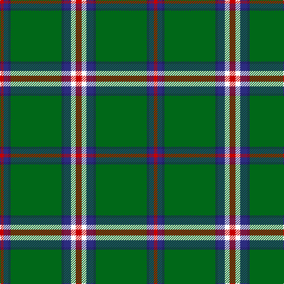

In pattern [RBBGBBWR](/patterns/rbbgbbwr/).

This was sourced from tartans-authority.  It is a [8 stripes tartan](/stripes/stripes8/).

Original link http://www.tartansauthority.com/tartan-ferret/display/10863/

## Thread count
R/6 DB8 DBa4 G86 DBa4 DB12 W8 R/10

## Palette
Each colour and its ΔE from the base-6 reference it is a variant of.

| Colour | Shade | Base | ΔE (OKLab) |
|---|---|---|---|
| DB | <code style="background-color:#2C2C80;">#2C2C80</code> `#2C2C80` | B <code style="background-color:#2A418A;">#2A418A</code> | 0.06 |
| DBa | <code style="background-color:#202060;">#202060</code> `#202060` | B <code style="background-color:#2A418A;">#2A418A</code> | 0.11 |
| G | <code style="background-color:#006818;">#006818</code> `#006818` | G <code style="background-color:#006100;">#006100</code> | 0.02 |
| R | <code style="background-color:#C80000;">#C80000</code> `#C80000` | R <code style="background-color:#CC0000;">#CC0000</code> | 0.01 |
| W | <code style="background-color:#FCFCFC;">#FCFCFC</code> `#FCFCFC` | W <code style="background-color:#F7F7F7;">#F7F7F7</code> | 0.01 |

# Sample pattern

## Nearest tartans

The nearest existing variants by ΔTartan distance.

1. [Hall (P.I.E.) (Personal)](/setts/s8/y5g3y3g53r7b5r13w4~b2c2c80-g006818-r901c38-wf8f8f8-ye8c000~x2/) — ΔT 0.77
1. [Bundanoon (District)](/setts/s9/b17r3g55b3g4b3g4y3w5~b2c2c80-g006818-rc80000-wfcfcfc-ye8c000~x2/) — ΔT 0.78
1. [Scotts Valley](/setts/s9/g20r1y1r1w1g1r1w1b5~b00008c-g004c00-r8c0000-wc8c8c8-yc89800~x4/) — ΔT 0.90
1. [Mullikin (2013)](/setts/s8/r5w4y6b2g43b2y4r3~b000080-g003820-rc80000-wffffff-y48a4c0~x2/) — ΔT 0.98
1. [Selvon-Bruce (Personal)](/setts/s7/k3g2k3g18r2b2y1~b1c1c50-g288028-k101010-r880000-ybc8c00~x4/) — ΔT 1.06
1. [Canadian Caledonian District Tartan Tartan Number: 203. Earliest known date: 1939 MacKinlay strip. Designers Hastie-Cochrane and George MacBeth of Vancouver. See products available Copyright © Blair Urquhart, Comrie, 2015](/setts/s10/b3g16y1r1w1r6g3r1g3w1~b2c2c80-g006818-rc80000-we0e0e0-ye8c000~x2/) — ΔT 1.17
1. [Cavalier, Blue](/setts/s11/g40b10r2b2w2b3ga8g6b2g4w2~b1c1c1c-g789484-ga5c6428-ra07c58-we0e0e0~x2/) — ΔT 1.18
1. [Savoy](/setts/s13/g16k8g1k1w1g1w1y1g1k1r1g4k1~g408060-k101010-r888888-wc0c0c0-yd09800~x4/) — ΔT 1.18
1. [Canadian Caledonian](/setts/s10/b3g16y1r1w1r6g3r1g3w1~b2c2c80-g006818-rc80000-wfcfcfc-ye8c000~x4/) — ΔT 1.18
1. [Military Medical Memorial (USA)](/setts/s6/b6w3r3g55k10r3~b292e7f-g016819-k101010-rec1a1b-wffffff~x4/) — ΔT 1.20

## Neighbour map

Every grey dot is one of 15726 variants placed by the first two principal components of the ΔTartan feature space (44% of its variance). Red is this tartan; blue dots are its nearest — click one to open its page.

<svg viewBox="0 0 640 380" role="img" style="max-width:100%;height:auto;border:1px solid #e0e0e0;border-radius:4px;display:block" xmlns="http://www.w3.org/2000/svg"><image href="/nn/cloud.v1.png" width="640" height="380"/><a href="/setts/s8/y5g3y3g53r7b5r13w4~b2c2c80-g006818-r901c38-wf8f8f8-ye8c000~x2/"><circle cx="343.3" cy="131.8" r="4" fill="#3465a4"><title>Hall (P.I.E.) (Personal)</title></circle></a><a href="/setts/s9/b17r3g55b3g4b3g4y3w5~b2c2c80-g006818-rc80000-wfcfcfc-ye8c000~x2/"><circle cx="383.3" cy="127.7" r="4" fill="#3465a4"><title>Bundanoon (District)</title></circle></a><a href="/setts/s9/g20r1y1r1w1g1r1w1b5~b00008c-g004c00-r8c0000-wc8c8c8-yc89800~x4/"><circle cx="400.5" cy="122.0" r="4" fill="#3465a4"><title>Scotts Valley</title></circle></a><a href="/setts/s8/r5w4y6b2g43b2y4r3~b000080-g003820-rc80000-wffffff-y48a4c0~x2/"><circle cx="351.8" cy="116.9" r="4" fill="#3465a4"><title>Mullikin (2013)</title></circle></a><a href="/setts/s7/k3g2k3g18r2b2y1~b1c1c50-g288028-k101010-r880000-ybc8c00~x4/"><circle cx="377.0" cy="154.2" r="4" fill="#3465a4"><title>Selvon-Bruce (Personal)</title></circle></a><a href="/setts/s10/b3g16y1r1w1r6g3r1g3w1~b2c2c80-g006818-rc80000-we0e0e0-ye8c000~x2/"><circle cx="339.3" cy="133.9" r="4" fill="#3465a4"><title>Canadian Caledonian District Tartan Tartan Number: 203. Earliest known date: 1939 MacKinlay strip. Designers Hastie-Cochrane and George MacBeth of Vancouver. See products available Copyright © Blair Urquhart, Comrie, 2015</title></circle></a><a href="/setts/s11/g40b10r2b2w2b3ga8g6b2g4w2~b1c1c1c-g789484-ga5c6428-ra07c58-we0e0e0~x2/"><circle cx="359.6" cy="109.9" r="4" fill="#3465a4"><title>Cavalier, Blue</title></circle></a><a href="/setts/s13/g16k8g1k1w1g1w1y1g1k1r1g4k1~g408060-k101010-r888888-wc0c0c0-yd09800~x4/"><circle cx="341.5" cy="114.1" r="4" fill="#3465a4"><title>Savoy</title></circle></a><a href="/setts/s10/b3g16y1r1w1r6g3r1g3w1~b2c2c80-g006818-rc80000-wfcfcfc-ye8c000~x4/"><circle cx="332.6" cy="131.1" r="4" fill="#3465a4"><title>Canadian Caledonian</title></circle></a><a href="/setts/s6/b6w3r3g55k10r3~b292e7f-g016819-k101010-rec1a1b-wffffff~x4/"><circle cx="409.2" cy="151.2" r="4" fill="#3465a4"><title>Military Medical Memorial (USA)</title></circle></a><circle cx="365.0" cy="121.7" r="5" fill="#c00000"/></svg>

ID: /setts/s8/r5w4b6ba2g43ba2b4r3~b2c2c80-ba202060-g006818-rc80000-wfcfcfc~x2/
