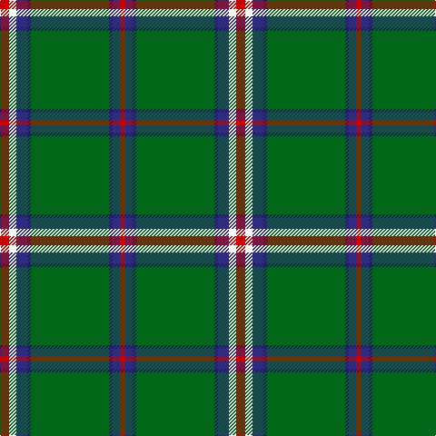

In pattern [RBBGBBWR](/stripes/rbbgbbwr/).

This was sourced from tartans-authority.  It is a [8 stripe tartan](/stripes/stripes8/).

Original link http://www.tartansauthority.com/tartan-ferret/display/10863/

## Thread count
R/10 W8 DB12 DBa4 G86 DBa4 DB8 R/6

## Palette
Each colour and the base-6 reference it is a variant of.

| Colour | Shade | Base |
|---|---|---|
| DB | <code style="background-color:#2C2C80;">#2C2C80</code> `oklch(35.0% 0.138 276.6)` <small>#2C2C80</small> | B <code style="background-color:#2A418A;">#2A418A</code> |
| DBa | <code style="background-color:#202060;">#202060</code> `oklch(28.9% 0.111 276.9)` <small>#202060</small> | B <code style="background-color:#2A418A;">#2A418A</code> |
| G | <code style="background-color:#006818;">#006818</code> `oklch(45.0% 0.142 145.0)` <small>#006818</small> | G <code style="background-color:#006100;">#006100</code> |
| R | <code style="background-color:#C80000;">#C80000</code> `oklch(52.3% 0.215 29.2)` <small>#C80000</small> | R <code style="background-color:#CC0000;">#CC0000</code> |
| W | <code style="background-color:#FCFCFC;">#FCFCFC</code> `oklch(99.1% 0.000 89.9)` <small>#FCFCFC</small> | W <code style="background-color:#F7F7F7;">#F7F7F7</code> |

# Sample pattern

## Nearest tartans

The nearest existing variants by ΔTartan distance.

1. [Hall (P.I.E.) (Personal)](/setts/s8/ly5g3ly3g53r7db5r13w4~x2/) — ΔT 0.77
1. [Bundanoon (District)](/setts/s9/db17r3g55db3g4db3g4ly3w5~x2/) — ΔT 0.78
1. [Scotts Valley](/setts/s9/dg20r1ly1r1lb1dg1r1lb1db5~x4/) — ΔT 0.90
1. [Mullikin (2013)](/setts/s8/r5w4lg6db2dg43db2lg4r3~x2/) — ΔT 0.98
1. [Selvon-Bruce (Personal)](/setts/s7/k3g2k3g18r2db2lo1~x4/) — ΔT 1.06
1. [Savoy](/setts/s13/g16k8g1k1lb1g1lb1lo1g1k1o1g4k1~x4/) — ΔT 1.17
1. [Cavalier, Blue](/setts/s11/y40dt10o2dt2w2dt3y8y6dt2y4w2~x2/) — ΔT 1.18
1. [Canadian Caledonian](/setts/s10/db3g16ly1r1w1r6g3r1g3w1~x4/) — ΔT 1.18
1. [Military Medical Memorial (USA)](/setts/s6/db6w3r3g55k10r3~x4/) — ΔT 1.20
1. [Seattle (District)](/setts/s10/g4lb1db2r1g1r1db2lb1g14lo1~x4/) — ΔT 1.20

## Neighbour map

Every grey dot is one of 14299 variants placed by the first two principal components of the ΔTartan feature space (44% of its variance). Red is this tartan; blue dots are its nearest — click one to open its page.

<svg viewBox="0 0 640 380" role="img" style="max-width:100%;height:auto;border:1px solid #e0e0e0;border-radius:4px;display:block" xmlns="http://www.w3.org/2000/svg"><image href="/nn/cloud.v1.png" width="640" height="380"/><a href="/setts/s8/ly5g3ly3g53r7db5r13w4~x2/"><circle cx="345.3" cy="131.6" r="4" fill="#3465a4"><title>Hall (P.I.E.) (Personal)</title></circle></a><a href="/setts/s9/db17r3g55db3g4db3g4ly3w5~x2/"><circle cx="386.0" cy="127.9" r="4" fill="#3465a4"><title>Bundanoon (District)</title></circle></a><a href="/setts/s9/dg20r1ly1r1lb1dg1r1lb1db5~x4/"><circle cx="403.1" cy="122.9" r="4" fill="#3465a4"><title>Scotts Valley</title></circle></a><a href="/setts/s8/r5w4lg6db2dg43db2lg4r3~x2/"><circle cx="354.5" cy="115.3" r="4" fill="#3465a4"><title>Mullikin (2013)</title></circle></a><a href="/setts/s7/k3g2k3g18r2db2lo1~x4/"><circle cx="379.4" cy="154.9" r="4" fill="#3465a4"><title>Selvon-Bruce (Personal)</title></circle></a><a href="/setts/s13/g16k8g1k1lb1g1lb1lo1g1k1o1g4k1~x4/"><circle cx="344.3" cy="114.5" r="4" fill="#3465a4"><title>Savoy</title></circle></a><a href="/setts/s11/y40dt10o2dt2w2dt3y8y6dt2y4w2~x2/"><circle cx="361.6" cy="110.4" r="4" fill="#3465a4"><title>Cavalier, Blue</title></circle></a><a href="/setts/s10/db3g16ly1r1w1r6g3r1g3w1~x4/"><circle cx="334.4" cy="130.3" r="4" fill="#3465a4"><title>Canadian Caledonian</title></circle></a><a href="/setts/s6/db6w3r3g55k10r3~x4/"><circle cx="411.5" cy="150.2" r="4" fill="#3465a4"><title>Military Medical Memorial (USA)</title></circle></a><a href="/setts/s10/g4lb1db2r1g1r1db2lb1g14lo1~x4/"><circle cx="383.1" cy="139.3" r="4" fill="#3465a4"><title>Seattle (District)</title></circle></a><circle cx="367.4" cy="121.8" r="5" fill="#c00000"/></svg>

ID: /setts/s8/r5w4db6db2g43db2db4r3~x2/
