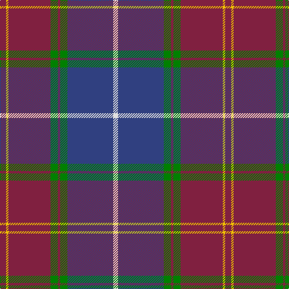

In pattern [RYRGRGBW](/patterns/ryrgrgbw/).

This was sourced from weddslist.  It is a [8 stripes tartan](/stripes/stripes8/).

Original link http://www.weddslist.com/cgi-bin/tartans/pg.pl?source=sts

## Thread count
DR/10 Y4 DR70 G12 DR4 G12 B76 LN/8

## Palette
Each colour and its ΔE from the base-6 reference it is a variant of.

| Colour | Shade | Base | ΔE (OKLab) |
|---|---|---|---|
| B | <code style="background-color:#304080;">#304080</code> `#304080` | B <code style="background-color:#2A418A;">#2A418A</code> | 0.02 |
| DR | <code style="background-color:#802040;">#802040</code> `#802040` | R <code style="background-color:#CC0000;">#CC0000</code> | 0.17 |
| G | <code style="background-color:#008000;">#008000</code> `#008000` | G <code style="background-color:#006100;">#006100</code> | 0.10 |
| LN | <code style="background-color:#E0E0E0;">#E0E0E0</code> `#E0E0E0` | W <code style="background-color:#F7F7F7;">#F7F7F7</code> | 0.07 |
| Y | <code style="background-color:#F0C000;">#F0C000</code> `#F0C000` | Y <code style="background-color:#F2BF00;">#F2BF00</code> | 0.00 |

# Sample pattern

## Nearest tartans

The nearest existing variants by ΔTartan distance.

1. [21st Century (Fashion)](/setts/s8/w4b38g6r2g6r38y2r3~b003c64-g006818-r880000-we0e0e0-ybc8c00~x2/) — ΔT 0.85
1. [Singh](/setts/s8/b3r3b34g18y2g18w2r3~b6c0070-g006818-r880000-wc0c0c0-yd09800~x2/) — ΔT 0.93
1. [Murdoch](/setts/s6/k2r1b17r17ba1y2~b304080-ba102040-k000000-r802040-yf0c000~x4/) — ΔT 0.98
1. [MacCord (Personal)](/setts/s7/g6r2b1r3b16ba20w2~b202060-ba506878-g285800-rc80000-we0e0e0~x2/) — ΔT 1.06
1. [St. Margaret Youth Group (Corporate)](/setts/s8/r30b5r3b33g8k3b8w2~b202060-g006818-k101010-r901c38-we0e0e0~x2/) — ΔT 1.12
1. [Scotland 2000 Commemorative Tartan Tartan Number: 2514. Earliest known date: 1999 Strathmore Woollen Mills Millenium tartan designed by Arthur Mackie of Strathmore Woollen Co., Forfar See products available Copyright © Blair Urquhart, Comrie, 2015](/setts/s8/w4b30g6r2g6r28y2r3~b2888c4-g006818-r901c38-we0e0e0-ye8c000~x2/) — ΔT 1.14
1. [Scotland 2000 (Commemorative)](/setts/s8/w4b38g6ba2g6ba36y2ba3~b003c64-ba4c0000-g006818-wc0c0c0-yd09800~x2/) — ΔT 1.14
1. [Broz Sanz Elementary School](/setts/s12/b20r2ba4w2ba4r2ba4k1ba1k1ba1k4~b5c5c5c-ba2c2c80-k101010-rc80000-wc0c0c0~x4/) — ΔT 1.15
1. [Ormiston (Personal)](/setts/s9/g26b3r3b20r3b3r30w3k2~b2c4084-g005020-k101010-r960000-wc0c0c0~x2/) — ΔT 1.17
1. [Scotland 2000](/setts/s8/w4b38g6ba2g6ba36y2ba3~b003c64-ba4c0000-g006818-wffffff-yd09800~x2/) — ΔT 1.17

## Neighbour map

Every grey dot is one of 15726 variants placed by the first two principal components of the ΔTartan feature space (44% of its variance). Red is this tartan; blue dots are its nearest — click one to open its page.

<svg viewBox="0 0 640 380" role="img" style="max-width:100%;height:auto;border:1px solid #e0e0e0;border-radius:4px;display:block" xmlns="http://www.w3.org/2000/svg"><image href="/nn/cloud.v1.png" width="640" height="380"/><a href="/setts/s8/w4b38g6r2g6r38y2r3~b003c64-g006818-r880000-we0e0e0-ybc8c00~x2/"><circle cx="290.1" cy="142.1" r="4" fill="#3465a4"><title>21st Century (Fashion)</title></circle></a><a href="/setts/s8/b3r3b34g18y2g18w2r3~b6c0070-g006818-r880000-wc0c0c0-yd09800~x2/"><circle cx="286.5" cy="152.7" r="4" fill="#3465a4"><title>Singh</title></circle></a><a href="/setts/s6/k2r1b17r17ba1y2~b304080-ba102040-k000000-r802040-yf0c000~x4/"><circle cx="312.8" cy="168.5" r="4" fill="#3465a4"><title>Murdoch</title></circle></a><a href="/setts/s7/g6r2b1r3b16ba20w2~b202060-ba506878-g285800-rc80000-we0e0e0~x2/"><circle cx="245.7" cy="160.0" r="4" fill="#3465a4"><title>MacCord (Personal)</title></circle></a><a href="/setts/s8/r30b5r3b33g8k3b8w2~b202060-g006818-k101010-r901c38-we0e0e0~x2/"><circle cx="320.1" cy="166.4" r="4" fill="#3465a4"><title>St. Margaret Youth Group (Corporate)</title></circle></a><a href="/setts/s8/w4b30g6r2g6r28y2r3~b2888c4-g006818-r901c38-we0e0e0-ye8c000~x2/"><circle cx="236.3" cy="145.6" r="4" fill="#3465a4"><title>Scotland 2000 Commemorative Tartan Tartan Number: 2514. Earliest known date: 1999 Strathmore Woollen Mills Millenium tartan designed by Arthur Mackie of Strathmore Woollen Co., Forfar See products available Copyright © Blair Urquhart, Comrie, 2015</title></circle></a><a href="/setts/s8/w4b38g6ba2g6ba36y2ba3~b003c64-ba4c0000-g006818-wc0c0c0-yd09800~x2/"><circle cx="290.7" cy="151.7" r="4" fill="#3465a4"><title>Scotland 2000 (Commemorative)</title></circle></a><a href="/setts/s12/b20r2ba4w2ba4r2ba4k1ba1k1ba1k4~b5c5c5c-ba2c2c80-k101010-rc80000-wc0c0c0~x4/"><circle cx="277.7" cy="120.5" r="4" fill="#3465a4"><title>Broz Sanz Elementary School</title></circle></a><a href="/setts/s9/g26b3r3b20r3b3r30w3k2~b2c4084-g005020-k101010-r960000-wc0c0c0~x2/"><circle cx="252.6" cy="158.6" r="4" fill="#3465a4"><title>Ormiston (Personal)</title></circle></a><a href="/setts/s8/w4b38g6ba2g6ba36y2ba3~b003c64-ba4c0000-g006818-wffffff-yd09800~x2/"><circle cx="272.1" cy="144.1" r="4" fill="#3465a4"><title>Scotland 2000</title></circle></a><circle cx="285.6" cy="144.5" r="5" fill="#c00000"/></svg>

ID: /setts/s8/r5y2r35g6r2g6b38w4~b304080-g008000-r802040-we0e0e0-yf0c000~x2/
