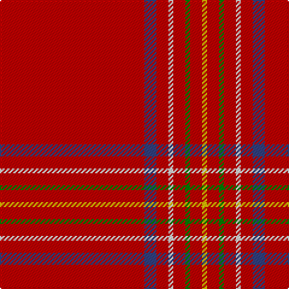

In pattern [RBRWRGRY](/patterns/rbrwrgry/).

This was sourced from weddslist.  It is a [8 stripes tartan](/stripes/stripes8/).

Original link http://www.weddslist.com/cgi-bin/tartans/pg.pl?source=sts

## Thread count
R/120 B10 R10 LN4 R10 G4 R10 Y/4

## Palette
Each colour and its ΔE from the base-6 reference it is a variant of.

| Colour | Shade | Base | ΔE (OKLab) |
|---|---|---|---|
| B | <code style="background-color:#304080;">#304080</code> `#304080` | B <code style="background-color:#2A418A;">#2A418A</code> | 0.02 |
| G | <code style="background-color:#008000;">#008000</code> `#008000` | G <code style="background-color:#006100;">#006100</code> | 0.10 |
| LN | <code style="background-color:#E0E0E0;">#E0E0E0</code> `#E0E0E0` | W <code style="background-color:#F7F7F7;">#F7F7F7</code> | 0.07 |
| R | <code style="background-color:#C00000;">#C00000</code> `#C00000` | R <code style="background-color:#CC0000;">#CC0000</code> | 0.03 |
| Y | <code style="background-color:#F0C000;">#F0C000</code> `#F0C000` | Y <code style="background-color:#F2BF00;">#F2BF00</code> | 0.00 |

# Sample pattern

## Nearest tartans

The nearest existing variants by ΔTartan distance.

1. [Burnett of Leys Family Tartan Tartan Number: 1430. Earliest known date: 1938 Mentioned in the Public Register of All Arms and Bearings in Scotland but not defined. See products available Copyright © Blair Urquhart, Comrie, 2015](/setts/s8/r60b5r5w2r5g2r5y2x2~b2c2c80-g006818-rc80000-we0e0e0-ye8c000/) — ΔT 0.24
1. [Burnett of Leys (Clan)](/setts/s8/r75b6r6w2r6g2r6y2x2~b2c2c80-g006818-rc80000-wf8f8f8-yd09800/) — ΔT 0.49
1. [Burnett of Leys](/setts/s8/r92b10r8w3r8g4r8y3x2~b2c2c80-g006818-rc80000-wf8f8f8-yd09800/) — ΔT 0.51
1. [Taplin (Name)](/setts/s11/r52k2r5g3r5k5r5y3r5k2r52x2~g006818-k101010-rc80000-yfccc00/) — ΔT 1.30
1. [Taplin](/setts/s11/r52k2r5g3r5k5r5y3r5k2r52x2~g005020-k101010-rdc0000-ye8c000/) — ΔT 1.45
1. [Gudbrandsdalen, Rondastakken](/setts/s8/r65w2r3ra4g11r3g3r11x2~g006818-rc80000-ra880000-wfcfcfc/) — ΔT 1.53
1. [Gudbrandsdalen, Rondastakken](/setts/s8/r65w2r3ra4g11r3g3r11~g003000-rc00000-ra800000-we0e0e0/) — ΔT 1.59
1. [O'Malley (Name?)](/setts/s11/r45k3y4k3r45k1b2k1r2g8r2x2~b780078-g006818-k101010-rc80000-ye8c000/) — ΔT 1.65
1. [Earl of Inverness (Artefact)](/setts/s8/r42b4y1b6g1b1g1r12x2~b440044-g006818-rc80000-yd8b000/) — ΔT 1.68
1. [Inverness, Earl of](/setts/s8/r42b4y1b6g1b1g1r12x2~b304080-g008000-rc00000-yf0c000/) — ΔT 1.71

## Neighbour map

Every grey dot is one of 15726 variants placed by the first two principal components of the ΔTartan feature space (44% of its variance). Red is this tartan; blue dots are its nearest — click one to open its page.

<svg viewBox="0 0 640 380" role="img" style="max-width:100%;height:auto;border:1px solid #e0e0e0;border-radius:4px;display:block" xmlns="http://www.w3.org/2000/svg"><image href="/nn/cloud.v1.png" width="640" height="380"/><a href="/setts/s8/r60b5r5w2r5g2r5y2x2~b2c2c80-g006818-rc80000-we0e0e0-ye8c000/"><circle cx="626.0" cy="107.5" r="4" fill="#3465a4"><title>Burnett of Leys Family Tartan Tartan Number: 1430. Earliest known date: 1938 Mentioned in the Public Register of All Arms and Bearings in Scotland but not defined. See products available Copyright © Blair Urquhart, Comrie, 2015</title></circle></a><a href="/setts/s8/r75b6r6w2r6g2r6y2x2~b2c2c80-g006818-rc80000-wf8f8f8-yd09800/"><circle cx="626.0" cy="101.6" r="4" fill="#3465a4"><title>Burnett of Leys (Clan)</title></circle></a><a href="/setts/s8/r92b10r8w3r8g4r8y3x2~b2c2c80-g006818-rc80000-wf8f8f8-yd09800/"><circle cx="626.0" cy="106.8" r="4" fill="#3465a4"><title>Burnett of Leys</title></circle></a><a href="/setts/s11/r52k2r5g3r5k5r5y3r5k2r52x2~g006818-k101010-rc80000-yfccc00/"><circle cx="626.0" cy="127.2" r="4" fill="#3465a4"><title>Taplin (Name)</title></circle></a><a href="/setts/s11/r52k2r5g3r5k5r5y3r5k2r52x2~g005020-k101010-rdc0000-ye8c000/"><circle cx="626.0" cy="121.5" r="4" fill="#3465a4"><title>Taplin</title></circle></a><a href="/setts/s8/r65w2r3ra4g11r3g3r11x2~g006818-rc80000-ra880000-wfcfcfc/"><circle cx="623.5" cy="126.4" r="4" fill="#3465a4"><title>Gudbrandsdalen, Rondastakken</title></circle></a><a href="/setts/s8/r65w2r3ra4g11r3g3r11~g003000-rc00000-ra800000-we0e0e0/"><circle cx="616.0" cy="125.2" r="4" fill="#3465a4"><title>Gudbrandsdalen, Rondastakken</title></circle></a><a href="/setts/s11/r45k3y4k3r45k1b2k1r2g8r2x2~b780078-g006818-k101010-rc80000-ye8c000/"><circle cx="595.9" cy="79.2" r="4" fill="#3465a4"><title>O'Malley (Name?)</title></circle></a><a href="/setts/s8/r42b4y1b6g1b1g1r12x2~b440044-g006818-rc80000-yd8b000/"><circle cx="626.0" cy="116.7" r="4" fill="#3465a4"><title>Earl of Inverness (Artefact)</title></circle></a><a href="/setts/s8/r42b4y1b6g1b1g1r12x2~b304080-g008000-rc00000-yf0c000/"><circle cx="625.3" cy="119.9" r="4" fill="#3465a4"><title>Inverness, Earl of</title></circle></a><circle cx="626.0" cy="110.8" r="5" fill="#c00000"/></svg>

ID: /setts/s8/r60b5r5w2r5g2r5y2x2~b304080-g008000-rc00000-we0e0e0-yf0c000/
