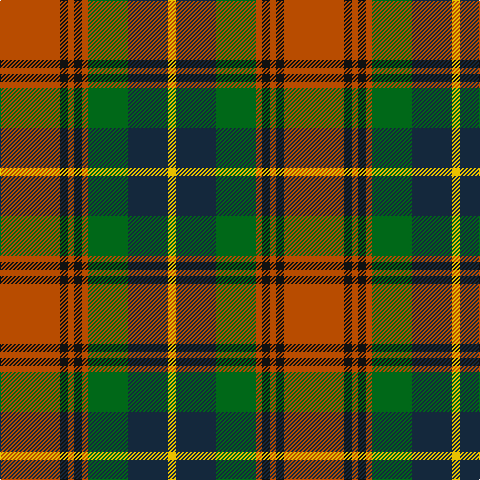

In pattern [RKRKRGBY](/patterns/rkrkrgby/).

This was sourced from tartans-authority.  It is a [8 stripes tartan](/stripes/stripes8/).

Original link http://www.tartansauthority.com/tartan-ferret/display/2654/

## Thread count
DO/60 K8 DO6 K8 DO6 G40 DN40 Y/8

## Palette
Each colour and its ΔE from the base-6 reference it is a variant of.

| Colour | Shade | Base | ΔE (OKLab) |
|---|---|---|---|
| DN | <code style="background-color:#14283C;">#14283C</code> `#14283C` | B <code style="background-color:#2A418A;">#2A418A</code> | 0.15 |
| DO | <code style="background-color:#B84C00;">#B84C00</code> `#B84C00` | R <code style="background-color:#CC0000;">#CC0000</code> | 0.08 |
| G | <code style="background-color:#006818;">#006818</code> `#006818` | G <code style="background-color:#006100;">#006100</code> | 0.02 |
| K | <code style="background-color:#101010;">#101010</code> `#101010` | K <code style="background-color:#000000;">#000000</code> | 0.17 |
| Y | <code style="background-color:#E8C000;">#E8C000</code> `#E8C000` | Y <code style="background-color:#F2BF00;">#F2BF00</code> | 0.02 |

# Sample pattern

## Nearest tartans

The nearest existing variants by ΔTartan distance.

1. [Caledonian Brewery (Corporate)](/setts/s7/w8g26ga12r32wa4r4ga4-g003820-ga006818-r880000-wc0c0c0-waa8ace8/) — ΔT 0.59
1. [Craik of Assington (Personal)](/setts/s8/b16r44b4g32r8g16k4y8-b1c0070-g006818-k101010-r880000-yd09800/) — ΔT 0.71
1. [Craik of Assington Personal Tartan Tartan Number: 494. Earliest known date: 1981 Restricted See products available Copyright © Blair Urquhart, Comrie, 2015](/setts/s8/b16r44b4g32r8g16k4y8-b2c2c80-g006818-k101010-rc80000-ye8c000/) — ΔT 0.74
1. [Craik, of Assington](/setts/s8/b16r44b4g32r8g16k4y8-b304080-g008000-k000000-rc00000-yf0c000/) — ΔT 0.82
1. [Caledonian Brewery](/setts/s7/w8g40ga20r50b4r4ga4-b8080d0-g003000-ga008000-rc00000-we0e0e0/) — ΔT 0.88
1. [Sawyer](/setts/s8/g8y4g40b4k16r32w4r8-b1c0070-g006818-k101010-ra00000-wa8ace8-yb8b8b8/) — ΔT 0.93
1. [Connolly Dress (Name)](/setts/s10/g12k4g6k4g12b16r40y4r6g4-b2c2c80-g006818-k101010-rc80000-ye8c000/) — ΔT 0.94
1. [Sikh](/setts/s8/r56k12r7k12r7g50b50y10-b2c2c80-g006818-k101010-rb84c00-ye8c000/) — ΔT 0.97
1. [Sawyer Family Tartan Tartan Number: 2162. Earliest known date: 1994 Information from Dr. Phil Smith, Narvon, USA. See products available Copyright © Blair Urquhart, Comrie, 2015](/setts/s8/g8w4g40b4k16r32ba4r8-b2c2c80-ba5c8ca8-g006818-k101010-rc80000-we0e0e0/) — ΔT 0.97
1. [Graham of Montrose Red](/setts/s9/w4k4r40g40k20w20r40k4w4-g006818-k101010-r880000-wa8ace8/) — ΔT 0.99

## Neighbour map

Every grey dot is one of 15726 variants placed by the first two principal components of the ΔTartan feature space (44% of its variance). Red is this tartan; blue dots are its nearest — click one to open its page.

<svg viewBox="0 0 640 380" role="img" style="max-width:100%;height:auto;border:1px solid #e0e0e0;border-radius:4px;display:block" xmlns="http://www.w3.org/2000/svg"><image href="/nn/cloud.v1.png" width="640" height="380"/><a href="/setts/s7/w8g26ga12r32wa4r4ga4-g003820-ga006818-r880000-wc0c0c0-waa8ace8/"><circle cx="182.9" cy="195.2" r="4" fill="#3465a4"><title>Caledonian Brewery (Corporate)</title></circle></a><a href="/setts/s8/b16r44b4g32r8g16k4y8-b1c0070-g006818-k101010-r880000-yd09800/"><circle cx="206.4" cy="184.3" r="4" fill="#3465a4"><title>Craik of Assington (Personal)</title></circle></a><a href="/setts/s8/b16r44b4g32r8g16k4y8-b2c2c80-g006818-k101010-rc80000-ye8c000/"><circle cx="193.6" cy="172.2" r="4" fill="#3465a4"><title>Craik of Assington Personal Tartan Tartan Number: 494. Earliest known date: 1981 Restricted See products available Copyright © Blair Urquhart, Comrie, 2015</title></circle></a><a href="/setts/s8/b16r44b4g32r8g16k4y8-b304080-g008000-k000000-rc00000-yf0c000/"><circle cx="186.5" cy="169.9" r="4" fill="#3465a4"><title>Craik, of Assington</title></circle></a><a href="/setts/s7/w8g40ga20r50b4r4ga4-b8080d0-g003000-ga008000-rc00000-we0e0e0/"><circle cx="205.1" cy="158.6" r="4" fill="#3465a4"><title>Caledonian Brewery</title></circle></a><a href="/setts/s8/g8y4g40b4k16r32w4r8-b1c0070-g006818-k101010-ra00000-wa8ace8-yb8b8b8/"><circle cx="187.8" cy="161.1" r="4" fill="#3465a4"><title>Sawyer</title></circle></a><a href="/setts/s10/g12k4g6k4g12b16r40y4r6g4-b2c2c80-g006818-k101010-rc80000-ye8c000/"><circle cx="207.4" cy="153.1" r="4" fill="#3465a4"><title>Connolly Dress (Name)</title></circle></a><a href="/setts/s8/r56k12r7k12r7g50b50y10-b2c2c80-g006818-k101010-rb84c00-ye8c000/"><circle cx="139.3" cy="186.9" r="4" fill="#3465a4"><title>Sikh</title></circle></a><a href="/setts/s8/g8w4g40b4k16r32ba4r8-b2c2c80-ba5c8ca8-g006818-k101010-rc80000-we0e0e0/"><circle cx="179.3" cy="154.4" r="4" fill="#3465a4"><title>Sawyer Family Tartan Tartan Number: 2162. Earliest known date: 1994 Information from Dr. Phil Smith, Narvon, USA. See products available Copyright © Blair Urquhart, Comrie, 2015</title></circle></a><a href="/setts/s9/w4k4r40g40k20w20r40k4w4-g006818-k101010-r880000-wa8ace8/"><circle cx="196.6" cy="171.6" r="4" fill="#3465a4"><title>Graham of Montrose Red</title></circle></a><circle cx="192.7" cy="173.5" r="5" fill="#c00000"/></svg>

ID: /setts/s8/r60k8r6k8r6g40b40y8-b14283c-g006818-k101010-rb84c00-ye8c000/
