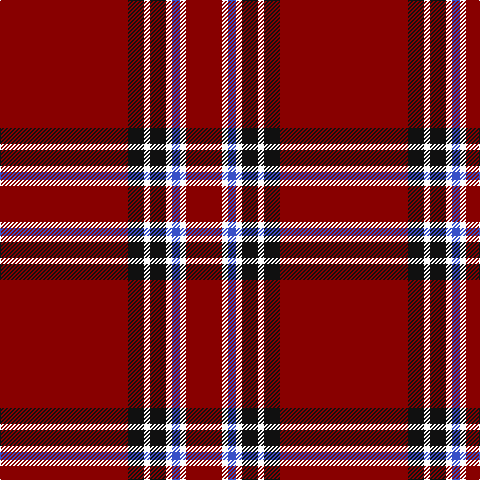

**Bands:** [RKWKWBWR](/stripes/rkwkwbwr/) · **Stripes:** [R K W K W B W R](/stripes/stripes8/) R K W K W B W R

This was sourced from tartans-authority.  It is a [8 band tartan](/bands/bands8/).

Original link http://www.tartansauthority.com/tartan-ferret/display/5271/

## Thread count
DR/128 K16 W6 K16 W6 B8 W6 DR/36

## Palette
Each colour and its ΔE from the base-6 reference it is a variant of.

| Colour | Shade | Base | ΔE (OKLab) |
|---|---|---|---|
| B | <code style="background-color:#3850C8;">#3850C8</code> `#3850C8` | B <code style="background-color:#2A418A;">#2A418A</code> | 0.11 |
| DR | <code style="background-color:#880000;">#880000</code> `#880000` | R <code style="background-color:#CC0000;">#CC0000</code> | 0.15 |
| K | <code style="background-color:#101010;">#101010</code> `#101010` | K <code style="background-color:#000000;">#000000</code> | 0.17 |
| W | <code style="background-color:#FCFCFC;">#FCFCFC</code> `#FCFCFC` | W <code style="background-color:#F7F7F7;">#F7F7F7</code> | 0.01 |

# Sample pattern

## Nearest tartans

The nearest existing variants by ΔTartan distance.

1. [Anthony Plaid Red](/setts/s9/r18k1ly3k1lr1r3k2r2lr2~x4/) — ΔT 0.87
1. [Highlands of Wyomissing (Corporate)](/setts/s8/r35lb3r8ly2dg11~x2/) — ΔT 1.05
1. [Unnamed C20th - Skirt](/setts/s10/r58k12r4k2ly2k2r10w5k2ly4~x2/) — ΔT 1.22
1. [Aberdeen Football Club (2002)](/setts/s8/k4r4ly2r41k4r4k12w2~x2/) — ΔT 1.26
1. [Rose](/setts/s9/dg2r28db6r5db2r2db2r11lr2~x2/) — ΔT 1.32
1. [Rose](/setts/s9/dg2r28db6r5db2r2db2r11lr2/) — ΔT 1.32
1. [Rose](/setts/s9/dg2r28db6r5db2r2db2r11lb2/) — ΔT 1.35
1. [Stuart of Bute](/setts/s9/r12dg6k1dg2k1dg1k6r24lr2~x2/) — ΔT 1.36
1. [Wilding, Michael John (Personal)](/setts/s13/w2k2t2ly2k2r6k1r12k2r6w1r23k1~x2/) — ΔT 1.38
1. [De Nardi #2 (Personal)](/setts/s8/r68db27r5ly3r5g3r13t3~x2/) — ΔT 1.41

## Neighbour map

Every grey dot is one of 14299 variants placed by the first two principal components of the ΔTartan feature space (44% of its variance). Red is this tartan; blue dots are its nearest — click one to open its page.

<svg viewBox="0 0 640 380" role="img" style="max-width:100%;height:auto;border:1px solid #e0e0e0;border-radius:4px;display:block" xmlns="http://www.w3.org/2000/svg"><image href="/nn/cloud.v1.png" width="640" height="380"/><a href="/setts/s9/r18k1ly3k1lr1r3k2r2lr2~x4/"><circle cx="442.3" cy="126.0" r="4" fill="#3465a4"><title>Anthony Plaid Red</title></circle></a><a href="/setts/s8/r35lb3r8ly2dg11~x2/"><circle cx="448.2" cy="151.1" r="4" fill="#3465a4"><title>Highlands of Wyomissing (Corporate)</title></circle></a><a href="/setts/s10/r58k12r4k2ly2k2r10w5k2ly4~x2/"><circle cx="477.3" cy="90.5" r="4" fill="#3465a4"><title>Unnamed C20th - Skirt</title></circle></a><a href="/setts/s8/k4r4ly2r41k4r4k12w2~x2/"><circle cx="435.5" cy="115.7" r="4" fill="#3465a4"><title>Aberdeen Football Club (2002)</title></circle></a><a href="/setts/s9/dg2r28db6r5db2r2db2r11lr2~x2/"><circle cx="507.9" cy="156.5" r="4" fill="#3465a4"><title>Rose</title></circle></a><a href="/setts/s9/dg2r28db6r5db2r2db2r11lr2/"><circle cx="507.9" cy="156.5" r="4" fill="#3465a4"><title>Rose</title></circle></a><a href="/setts/s9/dg2r28db6r5db2r2db2r11lb2/"><circle cx="491.9" cy="143.1" r="4" fill="#3465a4"><title>Rose</title></circle></a><a href="/setts/s9/r12dg6k1dg2k1dg1k6r24lr2~x2/"><circle cx="414.1" cy="129.7" r="4" fill="#3465a4"><title>Stuart of Bute</title></circle></a><a href="/setts/s13/w2k2t2ly2k2r6k1r12k2r6w1r23k1~x2/"><circle cx="467.4" cy="95.5" r="4" fill="#3465a4"><title>Wilding, Michael John (Personal)</title></circle></a><a href="/setts/s8/r68db27r5ly3r5g3r13t3~x2/"><circle cx="475.7" cy="114.2" r="4" fill="#3465a4"><title>De Nardi #2 (Personal)</title></circle></a><circle cx="484.4" cy="126.4" r="5" fill="#c00000"/></svg>

ID: /setts/s8/r64k8w3k8w3b4w3r18~x2/
