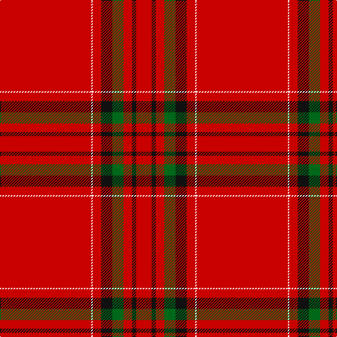

This page is one **sett** — a single exact thread-count. It belongs to the [tartan](/tartans/r65w1r6k8g8r6k3r11/)
(the same proportion at any scale), whose colour order is pattern [RKRGKRWR](/stripes/rkrgkrwr/).

Sourced from register-of-tartans.  It is a [8 stripe tartan](/stripes/stripes8/).

Original link https://www.tartanregister.gov.uk/tartanDetails.aspx?ref=1557

## Register references

External register numbers recorded for this tartan.

- Scottish Register of Tartans: [1557](https://www.tartanregister.gov.uk/tartanDetails.aspx?ref=1557)
- Scottish Tartans Authority (ITI): 6145

## Thread count
R/130 W2 R12 K16 G16 R12 K6 R/22

## Palette

Palette: <strong>Tartan Register</strong>
<table><thead><tr><th>Colour</th><th>Threads</th><th>Shade</th><th>Base</th><th>OKLCh</th></tr></thead><tbody><tr><td>R/</td><td style="text-align:right;font-variant-numeric:tabular-nums">130</td><td><code style="background-color:#C80000;">#C80000</code> <small style="color:#888">#C80000</small></td><td>R <code style="background-color:#CC0000;">#CC0000</code></td><td><small style="color:#888">oklch(52.3% 0.215 29.2)</small></td></tr><tr><td>W</td><td style="text-align:right;font-variant-numeric:tabular-nums">2</td><td><code style="background-color:#FCFCFC;">#FCFCFC</code> <small style="color:#888">#FCFCFC</small></td><td>W <code style="background-color:#F7F7F7;">#F7F7F7</code></td><td><small style="color:#888">oklch(99.1% 0.000 89.9)</small></td></tr><tr><td>R</td><td style="text-align:right;font-variant-numeric:tabular-nums">12</td><td><code style="background-color:#C80000;">#C80000</code> <small style="color:#888">#C80000</small></td><td>R <code style="background-color:#CC0000;">#CC0000</code></td><td><small style="color:#888">oklch(52.3% 0.215 29.2)</small></td></tr><tr><td>K</td><td style="text-align:right;font-variant-numeric:tabular-nums">16</td><td><code style="background-color:#101010;">#101010</code> <small style="color:#888">#101010</small></td><td>K <code style="background-color:#000000;">#000000</code></td><td><small style="color:#888">oklch(17.3% 0.000 89.9)</small></td></tr><tr><td>G</td><td style="text-align:right;font-variant-numeric:tabular-nums">16</td><td><code style="background-color:#006818;">#006818</code> <small style="color:#888">#006818</small></td><td>G <code style="background-color:#006100;">#006100</code></td><td><small style="color:#888">oklch(45.0% 0.142 145.0)</small></td></tr><tr><td>R</td><td style="text-align:right;font-variant-numeric:tabular-nums">12</td><td><code style="background-color:#C80000;">#C80000</code> <small style="color:#888">#C80000</small></td><td>R <code style="background-color:#CC0000;">#CC0000</code></td><td><small style="color:#888">oklch(52.3% 0.215 29.2)</small></td></tr><tr><td>K</td><td style="text-align:right;font-variant-numeric:tabular-nums">6</td><td><code style="background-color:#101010;">#101010</code> <small style="color:#888">#101010</small></td><td>K <code style="background-color:#000000;">#000000</code></td><td><small style="color:#888">oklch(17.3% 0.000 89.9)</small></td></tr><tr><td>R/</td><td style="text-align:right;font-variant-numeric:tabular-nums">22</td><td><code style="background-color:#C80000;">#C80000</code> <small style="color:#888">#C80000</small></td><td>R <code style="background-color:#CC0000;">#CC0000</code></td><td><small style="color:#888">oklch(52.3% 0.215 29.2)</small></td></tr></tbody></table>

# Sample pattern

## Nearest tartans

The nearest existing variants by ΔTartan distance, with this tartan at the top so the swatches line up against it.

ΔTartan

Tartan

Sett

—

<a href="/ttd/edit/#slug=r65w1r6k8g8r6k3r11~x2">Gudbrandsdalen, Rondastakken #2</a> <a class="nn-out" href="/setts/s8/r65w1r6k8g8r6k3r11~x2/" title="open its dictionary page">↗</a>

0.78

<a href="/ttd/edit/#slug=r42db4ly1db6dg1db1dg1r12~x2">Inverness Earl of</a> <a class="nn-out" href="/setts/s8/r42db4ly1db6dg1db1dg1r12~x2/" title="open its dictionary page">↗</a>

0.90

<a href="/ttd/edit/#slug=r114g10w3g16ly3g3ly3r28~x2">Duke of Sussex (Earl of Inverness)</a> <a class="nn-out" href="/setts/s8/r114g10w3g16ly3g3ly3r28~x2/" title="open its dictionary page">↗</a>

0.90

<a href="/ttd/edit/#slug=r65w2r3r4dg11r3dg3r11">Gudbrandsdalen, Rondastakken</a> <a class="nn-out" href="/setts/s8/r65w2r3r4dg11r3dg3r11/" title="open its dictionary page">↗</a>

0.91

<a href="/ttd/edit/#slug=g4r16k5r50g4w1~x4">Chalet</a> <a class="nn-out" href="/setts/s6/g4r16k5r50g4w1~x4/" title="open its dictionary page">↗</a>

0.99

<a href="/ttd/edit/#slug=r42dp4ly1dp6g1dp1g1r12~x2">Earl of Inverness (Artefact)</a> <a class="nn-out" href="/setts/s8/r42dp4ly1dp6g1dp1g1r12~x2/" title="open its dictionary page">↗</a>

1.07

<a href="/ttd/edit/#slug=r42db4ly1db6g1db1g1r12~x2">Inverness, Earl of</a> <a class="nn-out" href="/setts/s8/r42db4ly1db6g1db1g1r12~x2/" title="open its dictionary page">↗</a>

1.13

<a href="/ttd/edit/#slug=r45k3ly4k3r45k1dp2k1r2g8r2~x2">O'Malley (Name?)</a> <a class="nn-out" href="/setts/s11/r45k3ly4k3r45k1dp2k1r2g8r2~x2/" title="open its dictionary page">↗</a>

1.16

<a href="/ttd/edit/#slug=r65w2r3r4g11r3g3r11~x2">Gudbrandsdalen, Rondastakken</a> <a class="nn-out" href="/setts/s8/r65w2r3r4g11r3g3r11~x2/" title="open its dictionary page">↗</a>

1.22

<a href="/ttd/edit/#slug=r72k6lb2k11ly2db2ly2r18~x2">Princess Elizabeth (Royal)</a> <a class="nn-out" href="/setts/s8/r72k6lb2k11ly2db2ly2r18~x2/" title="open its dictionary page">↗</a>

1.23

<a href="/ttd/edit/#slug=r72k8r4g16r7o2~x2">MacAndrew Dress (Name)</a> <a class="nn-out" href="/setts/s6/r72k8r4g16r7o2~x2/" title="open its dictionary page">↗</a>

## Neighbour map

Every grey dot is one of 14299 variants placed by the first two principal components of the ΔTartan feature space (44% of its variance). Red is this tartan; blue dots are its nearest — click one to open its page.

<svg viewBox="0 0 640 380" role="img" style="max-width:100%;height:auto;border:1px solid #e0e0e0;border-radius:4px;display:block" xmlns="http://www.w3.org/2000/svg"><image href="/nn/cloud.v1.png" width="640" height="380"/><a href="/setts/s8/r42db4ly1db6dg1db1dg1r12~x2/"><circle cx="607.5" cy="103.0" r="4" fill="#3465a4"><title>Inverness Earl of</title></circle></a><a href="/setts/s8/r114g10w3g16ly3g3ly3r28~x2/"><circle cx="601.4" cy="109.6" r="4" fill="#3465a4"><title>Duke of Sussex (Earl of Inverness)</title></circle></a><a href="/setts/s8/r65w2r3r4dg11r3dg3r11/"><circle cx="613.6" cy="120.0" r="4" fill="#3465a4"><title>Gudbrandsdalen, Rondastakken</title></circle></a><a href="/setts/s6/g4r16k5r50g4w1~x4/"><circle cx="605.9" cy="114.6" r="4" fill="#3465a4"><title>Chalet</title></circle></a><a href="/setts/s8/r42dp4ly1dp6g1dp1g1r12~x2/"><circle cx="623.4" cy="111.9" r="4" fill="#3465a4"><title>Earl of Inverness (Artefact)</title></circle></a><a href="/setts/s8/r42db4ly1db6g1db1g1r12~x2/"><circle cx="623.0" cy="116.0" r="4" fill="#3465a4"><title>Inverness, Earl of</title></circle></a><a href="/setts/s11/r45k3ly4k3r45k1dp2k1r2g8r2~x2/"><circle cx="593.5" cy="73.7" r="4" fill="#3465a4"><title>O'Malley (Name?)</title></circle></a><a href="/setts/s8/r65w2r3r4g11r3g3r11~x2/"><circle cx="620.9" cy="122.0" r="4" fill="#3465a4"><title>Gudbrandsdalen, Rondastakken</title></circle></a><a href="/setts/s8/r72k6lb2k11ly2db2ly2r18~x2/"><circle cx="551.5" cy="84.7" r="4" fill="#3465a4"><title>Princess Elizabeth (Royal)</title></circle></a><a href="/setts/s6/r72k8r4g16r7o2~x2/"><circle cx="563.5" cy="132.8" r="4" fill="#3465a4"><title>MacAndrew Dress (Name)</title></circle></a><circle cx="616.9" cy="101.3" r="5" fill="#c00000"/></svg>

ID: /setts/s8/r65w1r6k8g8r6k3r11~x2/
