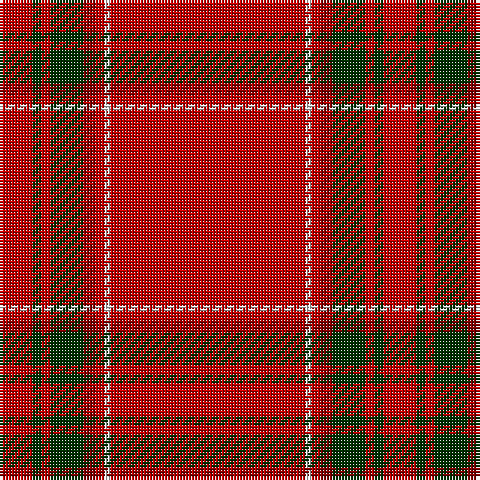

In pattern [RGRGRRWR](/stripes/rgrgrrwr/).

This was sourced from weddslist.  It is a [8 stripe tartan](/stripes/stripes8/).

Original link http://www.weddslist.com/cgi-bin/tartans/pg.pl?source=sts

## Thread count
R/65 LN2 R3 DR4 DG11 R3 DG3 R/11

## Palette
Each colour and the base-6 reference it is a variant of.

| Colour | Shade | Base |
|---|---|---|
| DG | <code style="background-color:#003000;">#003000</code> `oklch(26.8% 0.091 142.5)` <small>#003000</small> | G <code style="background-color:#006100;">#006100</code> |
| DR | <code style="background-color:#800000;">#800000</code> `oklch(37.7% 0.155 29.2)` <small>#800000</small> | R <code style="background-color:#CC0000;">#CC0000</code> |
| LN | <code style="background-color:#E0E0E0;">#E0E0E0</code> `oklch(90.7% 0.000 89.9)` <small>#E0E0E0</small> | W <code style="background-color:#F7F7F7;">#F7F7F7</code> |
| R | <code style="background-color:#C00000;">#C00000</code> `oklch(50.7% 0.208 29.2)` <small>#C00000</small> | R <code style="background-color:#CC0000;">#CC0000</code> |

# Sample pattern

## Nearest tartans

The nearest existing variants by ΔTartan distance.

1. [Gudbrandsdalen, Rondastakken](/setts/s8/r65w2r3r4g11r3g3r11~x2/) — ΔT 0.48
1. [Duke of Sussex (Earl of Inverness)](/setts/s8/r114g10w3g16ly3g3ly3r28~x2/) — ΔT 0.63
1. [Earl of Inverness (Artefact)](/setts/s8/r42dp4ly1dp6g1dp1g1r12~x2/) — ΔT 0.71
1. [Inverness, Earl of](/setts/s8/r42db4ly1db6g1db1g1r12~x2/) — ΔT 0.72
1. [Inverness Earl of](/setts/s8/r42db4ly1db6dg1db1dg1r12~x2/) — ΔT 0.83
1. [Gudbrandsdalen, Rondastakken #2](/setts/s8/r65w1r6k8g8r6k3r11~x2/) — ΔT 0.90
1. [MacAndrew Dress (Name)](/setts/s6/r72k8r4g16r7o2~x2/) — ΔT 1.11
1. [Inverness](/setts/s8/r36db3w1db6g1k1g1r9~x2/) — ΔT 1.17
1. [O'Malley (Name?)](/setts/s11/r45k3ly4k3r45k1dp2k1r2g8r2~x2/) — ΔT 1.24
1. [Prince of Denmark (Corporate)](/setts/s9/r52dg2r2dg2r3w3db2w2db2~x4/) — ΔT 1.28

## Neighbour map

Every grey dot is one of 14299 variants placed by the first two principal components of the ΔTartan feature space (44% of its variance). Red is this tartan; blue dots are its nearest — click one to open its page.

<svg viewBox="0 0 640 380" role="img" style="max-width:100%;height:auto;border:1px solid #e0e0e0;border-radius:4px;display:block" xmlns="http://www.w3.org/2000/svg"><image href="/nn/cloud.v1.png" width="640" height="380"/><a href="/setts/s8/r65w2r3r4g11r3g3r11~x2/"><circle cx="620.9" cy="122.0" r="4" fill="#3465a4"><title>Gudbrandsdalen, Rondastakken</title></circle></a><a href="/setts/s8/r114g10w3g16ly3g3ly3r28~x2/"><circle cx="601.4" cy="109.6" r="4" fill="#3465a4"><title>Duke of Sussex (Earl of Inverness)</title></circle></a><a href="/setts/s8/r42dp4ly1dp6g1dp1g1r12~x2/"><circle cx="623.4" cy="111.9" r="4" fill="#3465a4"><title>Earl of Inverness (Artefact)</title></circle></a><a href="/setts/s8/r42db4ly1db6g1db1g1r12~x2/"><circle cx="623.0" cy="116.0" r="4" fill="#3465a4"><title>Inverness, Earl of</title></circle></a><a href="/setts/s8/r42db4ly1db6dg1db1dg1r12~x2/"><circle cx="607.5" cy="103.0" r="4" fill="#3465a4"><title>Inverness Earl of</title></circle></a><a href="/setts/s8/r65w1r6k8g8r6k3r11~x2/"><circle cx="616.9" cy="101.3" r="4" fill="#3465a4"><title>Gudbrandsdalen, Rondastakken #2</title></circle></a><a href="/setts/s6/r72k8r4g16r7o2~x2/"><circle cx="563.5" cy="132.8" r="4" fill="#3465a4"><title>MacAndrew Dress (Name)</title></circle></a><a href="/setts/s8/r36db3w1db6g1k1g1r9~x2/"><circle cx="563.0" cy="96.6" r="4" fill="#3465a4"><title>Inverness</title></circle></a><a href="/setts/s11/r45k3ly4k3r45k1dp2k1r2g8r2~x2/"><circle cx="593.5" cy="73.7" r="4" fill="#3465a4"><title>O'Malley (Name?)</title></circle></a><a href="/setts/s9/r52dg2r2dg2r3w3db2w2db2~x4/"><circle cx="608.6" cy="94.9" r="4" fill="#3465a4"><title>Prince of Denmark (Corporate)</title></circle></a><circle cx="613.6" cy="120.0" r="5" fill="#c00000"/></svg>

ID: /setts/s8/r65w2r3r4dg11r3dg3r11/
