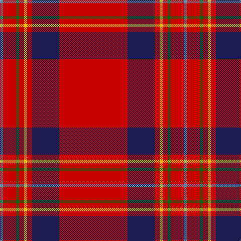

In pattern [BRGRYRBR](/patterns/brgryrbr/).

This was sourced from register-of-tartans.  It is a [8 stripes tartan](/stripes/stripes8/).

Original link https://www.tartanregister.gov.uk/tartanDetails.aspx?ref=5469

## Register references

External register numbers recorded for this tartan.

- Scottish Register of Tartans: [5469](https://www.tartanregister.gov.uk/tartanDetails.aspx?ref=5469)
- Scottish Tartans Authority (ITI): 7358

## Thread count
B/6 R26 G6 R10 Y6 R10 DB54 R/136

## Palette
Each colour and its ΔE from the base-6 reference it is a variant of.

| Colour | Shade | Base | ΔE (OKLab) |
|---|---|---|---|
| B | <code style="background-color:#5C8CA8;">#5C8CA8</code> `#5C8CA8` | B <code style="background-color:#2A418A;">#2A418A</code> | 0.23 |
| DB | <code style="background-color:#1C1C50;">#1C1C50</code> `#1C1C50` | B <code style="background-color:#2A418A;">#2A418A</code> | 0.14 |
| G | <code style="background-color:#006818;">#006818</code> `#006818` | G <code style="background-color:#006100;">#006100</code> | 0.02 |
| R | <code style="background-color:#C80000;">#C80000</code> `#C80000` | R <code style="background-color:#CC0000;">#CC0000</code> | 0.01 |
| Y | <code style="background-color:#E8C000;">#E8C000</code> `#E8C000` | Y <code style="background-color:#F2BF00;">#F2BF00</code> | 0.02 |

# Sample pattern

## Nearest tartans

The nearest existing variants by ΔTartan distance.

1. [De Nardi (Personal)](/setts/s8/r68b26r5y3r5g3r13ra3~b2c2c80-g006818-rc80000-ra888888-ye8c000~x2/) — ΔT 0.44
1. [Earl of Inverness (Royal)](/setts/s8/r100b10w5b14y4ba8y4r24~b1c1c50-ba2c2c80-rc80000-we0e0e0-ye8c000/) — ΔT 0.47
1. [Princess Elizabeth #2](/setts/s8/r60b8w3b10y3ba4y3r19~b2c2c80-ba5c8ca8-rc80000-we0e0e0-ye8c000~x2/) — ΔT 0.48
1. [Princess Elizabeth](/setts/s8/r60b8w3b10y3ba4y3r19~b304080-ba5480b0-rc00000-we0e0e0-yf0c000~x2/) — ΔT 0.52
1. [Perthshire Clayquhat District Tartan Tartan Number: 2800. Earliest known date: c.1739 Early historic plaid woven for (or by) Janet Craigie (nee Spalding) from the Braes of Clayquhat (now Cloquhat) in East Perthshire. Two pieces are now in the possession of the Scottish Tartans Authority (2014). See http://scottishtartans.co.uk/An_Unnamed_C18th_Plaid_from_Bridge_of_Cally.pdf See products available Copyright © Blair Urquhart, Comrie, 2015](/setts/s7/r23k1g9r3b1y1r1~b384080-g086818-k000000-rc8002c-y809cb0~x4/) — ΔT 0.74
1. [Oliver Family Tartan Tartan Number: 1606. Earliest known date: 1973 (1820) Designed for the Oliver Society, based on Tweedside Distict sett of c.1820 in Wilson's notebook now in Museum of Antiquities. See products available Copyright © Blair Urquhart, Comrie, 2015](/setts/s9/r40k3r2b12r2g2r2g2y3~b2c2c80-g006818-k101010-rc80000-ye8c000~x2/) — ΔT 0.92
1. [Hackston (Green stripe) (Portrait)](/setts/s8/r51y2k11ya3r11ya3r11g3~g006818-k101010-rc80000-yb8b8b8-yabc8c00~x2/) — ΔT 1.00
1. [Oliver, dress](/setts/s9/r40k3r2b12r2g2r2g2y3~b304080-g008000-k000000-rc00000-yf0c000~x2/) — ΔT 1.01
1. [Rose Clan Tartan Tartan Number: 845. Earliest known date: 1842 The text of the Vestiarium gives the colours as purple and crimson but in the plate they appear as mid blue and scarlet. The Lord Lyon records crimson as red. D.C. Stewart regarded this sett as a 'dress' tartan. ('The Setts..' 1950) James Logan records a 'hunting' version. ('The Scottish Gael' 1831). The castle of Kilravock which has been the residence of the Roses for over five centuries is still the seat of the chief. See products available Copyright © Blair Urquhart, Comrie, 2015](/setts/s9/g4r32b9r6b2r3b2r12w3~b2c2c80-g006818-rc80000-we0e0e0~x2/) — ΔT 1.17
1. [Rose](/setts/s9/g4r32b9r6b2r3b2r12w3~b2c2c80-g006818-rc80000-wfcfcfc~x2/) — ΔT 1.18

## Neighbour map

Every grey dot is one of 15726 variants placed by the first two principal components of the ΔTartan feature space (44% of its variance). Red is this tartan; blue dots are its nearest — click one to open its page.

<svg viewBox="0 0 640 380" role="img" style="max-width:100%;height:auto;border:1px solid #e0e0e0;border-radius:4px;display:block" xmlns="http://www.w3.org/2000/svg"><image href="/nn/cloud.v1.png" width="640" height="380"/><a href="/setts/s8/r68b26r5y3r5g3r13ra3~b2c2c80-g006818-rc80000-ra888888-ye8c000~x2/"><circle cx="491.3" cy="122.3" r="4" fill="#3465a4"><title>De Nardi (Personal)</title></circle></a><a href="/setts/s8/r100b10w5b14y4ba8y4r24~b1c1c50-ba2c2c80-rc80000-we0e0e0-ye8c000/"><circle cx="486.1" cy="105.9" r="4" fill="#3465a4"><title>Earl of Inverness (Royal)</title></circle></a><a href="/setts/s8/r60b8w3b10y3ba4y3r19~b2c2c80-ba5c8ca8-rc80000-we0e0e0-ye8c000~x2/"><circle cx="465.0" cy="120.2" r="4" fill="#3465a4"><title>Princess Elizabeth #2</title></circle></a><a href="/setts/s8/r60b8w3b10y3ba4y3r19~b304080-ba5480b0-rc00000-we0e0e0-yf0c000~x2/"><circle cx="472.8" cy="124.4" r="4" fill="#3465a4"><title>Princess Elizabeth</title></circle></a><a href="/setts/s7/r23k1g9r3b1y1r1~b384080-g086818-k000000-rc8002c-y809cb0~x4/"><circle cx="465.7" cy="124.8" r="4" fill="#3465a4"><title>Perthshire Clayquhat District Tartan Tartan Number: 2800. Earliest known date: c.1739 Early historic plaid woven for (or by) Janet Craigie (nee Spalding) from the Braes of Clayquhat (now Cloquhat) in East Perthshire. Two pieces are now in the possession of the Scottish Tartans Authority (2014). See http://scottishtartans.co.uk/An_Unnamed_C18th_Plaid_from_Bridge_of_Cally.pdf See products available Copyright © Blair Urquhart, Comrie, 2015</title></circle></a><a href="/setts/s9/r40k3r2b12r2g2r2g2y3~b2c2c80-g006818-k101010-rc80000-ye8c000~x2/"><circle cx="437.8" cy="103.7" r="4" fill="#3465a4"><title>Oliver Family Tartan Tartan Number: 1606. Earliest known date: 1973 (1820) Designed for the Oliver Society, based on Tweedside Distict sett of c.1820 in Wilson's notebook now in Museum of Antiquities. See products available Copyright © Blair Urquhart, Comrie, 2015</title></circle></a><a href="/setts/s8/r51y2k11ya3r11ya3r11g3~g006818-k101010-rc80000-yb8b8b8-yabc8c00~x2/"><circle cx="524.9" cy="120.9" r="4" fill="#3465a4"><title>Hackston (Green stripe) (Portrait)</title></circle></a><a href="/setts/s9/r40k3r2b12r2g2r2g2y3~b304080-g008000-k000000-rc00000-yf0c000~x2/"><circle cx="432.5" cy="103.0" r="4" fill="#3465a4"><title>Oliver, dress</title></circle></a><a href="/setts/s9/g4r32b9r6b2r3b2r12w3~b2c2c80-g006818-rc80000-we0e0e0~x2/"><circle cx="471.1" cy="154.2" r="4" fill="#3465a4"><title>Rose Clan Tartan Tartan Number: 845. Earliest known date: 1842 The text of the Vestiarium gives the colours as purple and crimson but in the plate they appear as mid blue and scarlet. The Lord Lyon records crimson as red. D.C. Stewart regarded this sett as a 'dress' tartan. ('The Setts..' 1950) James Logan records a 'hunting' version. ('The Scottish Gael' 1831). The castle of Kilravock which has been the residence of the Roses for over five centuries is still the seat of the chief. See products available Copyright © Blair Urquhart, Comrie, 2015</title></circle></a><a href="/setts/s9/g4r32b9r6b2r3b2r12w3~b2c2c80-g006818-rc80000-wfcfcfc~x2/"><circle cx="464.8" cy="151.7" r="4" fill="#3465a4"><title>Rose</title></circle></a><circle cx="476.9" cy="119.4" r="5" fill="#c00000"/></svg>

ID: /setts/s8/r68b27r5y3r5g3r13ba3~b1c1c50-ba5c8ca8-g006818-rc80000-ye8c000~x2/
