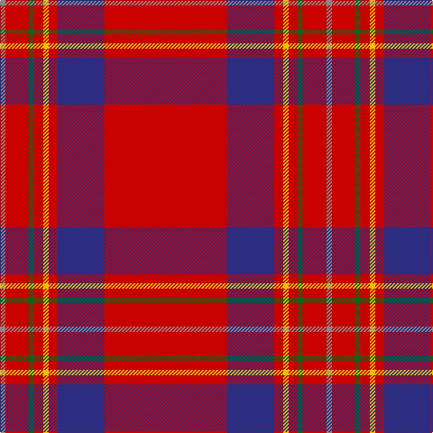

**Bands:** [RRGRYRBR](/stripes/rrgryrbr/) · **Stripes:** [O R G R LY R DB R](/stripes/stripes8/) O R G R LY R DB R

This was sourced from register-of-tartans.  It is a [8 band tartan](/bands/bands8/).

Original link https://www.tartanregister.gov.uk/tartanDetails.aspx?ref=900

## Also known as

This cloth is also recorded under:

- de Nardi

## Attestations

This cloth appears in 2 source records; the oldest owns this page.

- 01/08/2001 — De Nardi (Personal) (register-of-tartans, [record](https://www.tartanregister.gov.uk/tartanDetails.aspx?ref=900))
- pre 2004 — de Nardi (Personal) (tartans-authority, [record](http://www.tartansauthority.com/tartan-ferret/display/6187/))

## Register references

External register numbers recorded for this tartan.

- Scottish Register of Tartans: [900](https://www.tartanregister.gov.uk/tartanDetails.aspx?ref=900)
- Scottish Tartans Authority (ITI): 6187
- Scottish Tartans World Register: 2887

## Thread count
R/136 DB52 R10 Y6 R10 G6 R26 N/6

## Palette
Each colour and its ΔE from the base-6 reference it is a variant of.

| Colour | Shade | Base | ΔE (OKLab) |
|---|---|---|---|
| DB | <code style="background-color:#2C2C80;">#2C2C80</code> `#2C2C80` | B <code style="background-color:#2A418A;">#2A418A</code> | 0.06 |
| G | <code style="background-color:#006818;">#006818</code> `#006818` | G <code style="background-color:#006100;">#006100</code> | 0.02 |
| N | <code style="background-color:#888888;">#888888</code> `#888888` | R <code style="background-color:#CC0000;">#CC0000</code> | 0.24 |
| R | <code style="background-color:#C80000;">#C80000</code> `#C80000` | R <code style="background-color:#CC0000;">#CC0000</code> | 0.01 |
| Y | <code style="background-color:#E8C000;">#E8C000</code> `#E8C000` | Y <code style="background-color:#F2BF00;">#F2BF00</code> | 0.02 |

# Sample pattern

## Nearest tartans

The nearest existing variants by ΔTartan distance.

1. [De Nardi #2 (Personal)](/setts/s8/r68db27r5ly3r5g3r13t3~x2/) — ΔT 0.43
1. [Princess Elizabeth #2](/setts/s8/r60db8w3db10ly3t4ly3r19~x2/) — ΔT 0.55
1. [Earl of Inverness (Royal)](/setts/s8/r100db10w5db14ly4db8ly4r24/) — ΔT 0.70
1. [Perthshire Clayquhat District Tartan Tartan Number: 2800. Earliest known date: c.1739 Early historic plaid woven for (or by) Janet Craigie (nee Spalding) from the Braes of Clayquhat (now Cloquhat) in East Perthshire. Two pieces are now in the possession of the Scottish Tartans Authority (2014). See http://scottishtartans.co.uk/An_Unnamed_C18th_Plaid_from_Bridge_of_Cally.pdf See products available Copyright © Blair Urquhart, Comrie, 2015](/setts/s7/r23k1g9r3db1lr1r1~x4/) — ΔT 0.83
1. [Hackston (Green stripe) (Portrait)](/setts/s8/r51lr2k11lo3r11lo3r11g3~x2/) — ΔT 0.99
1. [Inverness - 1829 (District)](/setts/s8/r36db3w1db6g1k1g1r9~x4/) — ΔT 1.12
1. [Inverness](/setts/s8/r36db3w1db6g1k1g1r9~x2/) — ΔT 1.12
1. [Oliver, dress](/setts/s9/r40k3r2db12r2g2r2g2ly3~x2/) — ΔT 1.23
1. [Rose](/setts/s9/g4r32db9r6db2r3db2r12w3~x2/) — ΔT 1.26
1. [Junor (Personal)](/setts/s9/r72db6ly2db11t2db2t2r9k2~x2/) — ΔT 1.29

## Neighbour map

Every grey dot is one of 14299 variants placed by the first two principal components of the ΔTartan feature space (44% of its variance). Red is this tartan; blue dots are its nearest — click one to open its page.

<svg viewBox="0 0 640 380" role="img" style="max-width:100%;height:auto;border:1px solid #e0e0e0;border-radius:4px;display:block" xmlns="http://www.w3.org/2000/svg"><image href="/nn/cloud.v1.png" width="640" height="380"/><a href="/setts/s8/r68db27r5ly3r5g3r13t3~x2/"><circle cx="475.7" cy="114.2" r="4" fill="#3465a4"><title>De Nardi #2 (Personal)</title></circle></a><a href="/setts/s8/r60db8w3db10ly3t4ly3r19~x2/"><circle cx="463.6" cy="114.7" r="4" fill="#3465a4"><title>Princess Elizabeth #2</title></circle></a><a href="/setts/s8/r100db10w5db14ly4db8ly4r24/"><circle cx="484.7" cy="99.6" r="4" fill="#3465a4"><title>Earl of Inverness (Royal)</title></circle></a><a href="/setts/s7/r23k1g9r3db1lr1r1~x4/"><circle cx="464.7" cy="120.9" r="4" fill="#3465a4"><title>Perthshire Clayquhat District Tartan Tartan Number: 2800. Earliest known date: c.1739 Early historic plaid woven for (or by) Janet Craigie (nee Spalding) from the Braes of Clayquhat (now Cloquhat) in East Perthshire. Two pieces are now in the possession of the Scottish Tartans Authority (2014). See http://scottishtartans.co.uk/An_Unnamed_C18th_Plaid_from_Bridge_of_Cally.pdf See products available Copyright © Blair Urquhart, Comrie, 2015</title></circle></a><a href="/setts/s8/r51lr2k11lo3r11lo3r11g3~x2/"><circle cx="522.8" cy="115.3" r="4" fill="#3465a4"><title>Hackston (Green stripe) (Portrait)</title></circle></a><a href="/setts/s8/r36db3w1db6g1k1g1r9~x4/"><circle cx="557.0" cy="91.9" r="4" fill="#3465a4"><title>Inverness - 1829 (District)</title></circle></a><a href="/setts/s8/r36db3w1db6g1k1g1r9~x2/"><circle cx="563.0" cy="96.6" r="4" fill="#3465a4"><title>Inverness</title></circle></a><a href="/setts/s9/r40k3r2db12r2g2r2g2ly3~x2/"><circle cx="431.9" cy="98.5" r="4" fill="#3465a4"><title>Oliver, dress</title></circle></a><a href="/setts/s9/g4r32db9r6db2r3db2r12w3~x2/"><circle cx="463.5" cy="145.3" r="4" fill="#3465a4"><title>Rose</title></circle></a><a href="/setts/s9/r72db6ly2db11t2db2t2r9k2~x2/"><circle cx="528.2" cy="70.6" r="4" fill="#3465a4"><title>Junor (Personal)</title></circle></a><circle cx="489.9" cy="118.0" r="5" fill="#c00000"/></svg>

ID: /setts/s8/r68db26r5ly3r5g3r13o3~x2/
