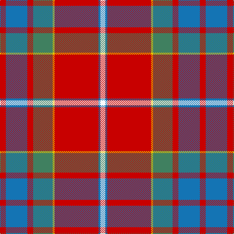

In pattern [RBRGYRBW](/patterns/rbrgyrbw/).

This was sourced from register-of-tartans.  It is a [8 stripes tartan](/stripes/stripes8/).

Original link https://www.tartanregister.gov.uk/tartanDetails.aspx?ref=1095

## Attestations

This cloth appears in 2 source records; the oldest owns this page.

- 01/12/2001 — Elbrick Dress (Personal) (register-of-tartans, [record](https://www.tartanregister.gov.uk/tartanDetails.aspx?ref=1095))
- pre 2004 — Elbrick Dress (Personal) (tartans-authority, [record](http://www.tartansauthority.com/tartan-ferret/display/6190/))

## Register references

External register numbers recorded for this tartan.

- Scottish Register of Tartans: [1095](https://www.tartanregister.gov.uk/tartanDetails.aspx?ref=1095)
- Scottish Tartans Authority (ITI): 6190
- Scottish Tartans World Register: 2971

## Thread count
R/12 B44 R12 G40 Y4 R90 B4 W/10

## Palette
Each colour and its ΔE from the base-6 reference it is a variant of.

| Colour | Shade | Base | ΔE (OKLab) |
|---|---|---|---|
| B | <code style="background-color:#1474B4;">#1474B4</code> `#1474B4` | B <code style="background-color:#2A418A;">#2A418A</code> | 0.15 |
| G | <code style="background-color:#408060;">#408060</code> `#408060` | G <code style="background-color:#006100;">#006100</code> | 0.14 |
| R | <code style="background-color:#C80000;">#C80000</code> `#C80000` | R <code style="background-color:#CC0000;">#CC0000</code> | 0.01 |
| W | <code style="background-color:#FCFCFC;">#FCFCFC</code> `#FCFCFC` | W <code style="background-color:#F7F7F7;">#F7F7F7</code> | 0.01 |
| Y | <code style="background-color:#E8C000;">#E8C000</code> `#E8C000` | Y <code style="background-color:#F2BF00;">#F2BF00</code> | 0.02 |

# Sample pattern

## Nearest tartans

The nearest existing variants by ΔTartan distance.

1. [Manitoba Masonic](/setts/s8/y3b8w3b34r34g4r4w2~b474f5a-g46785e-re50908-wffffff-ye2a81a~x2/) — ΔT 0.84
1. [MacLeay](/setts/s7/r27g4k4g4k4b6y1~b5c8ca8-g789484-k101010-rc80000-yd09800~x4/) — ΔT 0.92
1. [Richardson (Personal?)](/setts/s10/r25k1y2k1y2k1r10b18w2b12~b1474b4-k101010-rc80000-we0e0e0-ye8c000~x2/) — ΔT 1.01
1. [Shaw of Tordarroch](/setts/s8/b5k1r30ba15r8g30r8ba2~b5480b0-ba800080-g008000-k000000-rc00000~x2/) — ΔT 1.08
1. [MacDonald of Glenaladale](/setts/s11/b3ba1r30b32r3w1r3g23r31b3w1~b304080-ba5480b0-g008000-rc00000-we0e0e0/) — ΔT 1.10
1. [MacPhail Clan Tartan Tartan Number: 1028. Earliest known date: pre 1950 This sample comes from the MacGregor-Hastie collection which forms the basis of the cloth archive of the Scottish Tartans Society. Some of the samples, including this one, were unmarked. One can assume that the sample dates between 1930 and 1950. See products available Copyright © Blair Urquhart, Comrie, 2015](/setts/s6/r25b7r3g13ba1k2~b2c2c80-ba5c8ca8-g006818-k101010-rc80000~x4/) — ΔT 1.11
1. [MacDonald of Glenaladale](/setts/s11/b3ba1r30b32r3w1r3g23r31b3w1~b2c4084-ba3c82af-g005020-rdc0000-we0e0e0/) — ΔT 1.12
1. [Drummond, (Fingask)](/setts/s8/r22b3y1g12r6b3ba3w1~b304080-ba5480b0-g008000-rc00000-we0e0e0-yf0c000~x2/) — ΔT 1.13
1. [Outpost Club](/setts/s10/w6r5w9b2ba3b2ra36r2ra4r2~b000048-ba2474e8-rb03000-ra98481c-we8ccb8~x2/) — ΔT 1.14
1. [MacPhail](/setts/s6/r25b7r3g13ba1k2~b304080-ba5480b0-g008000-k000000-rc00000~x4/) — ΔT 1.17

## Neighbour map

Every grey dot is one of 15726 variants placed by the first two principal components of the ΔTartan feature space (44% of its variance). Red is this tartan; blue dots are its nearest — click one to open its page.

<svg viewBox="0 0 640 380" role="img" style="max-width:100%;height:auto;border:1px solid #e0e0e0;border-radius:4px;display:block" xmlns="http://www.w3.org/2000/svg"><image href="/nn/cloud.v1.png" width="640" height="380"/><a href="/setts/s8/y3b8w3b34r34g4r4w2~b474f5a-g46785e-re50908-wffffff-ye2a81a~x2/"><circle cx="288.7" cy="131.5" r="4" fill="#3465a4"><title>Manitoba Masonic</title></circle></a><a href="/setts/s7/r27g4k4g4k4b6y1~b5c8ca8-g789484-k101010-rc80000-yd09800~x4/"><circle cx="325.3" cy="118.9" r="4" fill="#3465a4"><title>MacLeay</title></circle></a><a href="/setts/s10/r25k1y2k1y2k1r10b18w2b12~b1474b4-k101010-rc80000-we0e0e0-ye8c000~x2/"><circle cx="293.5" cy="110.3" r="4" fill="#3465a4"><title>Richardson (Personal?)</title></circle></a><a href="/setts/s8/b5k1r30ba15r8g30r8ba2~b5480b0-ba800080-g008000-k000000-rc00000~x2/"><circle cx="284.7" cy="133.3" r="4" fill="#3465a4"><title>Shaw of Tordarroch</title></circle></a><a href="/setts/s11/b3ba1r30b32r3w1r3g23r31b3w1~b304080-ba5480b0-g008000-rc00000-we0e0e0/"><circle cx="326.3" cy="105.7" r="4" fill="#3465a4"><title>MacDonald of Glenaladale</title></circle></a><a href="/setts/s6/r25b7r3g13ba1k2~b2c2c80-ba5c8ca8-g006818-k101010-rc80000~x4/"><circle cx="338.0" cy="147.3" r="4" fill="#3465a4"><title>MacPhail Clan Tartan Tartan Number: 1028. Earliest known date: pre 1950 This sample comes from the MacGregor-Hastie collection which forms the basis of the cloth archive of the Scottish Tartans Society. Some of the samples, including this one, were unmarked. One can assume that the sample dates between 1930 and 1950. See products available Copyright © Blair Urquhart, Comrie, 2015</title></circle></a><a href="/setts/s11/b3ba1r30b32r3w1r3g23r31b3w1~b2c4084-ba3c82af-g005020-rdc0000-we0e0e0/"><circle cx="320.4" cy="100.7" r="4" fill="#3465a4"><title>MacDonald of Glenaladale</title></circle></a><a href="/setts/s8/r22b3y1g12r6b3ba3w1~b304080-ba5480b0-g008000-rc00000-we0e0e0-yf0c000~x2/"><circle cx="307.7" cy="115.9" r="4" fill="#3465a4"><title>Drummond, (Fingask)</title></circle></a><a href="/setts/s10/w6r5w9b2ba3b2ra36r2ra4r2~b000048-ba2474e8-rb03000-ra98481c-we8ccb8~x2/"><circle cx="329.5" cy="106.1" r="4" fill="#3465a4"><title>Outpost Club</title></circle></a><a href="/setts/s6/r25b7r3g13ba1k2~b304080-ba5480b0-g008000-k000000-rc00000~x4/"><circle cx="328.0" cy="144.6" r="4" fill="#3465a4"><title>MacPhail</title></circle></a><circle cx="308.4" cy="129.1" r="5" fill="#c00000"/></svg>

ID: /setts/s8/r6b22r6g20y2r45b2w5~b1474b4-g408060-rc80000-wfcfcfc-ye8c000~x2/
