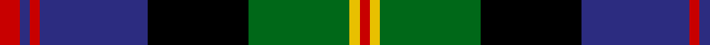

In pattern [RBRBKGYR](/patterns/rbrbkgyr/).

This was sourced from tartans-authority.  It is a [8 stripes tartan](/stripes/stripes8/).

Original link http://www.tartansauthority.com/tartan-ferret/display/2584/

## Attestations

This cloth appears in 2 source records; the oldest owns this page.

- pre 1746 — MacDonald of Borrodale (Clan) (tartans-authority, [record](http://www.tartansauthority.com/tartan-ferret/display/2584/))
- undated — MacDonald of Borrodale (register-of-tartans, [record](https://www.tartanregister.gov.uk/tartanDetails.aspx?ref=2351))

## Thread count
R/12 DB6 R6 DB64 K60 G60 Y6 R/6

## Palette
Each colour and its ΔE from the base-6 reference it is a variant of.

| Colour | Shade | Base | ΔE (OKLab) |
|---|---|---|---|
| DB | <code style="background-color:#2C2C80;">#2C2C80</code> `#2C2C80` | B <code style="background-color:#2A418A;">#2A418A</code> | 0.06 |
| G | <code style="background-color:#006818;">#006818</code> `#006818` | G <code style="background-color:#006100;">#006100</code> | 0.02 |
| K | <code style="background-color:#000000;">#000000</code> `#000000` | K <code style="background-color:#000000;">#000000</code> | 0.00 |
| R | <code style="background-color:#C80000;">#C80000</code> `#C80000` | R <code style="background-color:#CC0000;">#CC0000</code> | 0.01 |
| Y | <code style="background-color:#E8C000;">#E8C000</code> `#E8C000` | Y <code style="background-color:#F2BF00;">#F2BF00</code> | 0.02 |

# Sample pattern

## Nearest tartans

The nearest existing variants by ΔTartan distance.

1. [Royal College of Surgeons of Edinburgh](/setts/s9/b4ba16k2ba2k2ba2k13bb20w4x2~b5480b0-ba102040-bb505050-k000000-we0e0e0/) — ΔT 0.55
1. [Borrodale](/setts/s8/r5b3r3b29k29g29w4r4x2~b304080-g008000-k000000-rc00000-we0e0e0/) — ΔT 0.60
1. [MacLeod, Macleod of Harris](/setts/s7/r3k2g15k10b20k2y2x2~b304080-g008000-k000000-rc00000-yf0c000/) — ΔT 0.83
1. [Offally](/setts/s10/r7b2g5b18g10b2k24b2g10y3x2~b304080-g008000-k000000-r900030-yf0c000/) — ΔT 0.86
1. [Sandberg of Greenock (Personal)](/setts/s8/y3k12b1g5b12r1k2r1x4~b2c2c80-g006818-k101010-rc80000-ye8c000/) — ΔT 0.87
1. [Colquhoun](/setts/s7/r2g8w1k8b8k1b1x4~b304080-g008000-k000000-rc00000-we0e0e0/) — ΔT 0.89
1. [Genet, Citizen (Commem)](/setts/s7/r2k9g12b8r1b1w1x4~b1c0070-g006818-k101010-rc80000-we0e0e0/) — ΔT 0.90
1. [Scotch House 2000, antique](/setts/s8/b22r3b2r3b2k17ra18g4x2~b304080-g004010-k000000-rc00000-ra806050/) — ΔT 0.92
1. [MacLaren](/setts/s11/b22k4b4k4b4k22g22r6g6k2y3x2~b304080-g008000-k000000-rc00000-yf0c000/) — ΔT 0.93
1. [Barnes](/setts/s10/b20k3b3k3b3k16g2y3g12r2x2~b304080-g008000-k000000-rc00000-yf0c000/) — ΔT 0.93

## Neighbour map

Every grey dot is one of 15726 variants placed by the first two principal components of the ΔTartan feature space (44% of its variance). Red is this tartan; blue dots are its nearest — click one to open its page.

<svg viewBox="0 0 640 380" role="img" style="max-width:100%;height:auto;border:1px solid #e0e0e0;border-radius:4px;display:block" xmlns="http://www.w3.org/2000/svg"><image href="/nn/cloud.v1.png" width="640" height="380"/><a href="/setts/s9/b4ba16k2ba2k2ba2k13bb20w4x2~b5480b0-ba102040-bb505050-k000000-we0e0e0/"><circle cx="129.9" cy="168.5" r="4" fill="#3465a4"><title>Royal College of Surgeons of Edinburgh</title></circle></a><a href="/setts/s8/r5b3r3b29k29g29w4r4x2~b304080-g008000-k000000-rc00000-we0e0e0/"><circle cx="110.5" cy="167.2" r="4" fill="#3465a4"><title>Borrodale</title></circle></a><a href="/setts/s7/r3k2g15k10b20k2y2x2~b304080-g008000-k000000-rc00000-yf0c000/"><circle cx="147.6" cy="179.0" r="4" fill="#3465a4"><title>MacLeod, Macleod of Harris</title></circle></a><a href="/setts/s10/r7b2g5b18g10b2k24b2g10y3x2~b304080-g008000-k000000-r900030-yf0c000/"><circle cx="114.8" cy="158.8" r="4" fill="#3465a4"><title>Offally</title></circle></a><a href="/setts/s8/y3k12b1g5b12r1k2r1x4~b2c2c80-g006818-k101010-rc80000-ye8c000/"><circle cx="184.8" cy="167.4" r="4" fill="#3465a4"><title>Sandberg of Greenock (Personal)</title></circle></a><a href="/setts/s7/r2g8w1k8b8k1b1x4~b304080-g008000-k000000-rc00000-we0e0e0/"><circle cx="106.7" cy="191.7" r="4" fill="#3465a4"><title>Colquhoun</title></circle></a><a href="/setts/s7/r2k9g12b8r1b1w1x4~b1c0070-g006818-k101010-rc80000-we0e0e0/"><circle cx="167.4" cy="180.1" r="4" fill="#3465a4"><title>Genet, Citizen (Commem)</title></circle></a><a href="/setts/s8/b22r3b2r3b2k17ra18g4x2~b304080-g004010-k000000-rc00000-ra806050/"><circle cx="164.7" cy="171.9" r="4" fill="#3465a4"><title>Scotch House 2000, antique</title></circle></a><a href="/setts/s11/b22k4b4k4b4k22g22r6g6k2y3x2~b304080-g008000-k000000-rc00000-yf0c000/"><circle cx="123.7" cy="155.8" r="4" fill="#3465a4"><title>MacLaren</title></circle></a><a href="/setts/s10/b20k3b3k3b3k16g2y3g12r2x2~b304080-g008000-k000000-rc00000-yf0c000/"><circle cx="157.1" cy="161.0" r="4" fill="#3465a4"><title>Barnes</title></circle></a><circle cx="134.7" cy="165.9" r="5" fill="#c00000"/></svg>

ID: /setts/s8/r6b3r3b32k30g30y3r3x2~b2c2c80-g006818-k000000-rc80000-ye8c000/
