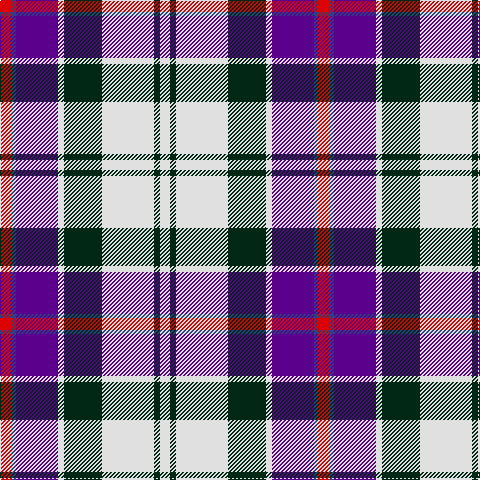

In pattern [RBBWGWGW](/stripes/rbbwgwgw/).

This was sourced from register-of-tartans.  It is a [8 stripe tartan](/stripes/stripes8/).

Original link https://www.tartanregister.gov.uk/tartanDetails.aspx?ref=824

## Also known as

This cloth is also recorded under:

- Culloden Dress Old
- Culloden, dress Ancient

## Attestations

This cloth appears in 2 source records; the oldest owns this page.

- undated — Culloden Dress Ancient (register-of-tartans, [record](https://www.tartanregister.gov.uk/tartanDetails.aspx?ref=824))
- undated — Culloden Dress Old Tartan Tartan Number: 1322. Earliest known date: 1983 Worn by a member of Prince Charles' staff during the battle but it is not known with which family or district it was first connected. It was first illustrated in Old & Rare in 1893 by D W Stewart whose son D C Stewart was a founder member of the Scottish Tartans Society. Now firmly established as a district tartan. See products available Copyright © Blair Urquhart, Comrie, 2015 (house-of-tartan, [record](http://www.house-of-tartan.scotland.net/house/TartanViewjs.asp?colr=Def&tnam=1322))

## Register references

External register numbers recorded for this tartan.

- Scottish Register of Tartans: [824](https://www.tartanregister.gov.uk/tartanDetails.aspx?ref=824)
- Scottish Tartans World Register: 1322

## Thread count
R/12 B4 P42 LN6 DG38 LN52 DG6 LN/10

## Palette
Each colour and the base-6 reference it is a variant of.

| Colour | Shade | Base |
|---|---|---|
| B | <code style="background-color:#2C4084;">#2C4084</code> `oklch(39.4% 0.117 268.3)` <small>#2C4084</small> | B <code style="background-color:#2A418A;">#2A418A</code> |
| DG | <code style="background-color:#002814;">#002814</code> `oklch(24.4% 0.059 156.5)` <small>#002814</small> | G <code style="background-color:#006100;">#006100</code> |
| LN | <code style="background-color:#E0E0E0;">#E0E0E0</code> `oklch(90.7% 0.000 89.9)` <small>#E0E0E0</small> | W <code style="background-color:#F7F7F7;">#F7F7F7</code> |
| P | <code style="background-color:#5A008C;">#5A008C</code> `oklch(37.0% 0.191 306.3)` <small>#5A008C</small> | B <code style="background-color:#2A418A;">#2A418A</code> |
| R | <code style="background-color:#DC0000;">#DC0000</code> `oklch(56.2% 0.230 29.2)` <small>#DC0000</small> | R <code style="background-color:#CC0000;">#CC0000</code> |

# Sample pattern

## Nearest tartans

The nearest existing variants by ΔTartan distance.

1. [Culloden, dress Ancient](/setts/s8/r6db2p21w3dg19w26dg3w5~x2/) — ΔT 0.47
1. [Davidson (Wedding) (Personal)](/setts/s7/r2db14k6g1w12g1w2~x4/) — ΔT 0.70
1. [Stewart of Appin, dress](/setts/s10/db8r3db34b3k9w31r5w3r3w8~x2/) — ΔT 0.87
1. [Ferguson Dress #2](/setts/s7/db68k42w32r5w32dg4w6/) — ΔT 0.91
1. [Ailsa, Craig](/setts/s8/r5w2db20ly2k16w18k2w5~x2/) — ΔT 0.91
1. [Stewart of Appin Dress Clan Tartan Tartan Number: 481. Earliest known date: pre 2003 The Stewarts of Appin fueded relentlessly with the Campbells, and they were supported in these pursuits and other military activities by some of the Clan MacColl, whose tartan is very similar. The Stewarts of Ardshiel, a branch of the Appin Clan, have a certified tartan of their own dating back to the 1820's, which has elements of the Appin design. Stewarts of Appin are descended from Dugald, the son of Sir John Stewart of Lorne who was murdered in 1463. Dugald established the Appin branch of the family by dividing his lands between his five sons. The tartan is worn by the Stonehaven pipe bands. See products available Copyright © Blair Urquhart, Comrie, 2015](/setts/s10/db8r3db34t3k9w31r5w3r3w8~x2/) — ΔT 0.93
1. [Stuart/Stewart of Appin Dress](/setts/s10/db8r3db34b3k9w31r5w3r3w8/) — ΔT 0.96
1. [Hebridean Arisaid Blue (Dance) Fashion Tartan Tartan Number: 6558. Earliest known date: 01/01/2005 Threadcount and colours aren't 100% original. Generated manually. See products available Copyright © Blair Urquhart, Comrie, 2015](/setts/s9/w17k2n6t6w1n1dp10k2dp3~x4/) — ΔT 0.98
1. [Manx Dress](/setts/s6/g4w28dp8ly2db17g4~x2/) — ΔT 1.01
1. [Pengelly, The Cornish (Name)](/setts/s7/lb5k26ly4lb24dp8k3r4~x2/) — ΔT 1.07

## Neighbour map

Every grey dot is one of 14299 variants placed by the first two principal components of the ΔTartan feature space (44% of its variance). Red is this tartan; blue dots are its nearest — click one to open its page.

<svg viewBox="0 0 640 380" role="img" style="max-width:100%;height:auto;border:1px solid #e0e0e0;border-radius:4px;display:block" xmlns="http://www.w3.org/2000/svg"><image href="/nn/cloud.v1.png" width="640" height="380"/><a href="/setts/s8/r6db2p21w3dg19w26dg3w5~x2/"><circle cx="155.5" cy="140.0" r="4" fill="#3465a4"><title>Culloden, dress Ancient</title></circle></a><a href="/setts/s7/r2db14k6g1w12g1w2~x4/"><circle cx="149.4" cy="138.7" r="4" fill="#3465a4"><title>Davidson (Wedding) (Personal)</title></circle></a><a href="/setts/s10/db8r3db34b3k9w31r5w3r3w8~x2/"><circle cx="165.9" cy="125.3" r="4" fill="#3465a4"><title>Stewart of Appin, dress</title></circle></a><a href="/setts/s7/db68k42w32r5w32dg4w6/"><circle cx="160.2" cy="148.1" r="4" fill="#3465a4"><title>Ferguson Dress #2</title></circle></a><a href="/setts/s8/r5w2db20ly2k16w18k2w5~x2/"><circle cx="116.9" cy="154.0" r="4" fill="#3465a4"><title>Ailsa, Craig</title></circle></a><a href="/setts/s10/db8r3db34t3k9w31r5w3r3w8~x2/"><circle cx="168.0" cy="126.1" r="4" fill="#3465a4"><title>Stewart of Appin Dress Clan Tartan Tartan Number: 481. Earliest known date: pre 2003 The Stewarts of Appin fueded relentlessly with the Campbells, and they were supported in these pursuits and other military activities by some of the Clan MacColl, whose tartan is very similar. The Stewarts of Ardshiel, a branch of the Appin Clan, have a certified tartan of their own dating back to the 1820's, which has elements of the Appin design. Stewarts of Appin are descended from Dugald, the son of Sir John Stewart of Lorne who was murdered in 1463. Dugald established the Appin branch of the family by dividing his lands between his five sons. The tartan is worn by the Stonehaven pipe bands. See products available Copyright © Blair Urquhart, Comrie, 2015</title></circle></a><a href="/setts/s10/db8r3db34b3k9w31r5w3r3w8/"><circle cx="169.3" cy="126.5" r="4" fill="#3465a4"><title>Stuart/Stewart of Appin Dress</title></circle></a><a href="/setts/s9/w17k2n6t6w1n1dp10k2dp3~x4/"><circle cx="152.3" cy="122.8" r="4" fill="#3465a4"><title>Hebridean Arisaid Blue (Dance) Fashion Tartan Tartan Number: 6558. Earliest known date: 01/01/2005 Threadcount and colours aren't 100% original. Generated manually. See products available Copyright © Blair Urquhart, Comrie, 2015</title></circle></a><a href="/setts/s6/g4w28dp8ly2db17g4~x2/"><circle cx="181.6" cy="150.5" r="4" fill="#3465a4"><title>Manx Dress</title></circle></a><a href="/setts/s7/lb5k26ly4lb24dp8k3r4~x2/"><circle cx="152.6" cy="162.2" r="4" fill="#3465a4"><title>Pengelly, The Cornish (Name)</title></circle></a><circle cx="152.5" cy="141.5" r="5" fill="#c00000"/></svg>

ID: /setts/s8/r6db2dp21w3dg19w26dg3w5~x2/
