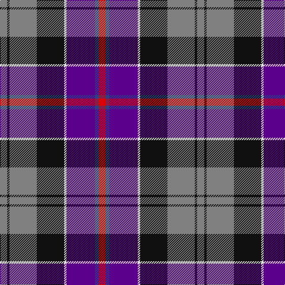

**Bands:** [GKGKWBBR](/stripes/gkgkwbbr/) · **Stripes:** [Y K Y K W DP DB R](/stripes/stripes8/) Y K Y K W DP DB R

This was sourced from register-of-tartans.  It is a [8 band tartan](/bands/bands8/).

Original link https://www.tartanregister.gov.uk/tartanDetails.aspx?ref=825

## Register references

External register numbers recorded for this tartan.

- Scottish Register of Tartans: [825](https://www.tartanregister.gov.uk/tartanDetails.aspx?ref=825)
- Scottish Tartans World Register: 1289

## Thread count
N/12 K4 N46 K46 LN4 P48 B6 R/12

## Palette
Each colour and its ΔE from the base-6 reference it is a variant of.

| Colour | Shade | Base | ΔE (OKLab) |
|---|---|---|---|
| B | <code style="background-color:#2C4084;">#2C4084</code> `#2C4084` | B <code style="background-color:#2A418A;">#2A418A</code> | 0.01 |
| K | <code style="background-color:#101010;">#101010</code> `#101010` | K <code style="background-color:#000000;">#000000</code> | 0.17 |
| LN | <code style="background-color:#E0E0E0;">#E0E0E0</code> `#E0E0E0` | W <code style="background-color:#F7F7F7;">#F7F7F7</code> | 0.07 |
| N | <code style="background-color:#808080;">#808080</code> `#808080` | G <code style="background-color:#006100;">#006100</code> | 0.23 |
| P | <code style="background-color:#5A008C;">#5A008C</code> `#5A008C` | B <code style="background-color:#2A418A;">#2A418A</code> | 0.13 |
| R | <code style="background-color:#DC0000;">#DC0000</code> `#DC0000` | R <code style="background-color:#CC0000;">#CC0000</code> | 0.03 |

# Sample pattern

## Nearest tartans

The nearest existing variants by ΔTartan distance.

1. [Galway County Crest (Fashion)](/setts/s9/o10t5db15k3db15k5r25k3w4~x2/) — ΔT 0.83
1. [Dean/Dundas (Melbourne, Australia) (Personal)](/setts/s9/r17k5n4k6ly5db31k5g6n3~x2/) — ΔT 0.88
1. [Culloden, Grey](/setts/s8/r6db3p24w2k23y23k2y6~x2/) — ΔT 0.93
1. [Eichelberger (Perrsonal)](/setts/s7/k20r6ly3db24g3r8w4~x2/) — ΔT 0.99
1. [Loch Etive](/setts/s8/lb3g2r21k26db18k2db3ly3~x2/) — ΔT 1.06
1. [Unidentified Scarlett #7](/setts/s10/dp22r3k22g22ly2g22k22r3dp22w3~x2/) — ΔT 1.08
1. [Commonwealth Games 1998](/setts/s11/dg10m2dg2r4dg16dp16r2t18lo2t8r3~x2/) — ΔT 1.10
1. [Tantallon](/setts/s10/ly3k21r7k2g10k2r7k2db21w3~x2/) — ΔT 1.13
1. [Wcwm 1873-4](/setts/s11/o6do1o2do2o1do4dp14k4db1k3ly1~x4/) — ΔT 1.14
1. [Asman, Dress (Name)](/setts/s11/db4ly3db22o6w2r6w2k6k20r3k4~x2/) — ΔT 1.15

## Neighbour map

Every grey dot is one of 14313 variants placed by the first two principal components of the ΔTartan feature space (44% of its variance). Red is this tartan; blue dots are its nearest — click one to open its page.

<svg viewBox="0 0 640 380" role="img" style="max-width:100%;height:auto;border:1px solid #e0e0e0;border-radius:4px;display:block" xmlns="http://www.w3.org/2000/svg"><image href="/nn/cloud.v1.png" width="640" height="380"/><a href="/setts/s9/o10t5db15k3db15k5r25k3w4~x2/"><circle cx="124.4" cy="172.8" r="4" fill="#3465a4"><title>Galway County Crest (Fashion)</title></circle></a><a href="/setts/s9/r17k5n4k6ly5db31k5g6n3~x2/"><circle cx="132.4" cy="137.3" r="4" fill="#3465a4"><title>Dean/Dundas (Melbourne, Australia) (Personal)</title></circle></a><a href="/setts/s8/r6db3p24w2k23y23k2y6~x2/"><circle cx="119.8" cy="140.9" r="4" fill="#3465a4"><title>Culloden, Grey</title></circle></a><a href="/setts/s7/k20r6ly3db24g3r8w4~x2/"><circle cx="117.6" cy="168.5" r="4" fill="#3465a4"><title>Eichelberger (Perrsonal)</title></circle></a><a href="/setts/s8/lb3g2r21k26db18k2db3ly3~x2/"><circle cx="158.4" cy="135.9" r="4" fill="#3465a4"><title>Loch Etive</title></circle></a><a href="/setts/s10/dp22r3k22g22ly2g22k22r3dp22w3~x2/"><circle cx="113.1" cy="165.2" r="4" fill="#3465a4"><title>Unidentified Scarlett #7</title></circle></a><a href="/setts/s11/dg10m2dg2r4dg16dp16r2t18lo2t8r3~x2/"><circle cx="126.3" cy="154.9" r="4" fill="#3465a4"><title>Commonwealth Games 1998</title></circle></a><a href="/setts/s10/ly3k21r7k2g10k2r7k2db21w3~x2/"><circle cx="118.3" cy="141.1" r="4" fill="#3465a4"><title>Tantallon</title></circle></a><a href="/setts/s11/o6do1o2do2o1do4dp14k4db1k3ly1~x4/"><circle cx="150.1" cy="117.8" r="4" fill="#3465a4"><title>Wcwm 1873-4</title></circle></a><a href="/setts/s11/db4ly3db22o6w2r6w2k6k20r3k4~x2/"><circle cx="146.2" cy="132.6" r="4" fill="#3465a4"><title>Asman, Dress (Name)</title></circle></a><circle cx="138.4" cy="151.8" r="5" fill="#c00000"/></svg>

ID: /setts/s8/r6db3dp24w2k23y23k2y6~x2/
