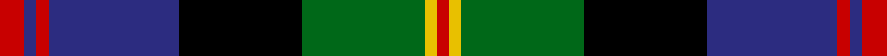
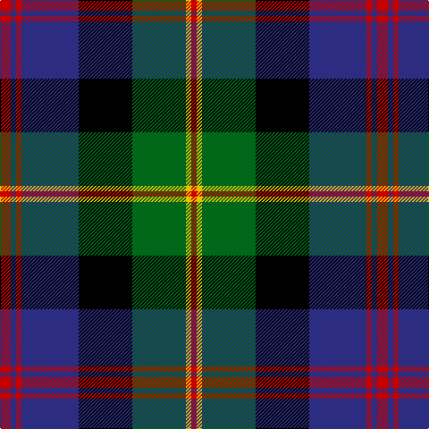

In pattern [RBRBKGYR](/stripes/rbrbkgyr/).

This was sourced from tartans-authority.  It is a [8 stripe tartan](/stripes/stripes8/).

Original link http://www.tartansauthority.com/tartan-ferret/display/2584/

## Attestations

This cloth appears in 2 source records; the oldest owns this page.

- pre 1746 — MacDonald of Borrodale (Clan) (tartans-authority, [record](http://www.tartansauthority.com/tartan-ferret/display/2584/))
- undated — MacDonald of Borrodale (register-of-tartans, [record](https://www.tartanregister.gov.uk/tartanDetails.aspx?ref=2351))

## Register references

External register numbers recorded for this tartan.

- Scottish Register of Tartans: [2351](https://www.tartanregister.gov.uk/tartanDetails.aspx?ref=2351)
- Scottish Tartans Authority (ITI): 2584
- Scottish Tartans World Register: 2584

## Thread count
R/12 DB6 R6 DB64 K60 G60 Y6 R/6

## Palette
Each colour and the base-6 reference it is a variant of.

| Colour | Shade | Base |
|---|---|---|
| DB | <code style="background-color:#2C2C80;">#2C2C80</code> `oklch(35.0% 0.138 276.6)` <small>#2C2C80</small> | B <code style="background-color:#2A418A;">#2A418A</code> |
| G | <code style="background-color:#006818;">#006818</code> `oklch(45.0% 0.142 145.0)` <small>#006818</small> | G <code style="background-color:#006100;">#006100</code> |
| K | <code style="background-color:#000000;">#000000</code> `oklch(0.0% 0.000 0.0)` <small>#000000</small> | K <code style="background-color:#000000;">#000000</code> |
| R | <code style="background-color:#C80000;">#C80000</code> `oklch(52.3% 0.215 29.2)` <small>#C80000</small> | R <code style="background-color:#CC0000;">#CC0000</code> |
| Y | <code style="background-color:#E8C000;">#E8C000</code> `oklch(81.9% 0.168 93.7)` <small>#E8C000</small> | Y <code style="background-color:#F2BF00;">#F2BF00</code> |

# Sample pattern

## Nearest tartans

The nearest existing variants by ΔTartan distance.

1. [Royal College of Surgeons of Edinburgh](/setts/s9/t4dt16k2dt2k2dt2k13n20w4~x2/) — ΔT 0.55
1. [Borrodale](/setts/s8/r5db3r3db29k29g29w4r4~x2/) — ΔT 0.60
1. [MacLeod, Macleod of Harris](/setts/s7/r3k2g15k10db20k2ly2~x2/) — ΔT 0.84
1. [Offally](/setts/s10/r7db2g5db18g10db2k24db2g10ly3~x2/) — ΔT 0.86
1. [Sandberg of Greenock (Personal)](/setts/s8/ly3k12db1g5db12r1k2r1~x4/) — ΔT 0.87
1. [Colquhoun](/setts/s7/r2g8w1k8db8k1db1~x4/) — ΔT 0.89
1. [Genet, Citizen (Commem)](/setts/s7/r2k9g12db8r1db1w1~x4/) — ΔT 0.89
1. [Scotch House 2000, antique](/setts/s8/db22r3db2r3db2k17o18dg4~x2/) — ΔT 0.92
1. [MacLaren](/setts/s11/db22k4db4k4db4k22g22r6g6k2ly3~x2/) — ΔT 0.93
1. [Barnes](/setts/s10/db20k3db3k3db3k16g2ly3g12r2~x2/) — ΔT 0.93

## Neighbour map

Every grey dot is one of 14299 variants placed by the first two principal components of the ΔTartan feature space (44% of its variance). Red is this tartan; blue dots are its nearest — click one to open its page.

<svg viewBox="0 0 640 380" role="img" style="max-width:100%;height:auto;border:1px solid #e0e0e0;border-radius:4px;display:block" xmlns="http://www.w3.org/2000/svg"><image href="/nn/cloud.v1.png" width="640" height="380"/><a href="/setts/s9/t4dt16k2dt2k2dt2k13n20w4~x2/"><circle cx="133.8" cy="170.9" r="4" fill="#3465a4"><title>Royal College of Surgeons of Edinburgh</title></circle></a><a href="/setts/s8/r5db3r3db29k29g29w4r4~x2/"><circle cx="114.3" cy="167.9" r="4" fill="#3465a4"><title>Borrodale</title></circle></a><a href="/setts/s7/r3k2g15k10db20k2ly2~x2/"><circle cx="151.4" cy="179.5" r="4" fill="#3465a4"><title>MacLeod, Macleod of Harris</title></circle></a><a href="/setts/s10/r7db2g5db18g10db2k24db2g10ly3~x2/"><circle cx="118.8" cy="160.3" r="4" fill="#3465a4"><title>Offally</title></circle></a><a href="/setts/s8/ly3k12db1g5db12r1k2r1~x4/"><circle cx="188.2" cy="169.7" r="4" fill="#3465a4"><title>Sandberg of Greenock (Personal)</title></circle></a><a href="/setts/s7/r2g8w1k8db8k1db1~x4/"><circle cx="110.8" cy="192.2" r="4" fill="#3465a4"><title>Colquhoun</title></circle></a><a href="/setts/s7/r2k9g12db8r1db1w1~x4/"><circle cx="170.9" cy="183.2" r="4" fill="#3465a4"><title>Genet, Citizen (Commem)</title></circle></a><a href="/setts/s8/db22r3db2r3db2k17o18dg4~x2/"><circle cx="167.8" cy="174.0" r="4" fill="#3465a4"><title>Scotch House 2000, antique</title></circle></a><a href="/setts/s11/db22k4db4k4db4k22g22r6g6k2ly3~x2/"><circle cx="127.7" cy="157.0" r="4" fill="#3465a4"><title>MacLaren</title></circle></a><a href="/setts/s10/db20k3db3k3db3k16g2ly3g12r2~x2/"><circle cx="161.0" cy="161.7" r="4" fill="#3465a4"><title>Barnes</title></circle></a><circle cx="138.5" cy="167.3" r="5" fill="#c00000"/></svg>

ID: /setts/s8/r6db3r3db32k30g30ly3r3~x2/
