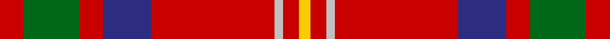

**Bands:** [RGRBRWRY](/stripes/rgrbrwry/) · **Stripes:** [R G R DB R LB R LY](/stripes/stripes8/) R G R DB R LB R LY

This was sourced from tartans-authority.  It is a [8 band tartan](/bands/bands8/).

Original link http://www.tartansauthority.com/tartan-ferret/display/10768/

## Thread count
R/12 G28 R12 DB24 R62 N4 R8 Y/6

## Palette
Each colour and its ΔE from the base-6 reference it is a variant of.

| Colour | Shade | Base | ΔE (OKLab) |
|---|---|---|---|
| DB | <code style="background-color:#2C2C80;">#2C2C80</code> `#2C2C80` | B <code style="background-color:#2A418A;">#2A418A</code> | 0.06 |
| G | <code style="background-color:#006818;">#006818</code> `#006818` | G <code style="background-color:#006100;">#006100</code> | 0.02 |
| N | <code style="background-color:#C0C0C0;">#C0C0C0</code> `#C0C0C0` | W <code style="background-color:#F7F7F7;">#F7F7F7</code> | 0.17 |
| R | <code style="background-color:#C80000;">#C80000</code> `#C80000` | R <code style="background-color:#CC0000;">#CC0000</code> | 0.01 |
| Y | <code style="background-color:#FCCC00;">#FCCC00</code> `#FCCC00` | Y <code style="background-color:#F2BF00;">#F2BF00</code> | 0.04 |

# Sample pattern

## Nearest tartans

The nearest existing variants by ΔTartan distance.

1. [Loch Lochy](/setts/s8/r6dg14r6db11r31lb2r4ly3~x2/) — ΔT 0.53
1. [Loch Creran (District)](/setts/s11/r6dg8ly2dg8r6dt8r29dg3lb2r5dt3~x2/) — ΔT 0.85
1. [Sturrock, Blue/Black (Clan)](/setts/s7/r52b16k16g22r16lo3r16~x2/) — ΔT 0.90
1. [MacDuff](/setts/s7/r96db16dg34dg48r18k6r9/) — ΔT 0.93
1. [Hoben (Personal)](/setts/s11/k3w1r20db4r4g10r4db4r20k1w3~x2/) — ΔT 1.04
1. [Justerini & Brooks](/setts/s9/r48ly14r9g14k6r11g6r10g3~x2/) — ΔT 1.05
1. [Chisholm](/setts/s8/r12dp2lb1dp2r3dg8r3dp1/) — ΔT 1.05
1. [Melieres, Michel (Personal)](/setts/s9/k2r1g8r3g3r14ly1r1w2~x2/) — ΔT 1.11
1. [Loch Linnhe](/setts/s10/g3r6db12r5lt2g10r31db2r4ly3~x2/) — ΔT 1.15
1. [Chisholm, The](/setts/s8/r12b2w1b2r3g8r3b1~x4/) — ΔT 1.16

## Neighbour map

Every grey dot is one of 14299 variants placed by the first two principal components of the ΔTartan feature space (44% of its variance). Red is this tartan; blue dots are its nearest — click one to open its page.

<svg viewBox="0 0 640 380" role="img" style="max-width:100%;height:auto;border:1px solid #e0e0e0;border-radius:4px;display:block" xmlns="http://www.w3.org/2000/svg"><image href="/nn/cloud.v1.png" width="640" height="380"/><a href="/setts/s8/r6dg14r6db11r31lb2r4ly3~x2/"><circle cx="332.5" cy="143.3" r="4" fill="#3465a4"><title>Loch Lochy</title></circle></a><a href="/setts/s11/r6dg8ly2dg8r6dt8r29dg3lb2r5dt3~x2/"><circle cx="317.3" cy="136.1" r="4" fill="#3465a4"><title>Loch Creran (District)</title></circle></a><a href="/setts/s7/r52b16k16g22r16lo3r16~x2/"><circle cx="317.0" cy="172.8" r="4" fill="#3465a4"><title>Sturrock, Blue/Black (Clan)</title></circle></a><a href="/setts/s7/r96db16dg34dg48r18k6r9/"><circle cx="294.1" cy="155.8" r="4" fill="#3465a4"><title>MacDuff</title></circle></a><a href="/setts/s11/k3w1r20db4r4g10r4db4r20k1w3~x2/"><circle cx="361.4" cy="115.8" r="4" fill="#3465a4"><title>Hoben (Personal)</title></circle></a><a href="/setts/s9/r48ly14r9g14k6r11g6r10g3~x2/"><circle cx="355.8" cy="138.1" r="4" fill="#3465a4"><title>Justerini &amp; Brooks</title></circle></a><a href="/setts/s8/r12dp2lb1dp2r3dg8r3dp1/"><circle cx="330.1" cy="178.1" r="4" fill="#3465a4"><title>Chisholm</title></circle></a><a href="/setts/s9/k2r1g8r3g3r14ly1r1w2~x2/"><circle cx="300.1" cy="135.2" r="4" fill="#3465a4"><title>Melieres, Michel (Personal)</title></circle></a><a href="/setts/s10/g3r6db12r5lt2g10r31db2r4ly3~x2/"><circle cx="307.6" cy="116.4" r="4" fill="#3465a4"><title>Loch Linnhe</title></circle></a><a href="/setts/s8/r12b2w1b2r3g8r3b1~x4/"><circle cx="321.2" cy="176.2" r="4" fill="#3465a4"><title>Chisholm, The</title></circle></a><circle cx="334.9" cy="149.1" r="5" fill="#c00000"/></svg>

ID: /setts/s8/r6g14r6db12r31lb2r4ly3~x2/
