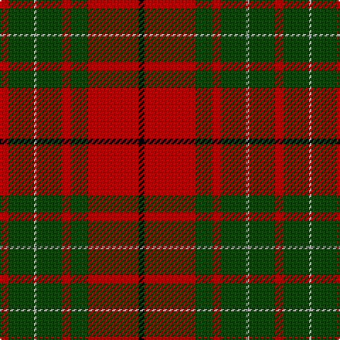

In pattern [KRGRGYGR](/patterns/krgrgygr/).

This was sourced from weddslist.  It is a [8 stripes tartan](/stripes/stripes8/).

Original link http://www.weddslist.com/cgi-bin/tartans/pg.pl?source=tinsel

## Attestations

This cloth appears in 2 source records; the oldest owns this page.

- undated — Cumming SM (weddslist, [record](http://www.weddslist.com/cgi-bin/tartans/pg.pl?source=tinsel))
- undated — Cumming SM (weddslist, [record](http://www.weddslist.com/cgi-bin/tartans/pg.pl?source=x))

## Thread count
DR/6 DG18 N2 DG18 DR6 DG12 DR36 K/4

## Palette
Each colour and its ΔE from the base-6 reference it is a variant of.

| Colour | Shade | Base | ΔE (OKLab) |
|---|---|---|---|
| DG | <code style="background-color:#11450D;">#11450D</code> `#11450D` | G <code style="background-color:#006400;">#006400</code> | 0.10 |
| DR | <code style="background-color:#AA0000;">#AA0000</code> `#AA0000` | R <code style="background-color:#C80000;">#C80000</code> | 0.06 |
| K | <code style="background-color:#000000;">#000000</code> `#000000` | K <code style="background-color:#000000;">#000000</code> | 0.00 |
| N | <code style="background-color:#AAAAAA;">#AAAAAA</code> `#AAAAAA` | Y <code style="background-color:#E8C000;">#E8C000</code> | 0.19 |

# Sample pattern

## Nearest tartans

The nearest existing variants by ΔTartan distance.

1. [Cumming SM](/setts/s8/r3g9w1g9r3g6r18k2-g004c00-k000000-rc80000-wd0d0d0/) — ΔT 0.85
1. [MacAulay](/setts/s6/k4r32g12r6g16y2-g11450d-k000000-raa0000-yaaaaaa/) — ΔT 0.88
1. [MacAulay](/setts/s6/k2r16g6r3g8y1-g11450d-k000000-raa0000-yaaaaaa/) — ΔT 0.88
1. [McNee (Name)](/setts/s7/k9w2r50g42r16g17k4-g006818-k101010-r880000-we0e0e0/) — ΔT 0.88
1. [Comyn or MacAulay Tartan Tartan Number: 1157. Earliest known date: 1850 This sett closely resembles the 'Vestiarium' version, but is in fact the one given by Logan as MacAuley and illustrated by MacIan in 'The Clans of the Scottish Highlands', 1847. The Smith brothers said that the sett had the approval of the head of the family og Cumming. See products available Copyright © Blair Urquhart, Comrie, 2015](/setts/s8/r6g18w2g18r6g12r36k4-g006818-k101010-rc80000-we0e0e0/) — ΔT 0.89
1. [Cumming #2](/setts/s8/r6g18w2g18r6g12r36k4-g006818-k101010-rc80000-wfcfcfc/) — ΔT 0.95
1. [Comyn](/setts/s8/k2r18g4r4g8y2g8r2-g11450d-k000000-raa0000-yaaaaaa/) — ΔT 1.12
1. [Comyn](/setts/s8/k1r9g2r2g4y1g4r1-g11450d-k000000-raa0000-yaaaaaa/) — ΔT 1.12
1. [Finnlaggan](/setts/s6/g14w2g36b12r36g4-b304080-g003000-rc00000-we0e0e0/) — ΔT 1.13
1. [Oriel #1 (District)](/setts/s9/r24b4r6g40k8g40r60k4r2-b2c2c80-g006818-k101010-rc80000/) — ΔT 1.17

## Neighbour map

Every grey dot is one of 15726 variants placed by the first two principal components of the ΔTartan feature space (44% of its variance). Red is this tartan; blue dots are its nearest — click one to open its page.

<svg viewBox="0 0 640 380" role="img" style="max-width:100%;height:auto;border:1px solid #e0e0e0;border-radius:4px;display:block" xmlns="http://www.w3.org/2000/svg"><image href="/nn/cloud.v1.png" width="640" height="380"/><a href="/setts/s8/r3g9w1g9r3g6r18k2-g004c00-k000000-rc80000-wd0d0d0/"><circle cx="307.8" cy="175.5" r="4" fill="#3465a4"><title>Cumming SM</title></circle></a><a href="/setts/s6/k4r32g12r6g16y2-g11450d-k000000-raa0000-yaaaaaa/"><circle cx="342.8" cy="196.6" r="4" fill="#3465a4"><title>MacAulay</title></circle></a><a href="/setts/s6/k2r16g6r3g8y1-g11450d-k000000-raa0000-yaaaaaa/"><circle cx="342.8" cy="196.6" r="4" fill="#3465a4"><title>MacAulay</title></circle></a><a href="/setts/s7/k9w2r50g42r16g17k4-g006818-k101010-r880000-we0e0e0/"><circle cx="337.8" cy="181.8" r="4" fill="#3465a4"><title>McNee (Name)</title></circle></a><a href="/setts/s8/r6g18w2g18r6g12r36k4-g006818-k101010-rc80000-we0e0e0/"><circle cx="315.8" cy="178.3" r="4" fill="#3465a4"><title>Comyn or MacAulay Tartan Tartan Number: 1157. Earliest known date: 1850 This sett closely resembles the 'Vestiarium' version, but is in fact the one given by Logan as MacAuley and illustrated by MacIan in 'The Clans of the Scottish Highlands', 1847. The Smith brothers said that the sett had the approval of the head of the family og Cumming. See products available Copyright © Blair Urquhart, Comrie, 2015</title></circle></a><a href="/setts/s8/r6g18w2g18r6g12r36k4-g006818-k101010-rc80000-wfcfcfc/"><circle cx="312.8" cy="177.0" r="4" fill="#3465a4"><title>Cumming #2</title></circle></a><a href="/setts/s8/k2r18g4r4g8y2g8r2-g11450d-k000000-raa0000-yaaaaaa/"><circle cx="304.9" cy="205.1" r="4" fill="#3465a4"><title>Comyn</title></circle></a><a href="/setts/s8/k1r9g2r2g4y1g4r1-g11450d-k000000-raa0000-yaaaaaa/"><circle cx="304.9" cy="205.1" r="4" fill="#3465a4"><title>Comyn</title></circle></a><a href="/setts/s6/g14w2g36b12r36g4-b304080-g003000-rc00000-we0e0e0/"><circle cx="314.8" cy="196.2" r="4" fill="#3465a4"><title>Finnlaggan</title></circle></a><a href="/setts/s9/r24b4r6g40k8g40r60k4r2-b2c2c80-g006818-k101010-rc80000/"><circle cx="343.7" cy="144.9" r="4" fill="#3465a4"><title>Oriel #1 (District)</title></circle></a><circle cx="330.3" cy="187.8" r="5" fill="#c00000"/></svg>

ID: /setts/s8/r6g18y2g18r6g12r36k4-g11450d-k000000-raa0000-yaaaaaa/
