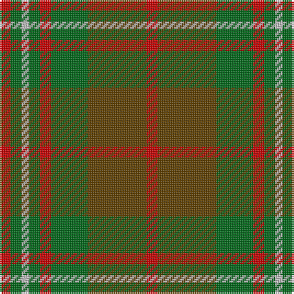

In pattern [RGGRGWGR](/patterns/rggrgwgr/).

This was sourced from tartans-authority.  It is a [8 stripes tartan](/stripes/stripes8/).

Original link http://www.tartansauthority.com/tartan-ferret/display/1546/

## Thread count
R/6 G6 N4 G6 R6 G20 T32 R/6

## Palette
Each colour and its ΔE from the base-6 reference it is a variant of.

| Colour | Shade | Base | ΔE (OKLab) |
|---|---|---|---|
| G | <code style="background-color:#006818;">#006818</code> `#006818` | G <code style="background-color:#006400;">#006400</code> | 0.02 |
| N | <code style="background-color:#C0C0C0;">#C0C0C0</code> `#C0C0C0` | W <code style="background-color:#F4F4F0;">#F4F4F0</code> | 0.16 |
| R | <code style="background-color:#C80000;">#C80000</code> `#C80000` | R <code style="background-color:#C80000;">#C80000</code> | 0.00 |
| T | <code style="background-color:#604000;">#604000</code> `#604000` | G <code style="background-color:#006400;">#006400</code> | 0.14 |

# Sample pattern

## Nearest tartans

The nearest existing variants by ΔTartan distance.

1. [Ballantrae (Dalgety)](/setts/s7/g10r6g62ga40g6gb44r10-g604000-ga003820-gb289c18-rc80000/) — ΔT 1.04
1. [Moncton, City of](/setts/s9/g16r4b8r4g40ga20r12ga40y4-b2c2c80-g006818-ga885c00-rc80000-ye8c000/) — ΔT 1.13
1. [Loch Rannoch Trade Tartan Tartan Number: 1735. Earliest known date: 1975 Nothing See products available Copyright © Blair Urquhart, Comrie, 2015](/setts/s8/b48g4b10y28g4y10ga34b4-b441800-g006818-ga604000-ya08858/) — ΔT 1.13
1. [Glen Esk (1993)](/setts/s7/g8r4g32r20ga20r4ga8-g005020-ga5c6428-rdc0000/) — ΔT 1.16
1. [Glen Esk (Fashion)](/setts/s7/g8r4g32r20ga20r4ga8-g004c00-ga6c6c00-rc80000/) — ΔT 1.16
1. [Ballintrae Trade Tartan Tartan Number: 1541. Earliest known date: 1982 Many new designs have been given district names to promote their Scottish connections. However, these names should not be confused with the District tartans which have earned their title through 'use and wont' and not a little history. See products available Copyright © Blair Urquhart, Comrie, 2015](/setts/s7/g10r5g62ga40g5gb44r10-g604000-ga003820-gb289c18-rc80000/) — ΔT 1.18
1. [Monaghan](/setts/s9/y6b4r28g34b28y16r28b4y6-b401000-g008000-r806050-yd08010/) — ΔT 1.20
1. [Monaghan, County (District)](/setts/s9/y6b4r28y16b28g32r26b4y6-b4c3428-g003820-ra03400-ybc8c00/) — ΔT 1.22
1. [Scott Hunting](/setts/s14/g32ga20r6ga6w4ga6r6ga6w4ga6r6ga20g32r6-g604000-ga006818-rc80000-wc0c0c0/) — ΔT 1.24
1. [Loch Rannoch](/setts/s8/b48g4b10r28g4r10ra34b4-b401000-g008000-r906030-ra806050/) — ΔT 1.28

## Neighbour map

Every grey dot is one of 15726 variants placed by the first two principal components of the ΔTartan feature space (44% of its variance). Red is this tartan; blue dots are its nearest — click one to open its page.

<svg viewBox="0 0 640 380" role="img" style="max-width:100%;height:auto;border:1px solid #e0e0e0;border-radius:4px;display:block" xmlns="http://www.w3.org/2000/svg"><image href="/nn/cloud.v1.png" width="640" height="380"/><a href="/setts/s7/g10r6g62ga40g6gb44r10-g604000-ga003820-gb289c18-rc80000/"><circle cx="259.3" cy="220.9" r="4" fill="#3465a4"><title>Ballantrae (Dalgety)</title></circle></a><a href="/setts/s9/g16r4b8r4g40ga20r12ga40y4-b2c2c80-g006818-ga885c00-rc80000-ye8c000/"><circle cx="254.3" cy="202.4" r="4" fill="#3465a4"><title>Moncton, City of</title></circle></a><a href="/setts/s8/b48g4b10y28g4y10ga34b4-b441800-g006818-ga604000-ya08858/"><circle cx="275.4" cy="202.0" r="4" fill="#3465a4"><title>Loch Rannoch Trade Tartan Tartan Number: 1735. Earliest known date: 1975 Nothing See products available Copyright © Blair Urquhart, Comrie, 2015</title></circle></a><a href="/setts/s7/g8r4g32r20ga20r4ga8-g005020-ga5c6428-rdc0000/"><circle cx="270.3" cy="253.9" r="4" fill="#3465a4"><title>Glen Esk (1993)</title></circle></a><a href="/setts/s7/g8r4g32r20ga20r4ga8-g004c00-ga6c6c00-rc80000/"><circle cx="272.7" cy="255.5" r="4" fill="#3465a4"><title>Glen Esk (Fashion)</title></circle></a><a href="/setts/s7/g10r5g62ga40g5gb44r10-g604000-ga003820-gb289c18-rc80000/"><circle cx="267.7" cy="213.2" r="4" fill="#3465a4"><title>Ballintrae Trade Tartan Tartan Number: 1541. Earliest known date: 1982 Many new designs have been given district names to promote their Scottish connections. However, these names should not be confused with the District tartans which have earned their title through 'use and wont' and not a little history. See products available Copyright © Blair Urquhart, Comrie, 2015</title></circle></a><a href="/setts/s9/y6b4r28g34b28y16r28b4y6-b401000-g008000-r806050-yd08010/"><circle cx="183.5" cy="217.4" r="4" fill="#3465a4"><title>Monaghan</title></circle></a><a href="/setts/s9/y6b4r28y16b28g32r26b4y6-b4c3428-g003820-ra03400-ybc8c00/"><circle cx="200.2" cy="227.1" r="4" fill="#3465a4"><title>Monaghan, County (District)</title></circle></a><a href="/setts/s14/g32ga20r6ga6w4ga6r6ga6w4ga6r6ga20g32r6-g604000-ga006818-rc80000-wc0c0c0/"><circle cx="254.8" cy="204.7" r="4" fill="#3465a4"><title>Scott Hunting</title></circle></a><a href="/setts/s8/b48g4b10r28g4r10ra34b4-b401000-g008000-r906030-ra806050/"><circle cx="290.4" cy="207.2" r="4" fill="#3465a4"><title>Loch Rannoch</title></circle></a><circle cx="245.8" cy="221.7" r="5" fill="#c00000"/></svg>

ID: /setts/s8/r6g32ga20r6ga6w4ga6r6-g604000-ga006818-rc80000-wc0c0c0/
