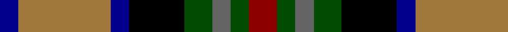

In pattern [BRBKGBGR](/patterns/brbkgbgr/).

This was sourced from register-of-tartans.  It is a [8 stripes tartan](/stripes/stripes8/).

Original link https://www.tartanregister.gov.uk/tartanDetails.aspx?ref=4936

## Attestations

This cloth appears in 2 source records; the oldest owns this page.

- 01/01/1982 — Burnfoot Check (register-of-tartans, [record](https://www.tartanregister.gov.uk/tartanDetails.aspx?ref=4936))
- 1982 — Burnfoot Check (Fashion) (tartans-authority, [record](http://www.tartansauthority.com/tartan-ferret/display/3773/))

## Thread count
DB/4 LT20 DB4 K12 G6 N4 G4 DR/6

## Palette
Each colour and its ΔE from the base-6 reference it is a variant of.

| Colour | Shade | Base | ΔE (OKLab) |
|---|---|---|---|
| DB | <code style="background-color:#00008C;">#00008C</code> `#00008C` | B <code style="background-color:#2C4084;">#2C4084</code> | 0.13 |
| DR | <code style="background-color:#8C0000;">#8C0000</code> `#8C0000` | R <code style="background-color:#C80000;">#C80000</code> | 0.13 |
| G | <code style="background-color:#004C00;">#004C00</code> `#004C00` | G <code style="background-color:#006400;">#006400</code> | 0.08 |
| K | <code style="background-color:#000000;">#000000</code> `#000000` | K <code style="background-color:#000000;">#000000</code> | 0.00 |
| LT | <code style="background-color:#A0783C;">#A0783C</code> `#A0783C` | R <code style="background-color:#C80000;">#C80000</code> | 0.18 |
| N | <code style="background-color:#646464;">#646464</code> `#646464` | B <code style="background-color:#2C4084;">#2C4084</code> | 0.16 |

# Sample pattern

## Nearest tartans

The nearest existing variants by ΔTartan distance.

1. [Caledonian Labrador Retrievers](/setts/s8/r42b8ba10b8r10k42g42y10-b000048-ba501400-g006818-k101010-r9c68a4-yfccc00/) — ΔT 0.67
1. [Eichelberger Family, Jörg (Personal)](/setts/s7/k40r12y16b48g16r16w8-b1a2b47-g124b24-k010512-r89051b-wddd5af-yef8f06/) — ΔT 0.83
1. [Bro-Menez Are (Corporate)](/setts/s7/b16k50g26r10y10ra10r16-b1474b4-g006818-k101010-r8c2c68-ra880000-ybc8c00/) — ΔT 0.91
1. [Caledonian Labrador Retrievers](/setts/s8/r42y8b10y8r10k42g42ya10-b441800-g00643c-k101010-r9c68a4-y86c67c-yae0a126/) — ΔT 0.92
1. [South Africa 1994 (Fashion)](/setts/s7/k40y8b26w8g60w8r26-b2c2c80-g006818-k101010-rc80000-we0e0e0-ye8c000/) — ΔT 0.95
1. [Huntly Gordon](/setts/s6/r4b6ba24k22g22y4-b102040-ba606090-g004010-k000000-rc00000-yf0c000/) — ΔT 1.05
1. [Labrador Club of Scotland (Corporate](/setts/s8/r42y8g10y8r10k42ga42ya10-g604000-ga006818-k101010-ra478a0-y98a46c-yabc8c00/) — ΔT 1.06
1. [Gordonstoun](/setts/s12/y8g40r6b22ba6r22g22r6k40r6k6ba6-b304080-ba5480b0-g008000-k000000-r900030-yf0c000/) — ΔT 1.11
1. [Logan, or MacLennan](/setts/s10/b4r4b4r4b16k16g16r4g4y4-b304080-g008000-k000000-rc00000-yf0c000/) — ΔT 1.12
1. [Bowie (white lines) (Name)](/setts/s13/b16r4b6r8b26w4g26w4ga26r8ga8y4ga16-b000048-g784c18-ga184800-rf03000-wfcfcfc-yc88c00/) — ΔT 1.13

## Neighbour map

Every grey dot is one of 15726 variants placed by the first two principal components of the ΔTartan feature space (44% of its variance). Red is this tartan; blue dots are its nearest — click one to open its page.

<svg viewBox="0 0 640 380" role="img" style="max-width:100%;height:auto;border:1px solid #e0e0e0;border-radius:4px;display:block" xmlns="http://www.w3.org/2000/svg"><image href="/nn/cloud.v1.png" width="640" height="380"/><a href="/setts/s8/r42b8ba10b8r10k42g42y10-b000048-ba501400-g006818-k101010-r9c68a4-yfccc00/"><circle cx="58.6" cy="188.5" r="4" fill="#3465a4"><title>Caledonian Labrador Retrievers</title></circle></a><a href="/setts/s7/k40r12y16b48g16r16w8-b1a2b47-g124b24-k010512-r89051b-wddd5af-yef8f06/"><circle cx="63.3" cy="202.7" r="4" fill="#3465a4"><title>Eichelberger Family, Jörg (Personal)</title></circle></a><a href="/setts/s7/b16k50g26r10y10ra10r16-b1474b4-g006818-k101010-r8c2c68-ra880000-ybc8c00/"><circle cx="94.7" cy="210.2" r="4" fill="#3465a4"><title>Bro-Menez Are (Corporate)</title></circle></a><a href="/setts/s8/r42y8b10y8r10k42g42ya10-b441800-g00643c-k101010-r9c68a4-y86c67c-yae0a126/"><circle cx="60.6" cy="187.6" r="4" fill="#3465a4"><title>Caledonian Labrador Retrievers</title></circle></a><a href="/setts/s7/k40y8b26w8g60w8r26-b2c2c80-g006818-k101010-rc80000-we0e0e0-ye8c000/"><circle cx="76.0" cy="178.8" r="4" fill="#3465a4"><title>South Africa 1994 (Fashion)</title></circle></a><a href="/setts/s6/r4b6ba24k22g22y4-b102040-ba606090-g004010-k000000-rc00000-yf0c000/"><circle cx="61.7" cy="208.3" r="4" fill="#3465a4"><title>Huntly Gordon</title></circle></a><a href="/setts/s8/r42y8g10y8r10k42ga42ya10-g604000-ga006818-k101010-ra478a0-y98a46c-yabc8c00/"><circle cx="66.8" cy="190.6" r="4" fill="#3465a4"><title>Labrador Club of Scotland (Corporate</title></circle></a><a href="/setts/s12/y8g40r6b22ba6r22g22r6k40r6k6ba6-b304080-ba5480b0-g008000-k000000-r900030-yf0c000/"><circle cx="60.7" cy="155.1" r="4" fill="#3465a4"><title>Gordonstoun</title></circle></a><a href="/setts/s10/b4r4b4r4b16k16g16r4g4y4-b304080-g008000-k000000-rc00000-yf0c000/"><circle cx="59.0" cy="203.1" r="4" fill="#3465a4"><title>Logan, or MacLennan</title></circle></a><a href="/setts/s13/b16r4b6r8b26w4g26w4ga26r8ga8y4ga16-b000048-g784c18-ga184800-rf03000-wfcfcfc-yc88c00/"><circle cx="65.1" cy="162.8" r="4" fill="#3465a4"><title>Bowie (white lines) (Name)</title></circle></a><circle cx="57.0" cy="191.5" r="5" fill="#c00000"/></svg>

ID: /setts/s8/r6g4b4g6k12ba4ra20ba4-b646464-ba00008c-g004c00-k000000-r8c0000-raa0783c/
