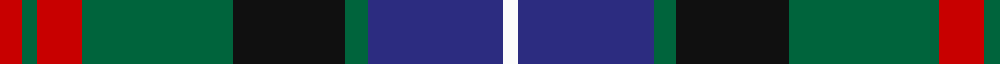
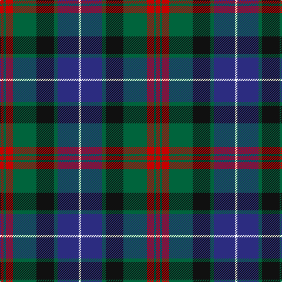

In pattern [RGRGKGBW](/patterns/rgrgkgbw/).

This was sourced from register-of-tartans.  It is a [8 stripes tartan](/stripes/stripes8/).

Original link https://www.tartanregister.gov.uk/tartanDetails.aspx?ref=856

## Attestations

This cloth appears in 2 source records; the oldest owns this page.

- 01/01/1955 — Curry (Personal) (register-of-tartans, [record](https://www.tartanregister.gov.uk/tartanDetails.aspx?ref=856))
- 1955 — Curry (Irish) (Name) (tartans-authority, [record](http://www.tartansauthority.com/tartan-ferret/display/6606/))

## Thread count
R/6 G4 R12 G40 K30 G6 DB36 W/4

## Palette
Each colour and its ΔE from the base-6 reference it is a variant of.

| Colour | Shade | Base | ΔE (OKLab) |
|---|---|---|---|
| DB | <code style="background-color:#2C2C80;">#2C2C80</code> `#2C2C80` | B <code style="background-color:#2C4084;">#2C4084</code> | 0.05 |
| G | <code style="background-color:#00643C;">#00643C</code> `#00643C` | G <code style="background-color:#006400;">#006400</code> | 0.06 |
| K | <code style="background-color:#101010;">#101010</code> `#101010` | K <code style="background-color:#000000;">#000000</code> | 0.17 |
| R | <code style="background-color:#C80000;">#C80000</code> `#C80000` | R <code style="background-color:#C80000;">#C80000</code> | 0.00 |
| W | <code style="background-color:#FCFCFC;">#FCFCFC</code> `#FCFCFC` | W <code style="background-color:#F4F4F0;">#F4F4F0</code> | 0.03 |

# Sample pattern

## Nearest tartans

The nearest existing variants by ΔTartan distance.

1. [MacLeod Clan Tartan Tartan Number: 1583. Earliest known date: 1831 This design appears in many early collections including Logans 'The Scottish Gael'(1831) and Smibert (1850). The sett has its source in the MacKenzie tartan used in 1777 by John MacKenzie called Lord MacLeod when he raised a regiment called 'Lord MacLeod's Highlanders'. The family claimed to be heirs of the last chief of Lewis, Roderick, who had died in 1595. (Tartans of Clan MacLeod. Rhuairidh MacLeod (1990).) This tartan was approved by Chief Norman Magnus, 26th Chief, in 1910, and has been the usual modern sett since then. The present Chief, John MacLeod, lives in Dunvegan Castle, Skye. See products available Copyright © Blair Urquhart, Comrie, 2015](/setts/s7/r6k4g30k20b40k4y4-b2c2c80-g006818-k101010-rc80000-ye8c000/) — ΔT 0.54
1. [Mantle (Personal)](/setts/s8/g6b32w4k28g36r6g4r6-b2c2c80-g006818-k101010-r880000-we0e0e0/) — ΔT 0.58
1. [Scotch House 2000 Original](/setts/s8/b44r6b4r6b4k34g36y8-b202060-g006818-k101010-rc80000-ya08858/) — ΔT 0.64
1. [Fruin Colquhoun (Commemorative?)](/setts/s7/r10g38w6k38b38k6b4-b2c2c80-g00643c-k101010-rc80000-we0e0e0/) — ΔT 0.65
1. [MacMillan Htg (1906) (Clan)](/setts/s10/b12y4b48k16y8k16g32r8g32r4-b2c2c80-g285800-k101010-rc80000-ye8c000/) — ΔT 0.65
1. [Genet, Citizen (Commem)](/setts/s7/r8k36g48b32r4b4w4-b1c0070-g006818-k101010-rc80000-we0e0e0/) — ΔT 0.67
1. [Patterson (blue) family Tartan Tartan Number: 2325. Earliest known date: 1996 A second tartan for the family of John Patterson. Assume same designer as the first Patterson (Red). See products available Copyright © Blair Urquhart, Comrie, 2015](/setts/s10/g8r6g22k20w4b44w4k20g22r6-b2c2c80-g006818-k101010-rc80000-we0e0e0/) — ΔT 0.70
1. [MacLeod Small Clan Tartan Tartan Number: 15833. Earliest known date: See products available Copyright © Blair Urquhart, Comrie, 2015](/setts/s7/r2k2g14k10b20k2y2-b2c2c80-g006818-k101010-rc80000-ye8c000/) — ΔT 0.71
1. [Colquhoun Clan Tartan Tartan Number: 274. Earliest known date: 1810-15 The Bonnie Banks and Braes of Loch Lomand were the setting for the interesting and sometimes violent history of the Colquhouns of Luss. Their tartan is well documented, appearing in the earliest collections, and certified by the Chief, with his seal and signature, in the archives of the Highland Society of London. (c.1816). The Clan tartan, in its present form, was woven by Wilson's of Bannockburn at the beginning of the 19th century and recorded in the firms pattern books dated 1819. Wilson often used purple in place of blue and produced proportionately equivalent patterns in different weights of cloth. Logan recorded a similar sett in 1831. The Vestiarium Scoticum shows a pattern with the white stripe next to the blue but this is regarded as an error. See products available Copyright © Blair Urquhart, Comrie, 2015](/setts/s7/r6g32w4k32b32k4b4-b2c2c80-g006818-k101010-rc80000-we0e0e0/) — ΔT 0.72
1. [Heart of the Highlands](/setts/s9/r36k6r8w6r8k36b40k4ra8-b5c5c5c-k101010-r888888-raa00048-wc0c0c0/) — ΔT 0.73

## Neighbour map

Every grey dot is one of 15726 variants placed by the first two principal components of the ΔTartan feature space (44% of its variance). Red is this tartan; blue dots are its nearest — click one to open its page.

<svg viewBox="0 0 640 380" role="img" style="max-width:100%;height:auto;border:1px solid #e0e0e0;border-radius:4px;display:block" xmlns="http://www.w3.org/2000/svg"><image href="/nn/cloud.v1.png" width="640" height="380"/><a href="/setts/s7/r6k4g30k20b40k4y4-b2c2c80-g006818-k101010-rc80000-ye8c000/"><circle cx="180.1" cy="191.3" r="4" fill="#3465a4"><title>MacLeod Clan Tartan Tartan Number: 1583. Earliest known date: 1831 This design appears in many early collections including Logans 'The Scottish Gael'(1831) and Smibert (1850). The sett has its source in the MacKenzie tartan used in 1777 by John MacKenzie called Lord MacLeod when he raised a regiment called 'Lord MacLeod's Highlanders'. The family claimed to be heirs of the last chief of Lewis, Roderick, who had died in 1595. (Tartans of Clan MacLeod. Rhuairidh MacLeod (1990).) This tartan was approved by Chief Norman Magnus, 26th Chief, in 1910, and has been the usual modern sett since then. The present Chief, John MacLeod, lives in Dunvegan Castle, Skye. See products available Copyright © Blair Urquhart, Comrie, 2015</title></circle></a><a href="/setts/s8/g6b32w4k28g36r6g4r6-b2c2c80-g006818-k101010-r880000-we0e0e0/"><circle cx="170.1" cy="192.0" r="4" fill="#3465a4"><title>Mantle (Personal)</title></circle></a><a href="/setts/s8/b44r6b4r6b4k34g36y8-b202060-g006818-k101010-rc80000-ya08858/"><circle cx="183.6" cy="184.8" r="4" fill="#3465a4"><title>Scotch House 2000 Original</title></circle></a><a href="/setts/s7/r10g38w6k38b38k6b4-b2c2c80-g00643c-k101010-rc80000-we0e0e0/"><circle cx="143.5" cy="199.7" r="4" fill="#3465a4"><title>Fruin Colquhoun (Commemorative?)</title></circle></a><a href="/setts/s10/b12y4b48k16y8k16g32r8g32r4-b2c2c80-g285800-k101010-rc80000-ye8c000/"><circle cx="158.4" cy="175.9" r="4" fill="#3465a4"><title>MacMillan Htg (1906) (Clan)</title></circle></a><a href="/setts/s7/r8k36g48b32r4b4w4-b1c0070-g006818-k101010-rc80000-we0e0e0/"><circle cx="166.2" cy="180.2" r="4" fill="#3465a4"><title>Genet, Citizen (Commem)</title></circle></a><a href="/setts/s10/g8r6g22k20w4b44w4k20g22r6-b2c2c80-g006818-k101010-rc80000-we0e0e0/"><circle cx="134.4" cy="176.3" r="4" fill="#3465a4"><title>Patterson (blue) family Tartan Tartan Number: 2325. Earliest known date: 1996 A second tartan for the family of John Patterson. Assume same designer as the first Patterson (Red). See products available Copyright © Blair Urquhart, Comrie, 2015</title></circle></a><a href="/setts/s7/r2k2g14k10b20k2y2-b2c2c80-g006818-k101010-rc80000-ye8c000/"><circle cx="191.7" cy="190.6" r="4" fill="#3465a4"><title>MacLeod Small Clan Tartan Tartan Number: 15833. Earliest known date: See products available Copyright © Blair Urquhart, Comrie, 2015</title></circle></a><a href="/setts/s7/r6g32w4k32b32k4b4-b2c2c80-g006818-k101010-rc80000-we0e0e0/"><circle cx="145.6" cy="202.4" r="4" fill="#3465a4"><title>Colquhoun Clan Tartan Tartan Number: 274. Earliest known date: 1810-15 The Bonnie Banks and Braes of Loch Lomand were the setting for the interesting and sometimes violent history of the Colquhouns of Luss. Their tartan is well documented, appearing in the earliest collections, and certified by the Chief, with his seal and signature, in the archives of the Highland Society of London. (c.1816). The Clan tartan, in its present form, was woven by Wilson's of Bannockburn at the beginning of the 19th century and recorded in the firms pattern books dated 1819. Wilson often used purple in place of blue and produced proportionately equivalent patterns in different weights of cloth. Logan recorded a similar sett in 1831. The Vestiarium Scoticum shows a pattern with the white stripe next to the blue but this is regarded as an error. See products available Copyright © Blair Urquhart, Comrie, 2015</title></circle></a><a href="/setts/s9/r36k6r8w6r8k36b40k4ra8-b5c5c5c-k101010-r888888-raa00048-wc0c0c0/"><circle cx="157.2" cy="172.1" r="4" fill="#3465a4"><title>Heart of the Highlands</title></circle></a><circle cx="159.2" cy="184.8" r="5" fill="#c00000"/></svg>

ID: /setts/s8/r6g4r12g40k30g6b36w4-b2c2c80-g00643c-k101010-rc80000-wfcfcfc/
