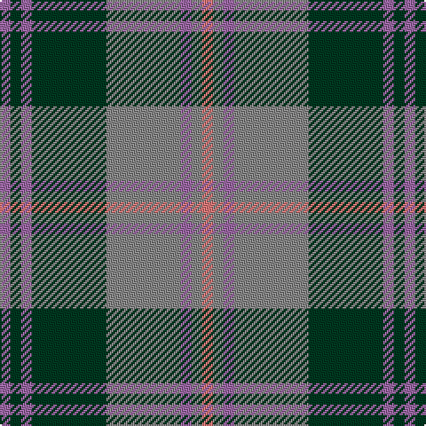

In pattern [RGRGRRRR](/patterns/rgrgrrrr/).

This was sourced from register-of-tartans.  It is a [8 stripes tartan](/stripes/stripes8/).

Original link https://www.tartanregister.gov.uk/tartanDetails.aspx?ref=11167

## Thread count
LP/6 DG6 LP6 DG42 N42 LP6 N6 LR/6

## Palette
Each colour and its ΔE from the base-6 reference it is a variant of.

| Colour | Shade | Base | ΔE (OKLab) |
|---|---|---|---|
| DG | <code style="background-color:#003820;">#003820</code> `#003820` | G <code style="background-color:#006400;">#006400</code> | 0.16 |
| LP | <code style="background-color:#9C68A4;">#9C68A4</code> `#9C68A4` | R <code style="background-color:#C80000;">#C80000</code> | 0.21 |
| LR | <code style="background-color:#E87878;">#E87878</code> `#E87878` | R <code style="background-color:#C80000;">#C80000</code> | 0.19 |
| N | <code style="background-color:#888888;">#888888</code> `#888888` | R <code style="background-color:#C80000;">#C80000</code> | 0.24 |

# Sample pattern

## Nearest tartans

The nearest existing variants by ΔTartan distance.

1. [Auld Lang Syne (Philip King Tailoring)](/setts/s8/k6b6k6b42g42k6g6w6-b5c8ca8-g8c7038-k101010-w98c8e8/) — ΔT 0.43
1. [Auld Lang Syne](/setts/s8/k6b6k6b42g42k6g6w6-b07648c-g503c14-k101010-w82f5fa/) — ΔT 0.91
1. [Hebridean 1](/setts/s9/b4r6g22r6b4ba4b22r4g4-b304080-ba5480b0-g008000-r900030/) — ΔT 0.92
1. [Speyside Blue (Fashion)](/setts/s8/b64k6b6k6ba10k16r42k8-b5c5c5c-ba1474b4-k101010-r888888/) — ΔT 0.96
1. [Speyside Grey (Fashion)](/setts/s8/b64k6b6k6r10k16ra42k8-b5c5c5c-k101010-r98481c-ra888888/) — ΔT 1.00
1. [Stewart of Appin 1](/setts/s10/g16r6g6r10g52b14ba6b56r6b12-b304080-ba5480b0-g008000-rc00000/) — ΔT 1.07
1. [Cercle de Fermieres de St-Elie . . .](/setts/s7/r12y6b48r6g42y6r12-b1474b4-g006818-rc80000-yfccc00/) — ΔT 1.08
1. [Kyle](/setts/s7/g76k8w8k8b20k8b20-b505050-g808080-k101010-we0e0e0/) — ΔT 1.08
1. [Lamont](/setts/s8/b22r4b4r4b4r22g28w4-b800080-g008000-r806050-we0e0e0/) — ΔT 1.09
1. [Antrim, County](/setts/s10/g10b4g36y4b10y4r10b34g4y8-b14283c-g406054-rc04c08-ybc8c00/) — ΔT 1.10

## Neighbour map

Every grey dot is one of 15726 variants placed by the first two principal components of the ΔTartan feature space (44% of its variance). Red is this tartan; blue dots are its nearest — click one to open its page.

<svg viewBox="0 0 640 380" role="img" style="max-width:100%;height:auto;border:1px solid #e0e0e0;border-radius:4px;display:block" xmlns="http://www.w3.org/2000/svg"><image href="/nn/cloud.v1.png" width="640" height="380"/><a href="/setts/s8/k6b6k6b42g42k6g6w6-b5c8ca8-g8c7038-k101010-w98c8e8/"><circle cx="231.4" cy="199.7" r="4" fill="#3465a4"><title>Auld Lang Syne (Philip King Tailoring)</title></circle></a><a href="/setts/s8/k6b6k6b42g42k6g6w6-b07648c-g503c14-k101010-w82f5fa/"><circle cx="240.0" cy="211.3" r="4" fill="#3465a4"><title>Auld Lang Syne</title></circle></a><a href="/setts/s9/b4r6g22r6b4ba4b22r4g4-b304080-ba5480b0-g008000-r900030/"><circle cx="209.1" cy="224.6" r="4" fill="#3465a4"><title>Hebridean 1</title></circle></a><a href="/setts/s8/b64k6b6k6ba10k16r42k8-b5c5c5c-ba1474b4-k101010-r888888/"><circle cx="263.6" cy="193.3" r="4" fill="#3465a4"><title>Speyside Blue (Fashion)</title></circle></a><a href="/setts/s8/b64k6b6k6r10k16ra42k8-b5c5c5c-k101010-r98481c-ra888888/"><circle cx="267.0" cy="192.9" r="4" fill="#3465a4"><title>Speyside Grey (Fashion)</title></circle></a><a href="/setts/s10/g16r6g6r10g52b14ba6b56r6b12-b304080-ba5480b0-g008000-rc00000/"><circle cx="265.1" cy="193.1" r="4" fill="#3465a4"><title>Stewart of Appin 1</title></circle></a><a href="/setts/s7/r12y6b48r6g42y6r12-b1474b4-g006818-rc80000-yfccc00/"><circle cx="182.6" cy="201.8" r="4" fill="#3465a4"><title>Cercle de Fermieres de St-Elie . . .</title></circle></a><a href="/setts/s7/g76k8w8k8b20k8b20-b505050-g808080-k101010-we0e0e0/"><circle cx="290.4" cy="190.2" r="4" fill="#3465a4"><title>Kyle</title></circle></a><a href="/setts/s8/b22r4b4r4b4r22g28w4-b800080-g008000-r806050-we0e0e0/"><circle cx="184.6" cy="208.9" r="4" fill="#3465a4"><title>Lamont</title></circle></a><a href="/setts/s10/g10b4g36y4b10y4r10b34g4y8-b14283c-g406054-rc04c08-ybc8c00/"><circle cx="245.7" cy="201.3" r="4" fill="#3465a4"><title>Antrim, County</title></circle></a><circle cx="232.6" cy="200.5" r="5" fill="#c00000"/></svg>

ID: /setts/s8/r6g6r6g42ra42r6ra6rb6-g003820-r9c68a4-ra888888-rbe87878/
