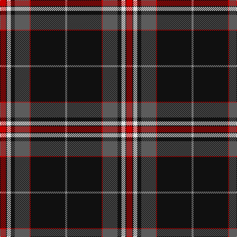

This page is one **sett** — a single exact thread-count. It belongs to the [tartan](/tartans/r6k1w4k4n15r1k35o2/)
(the same proportion at any scale), whose colour order is pattern [RKRBKWKR](/stripes/rkrbkwkr/).

Sourced from tartans-authority.  It is a [8 stripe tartan](/stripes/stripes8/).

Original link http://www.tartansauthority.com/tartan-ferret/display/10697/

## Register references

External register numbers recorded for this tartan.

- Scottish Register of Tartans: [10697](https://www.tartanregister.gov.uk/tartanDetails?ref=10697)
- Scottish Tartans Authority (ITI): 10697

## Thread count
R/12 K2 LN8 K8 N30 R2 K70 Na/4

## Palette

Palette: <strong>Tartan Register</strong> <small style="color:#888">(4 of 5 colours)</small>
<table><thead><tr><th>Colour</th><th>Threads</th><th>Shade</th><th>Base</th><th>OKLCh</th></tr></thead><tbody><tr><td>R/</td><td style="text-align:right;font-variant-numeric:tabular-nums">12</td><td><code style="background-color:#C80000;">#C80000</code> <small style="color:#888">#C80000</small></td><td>R <code style="background-color:#CC0000;">#CC0000</code></td><td><small style="color:#888">oklch(52.3% 0.215 29.2)</small></td></tr><tr><td>K</td><td style="text-align:right;font-variant-numeric:tabular-nums">2</td><td><code style="background-color:#101010;">#101010</code> <small style="color:#888">#101010</small></td><td>K <code style="background-color:#000000;">#000000</code></td><td><small style="color:#888">oklch(17.3% 0.000 89.9)</small></td></tr><tr><td>LN</td><td style="text-align:right;font-variant-numeric:tabular-nums">8</td><td><code style="background-color:#E0E0E0;">#E0E0E0</code> <small style="color:#888">#E0E0E0</small></td><td>W <code style="background-color:#F7F7F7;">#F7F7F7</code></td><td><small style="color:#888">oklch(90.7% 0.000 89.9)</small></td></tr><tr><td>K</td><td style="text-align:right;font-variant-numeric:tabular-nums">8</td><td><code style="background-color:#101010;">#101010</code> <small style="color:#888">#101010</small></td><td>K <code style="background-color:#000000;">#000000</code></td><td><small style="color:#888">oklch(17.3% 0.000 89.9)</small></td></tr><tr><td>N</td><td style="text-align:right;font-variant-numeric:tabular-nums">30</td><td><code style="background-color:#5C5C5C;">#5C5C5C</code> <small style="color:#888">#5C5C5C</small></td><td>B <code style="background-color:#2A418A;">#2A418A</code></td><td><small style="color:#888">oklch(47.5% 0.000 89.9)</small></td></tr><tr><td>R</td><td style="text-align:right;font-variant-numeric:tabular-nums">2</td><td><code style="background-color:#C80000;">#C80000</code> <small style="color:#888">#C80000</small></td><td>R <code style="background-color:#CC0000;">#CC0000</code></td><td><small style="color:#888">oklch(52.3% 0.215 29.2)</small></td></tr><tr><td>K</td><td style="text-align:right;font-variant-numeric:tabular-nums">70</td><td><code style="background-color:#101010;">#101010</code> <small style="color:#888">#101010</small></td><td>K <code style="background-color:#000000;">#000000</code></td><td><small style="color:#888">oklch(17.3% 0.000 89.9)</small></td></tr><tr><td>Na/</td><td style="text-align:right;font-variant-numeric:tabular-nums">4</td><td><code style="background-color:#888888;">#888888</code> <small style="color:#888">#888888</small></td><td>R <code style="background-color:#CC0000;">#CC0000</code></td><td><small style="color:#888">oklch(62.7% 0.000 89.9)</small></td></tr></tbody></table>

# Sample pattern

## Nearest tartans

The nearest existing variants by ΔTartan distance, with this tartan at the top so the swatches line up against it.

ΔTartan

Tartan

Sett

—

<a href="/ttd/edit/#slug=r6k1w4k4n15r1k35o2~x2">Distripress (Corporate)</a> <a class="nn-out" href="/setts/s8/r6k1w4k4n15r1k35o2~x2/" title="open its dictionary page">↗</a>

0.51

<a href="/ttd/edit/#slug=r35w8k85o6k4o14k2dp4">MacEvil (Corporate)</a> <a class="nn-out" href="/setts/s8/r35w8k85o6k4o14k2dp4/" title="open its dictionary page">↗</a>

0.76

<a href="/ttd/edit/#slug=db12w1db2k3r15k1ly2k39r2~x2">Superstition Fire Honor Guard Pipes</a> <a class="nn-out" href="/setts/s9/db12w1db2k3r15k1ly2k39r2~x2/" title="open its dictionary page">↗</a>

0.95

<a href="/ttd/edit/#slug=lo8k50o15dg6o6db3o6lo2~x2">Royal College of G.P.s (Corporate)</a> <a class="nn-out" href="/setts/s8/lo8k50o15dg6o6db3o6lo2~x2/" title="open its dictionary page">↗</a>

0.97

<a href="/ttd/edit/#slug=t12w1t2k3r15k1lo2k39r2~x2">Superstition Fire Honor Guard Pipes &amp; Drums</a> <a class="nn-out" href="/setts/s9/t12w1t2k3r15k1lo2k39r2~x2/" title="open its dictionary page">↗</a>

1.07

<a href="/ttd/edit/#slug=lr2k1r5n3o12n4lr1k40b1~x2">Montgomerie, Colin</a> <a class="nn-out" href="/setts/s9/lr2k1r5n3o12n4lr1k40b1~x2/" title="open its dictionary page">↗</a>

1.08

<a href="/ttd/edit/#slug=r4k2w6k2db40k80dg10w6r3">Italian American</a> <a class="nn-out" href="/setts/s9/r4k2w6k2db40k80dg10w6r3/" title="open its dictionary page">↗</a>

1.09

<a href="/ttd/edit/#slug=lo8n5r1n15k2lo1k36n1~x2">Cirse 3D</a> <a class="nn-out" href="/setts/s8/lo8n5r1n15k2lo1k36n1~x2/" title="open its dictionary page">↗</a>

1.11

<a href="/ttd/edit/#slug=k60w2r10dg6w4r15ly10~x2">Iberia Dress, Black (Fashion)</a> <a class="nn-out" href="/setts/s7/k60w2r10dg6w4r15ly10~x2/" title="open its dictionary page">↗</a>

1.15

<a href="/ttd/edit/#slug=r8db9dp3ly1dp1ly2dp2k32dp1~x2">Gedling, Peter (Personal)</a> <a class="nn-out" href="/setts/s9/r8db9dp3ly1dp1ly2dp2k32dp1~x2/" title="open its dictionary page">↗</a>

1.15

<a href="/ttd/edit/#slug=lb4n6k4r2ri10k44n1k1lb2~x2">Calgary HOG (Corporate)</a> <a class="nn-out" href="/setts/s9/lb4n6k4r2ri10k44n1k1lb2~x2/" title="open its dictionary page">↗</a>

## Neighbour map

Every grey dot is one of 14359 variants placed by the first two principal components of the ΔTartan feature space (44% of its variance). Red is this tartan; blue dots are its nearest — click one to open its page.

<svg viewBox="0 0 640 380" role="img" style="max-width:100%;height:auto;border:1px solid #e0e0e0;border-radius:4px;display:block" xmlns="http://www.w3.org/2000/svg"><image href="/nn/cloud.v1.png" width="640" height="380"/><a href="/setts/s8/r35w8k85o6k4o14k2dp4/"><circle cx="361.8" cy="99.0" r="4" fill="#3465a4"><title>MacEvil (Corporate)</title></circle></a><a href="/setts/s9/db12w1db2k3r15k1ly2k39r2~x2/"><circle cx="354.3" cy="96.7" r="4" fill="#3465a4"><title>Superstition Fire Honor Guard Pipes</title></circle></a><a href="/setts/s8/lo8k50o15dg6o6db3o6lo2~x2/"><circle cx="296.7" cy="121.8" r="4" fill="#3465a4"><title>Royal College of G.P.s (Corporate)</title></circle></a><a href="/setts/s9/t12w1t2k3r15k1lo2k39r2~x2/"><circle cx="335.7" cy="83.0" r="4" fill="#3465a4"><title>Superstition Fire Honor Guard Pipes &amp; Drums</title></circle></a><a href="/setts/s9/lr2k1r5n3o12n4lr1k40b1~x2/"><circle cx="356.0" cy="75.1" r="4" fill="#3465a4"><title>Montgomerie, Colin</title></circle></a><a href="/setts/s9/r4k2w6k2db40k80dg10w6r3/"><circle cx="341.0" cy="97.3" r="4" fill="#3465a4"><title>Italian American</title></circle></a><a href="/setts/s8/lo8n5r1n15k2lo1k36n1~x2/"><circle cx="376.7" cy="132.0" r="4" fill="#3465a4"><title>Cirse 3D</title></circle></a><a href="/setts/s7/k60w2r10dg6w4r15ly10~x2/"><circle cx="315.5" cy="109.8" r="4" fill="#3465a4"><title>Iberia Dress, Black (Fashion)</title></circle></a><a href="/setts/s9/r8db9dp3ly1dp1ly2dp2k32dp1~x2/"><circle cx="339.0" cy="107.0" r="4" fill="#3465a4"><title>Gedling, Peter (Personal)</title></circle></a><a href="/setts/s9/lb4n6k4r2ri10k44n1k1lb2~x2/"><circle cx="429.8" cy="89.0" r="4" fill="#3465a4"><title>Calgary HOG (Corporate)</title></circle></a><circle cx="354.7" cy="110.4" r="5" fill="#c00000"/></svg>

ID: /setts/s8/r6k1w4k4n15r1k35o2~x2/
