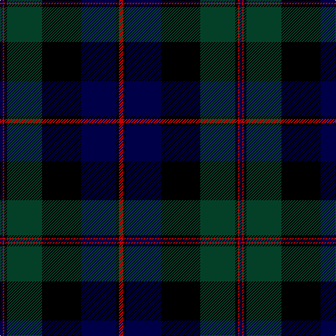

In pattern [BRKGKBKR](/patterns/brkgkbkr/).

This was sourced from register-of-tartans.  It is a [8 stripes tartan](/stripes/stripes8/).

Original link https://www.tartanregister.gov.uk/tartanDetails.aspx?ref=720

## Attestations

This cloth appears in 2 source records; the oldest owns this page.

- 01/01/1819 — Common Kilt (register-of-tartans, [record](https://www.tartanregister.gov.uk/tartanDetails.aspx?ref=720))
- 1819? — Common Kilt (Fashion) (tartans-authority, [record](http://www.tartansauthority.com/tartan-ferret/display/554/))

## Thread count
DB/4 R2 K4 DG50 K56 DB50 K4 R/6

## Palette
Each colour and its ΔE from the base-6 reference it is a variant of.

| Colour | Shade | Base | ΔE (OKLab) |
|---|---|---|---|
| DB | <code style="background-color:#000048;">#000048</code> `#000048` | B <code style="background-color:#2C4084;">#2C4084</code> | 0.21 |
| DG | <code style="background-color:#044028;">#044028</code> `#044028` | G <code style="background-color:#006400;">#006400</code> | 0.14 |
| K | <code style="background-color:#000000;">#000000</code> `#000000` | K <code style="background-color:#000000;">#000000</code> | 0.00 |
| R | <code style="background-color:#C80000;">#C80000</code> `#C80000` | R <code style="background-color:#C80000;">#C80000</code> | 0.00 |

# Sample pattern

## Nearest tartans

The nearest existing variants by ΔTartan distance.

1. [Dundas](/setts/s7/k8b32k24g48r2g4k4-b000052-g11450d-k000000-raa0000/) — ΔT 1.00
1. [Ogilvy VS](/setts/s8/b56y2b4k32g48k2g4r6-b000052-g11450d-k000000-raa0000-yaaaa00/) — ΔT 1.01
1. [MacThomas](/setts/s9/b2b2r4b42k22g42r4g2g2-b000060-g004c00-k000000-rc80000/) — ΔT 1.12
1. [Coarse Kilt](/setts/s7/r6k4b50k56g50k4r6-b000048-g044028-k000000-rc80000/) — ΔT 1.18
1. [Ogilvy VS](/setts/s8/b56y2b4k32g48k2g4r6-b00004c-g004c00-k000000-rc80000-yffc800/) — ΔT 1.20
1. [Kerr Hunting](/setts/s10/g40k2g4k2g6k28b56k2b4k8-b000052-g11450d-k000000/) — ΔT 1.21
1. [Singh, Gopal (Personal)](/setts/s6/k20r8b68ba68k2y6-b002814-ba000048-k000000-rfa4b00-yd87c00/) — ΔT 1.22
1. [Dundas](/setts/s7/k8b32k24g48r2g4k4-b000064-g004c00-k000000-rc80000/) — ΔT 1.23
1. [Ogilvy Hunting](/setts/s9/b48y4k16g32k2g6k2g6r8-b000052-g11450d-k000000-raa0000-yaaaa00/) — ΔT 1.25
1. [Black Watch RHR](/setts/s8/b20k2b6k2b40k50g80k6-b00004c-g004c00-k000000/) — ΔT 1.28

## Neighbour map

Every grey dot is one of 15726 variants placed by the first two principal components of the ΔTartan feature space (44% of its variance). Red is this tartan; blue dots are its nearest — click one to open its page.

<svg viewBox="0 0 640 380" role="img" style="max-width:100%;height:auto;border:1px solid #e0e0e0;border-radius:4px;display:block" xmlns="http://www.w3.org/2000/svg"><image href="/nn/cloud.v1.png" width="640" height="380"/><a href="/setts/s7/k8b32k24g48r2g4k4-b000052-g11450d-k000000-raa0000/"><circle cx="284.0" cy="188.5" r="4" fill="#3465a4"><title>Dundas</title></circle></a><a href="/setts/s8/b56y2b4k32g48k2g4r6-b000052-g11450d-k000000-raa0000-yaaaa00/"><circle cx="256.0" cy="147.6" r="4" fill="#3465a4"><title>Ogilvy VS</title></circle></a><a href="/setts/s9/b2b2r4b42k22g42r4g2g2-b000060-g004c00-k000000-rc80000/"><circle cx="253.3" cy="155.6" r="4" fill="#3465a4"><title>MacThomas</title></circle></a><a href="/setts/s7/r6k4b50k56g50k4r6-b000048-g044028-k000000-rc80000/"><circle cx="226.0" cy="203.5" r="4" fill="#3465a4"><title>Coarse Kilt</title></circle></a><a href="/setts/s8/b56y2b4k32g48k2g4r6-b00004c-g004c00-k000000-rc80000-yffc800/"><circle cx="243.9" cy="142.4" r="4" fill="#3465a4"><title>Ogilvy VS</title></circle></a><a href="/setts/s10/g40k2g4k2g6k28b56k2b4k8-b000052-g11450d-k000000/"><circle cx="316.7" cy="171.6" r="4" fill="#3465a4"><title>Kerr Hunting</title></circle></a><a href="/setts/s6/k20r8b68ba68k2y6-b002814-ba000048-k000000-rfa4b00-yd87c00/"><circle cx="276.2" cy="162.7" r="4" fill="#3465a4"><title>Singh, Gopal (Personal)</title></circle></a><a href="/setts/s7/k8b32k24g48r2g4k4-b000064-g004c00-k000000-rc80000/"><circle cx="270.3" cy="183.0" r="4" fill="#3465a4"><title>Dundas</title></circle></a><a href="/setts/s9/b48y4k16g32k2g6k2g6r8-b000052-g11450d-k000000-raa0000-yaaaa00/"><circle cx="234.4" cy="142.4" r="4" fill="#3465a4"><title>Ogilvy Hunting</title></circle></a><a href="/setts/s8/b20k2b6k2b40k50g80k6-b00004c-g004c00-k000000/"><circle cx="308.5" cy="173.8" r="4" fill="#3465a4"><title>Black Watch RHR</title></circle></a><circle cx="268.3" cy="168.9" r="5" fill="#c00000"/></svg>

ID: /setts/s8/r6k4b50k56g50k4r2b4-b000048-g044028-k000000-rc80000/
