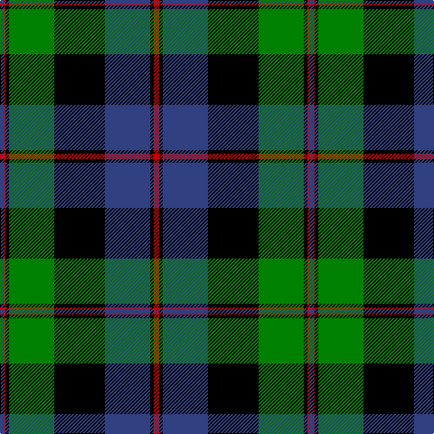

In pattern [BRKGKBKR](/patterns/brkgkbkr/).

This was sourced from weddslist.  It is a [8 stripes tartan](/stripes/stripes8/).

Original link http://www.weddslist.com/cgi-bin/tartans/pg.pl?source=sts

## Thread count
B/4 R2 K4 G50 K56 B50 K4 R/6

## Palette
Each colour and its ΔE from the base-6 reference it is a variant of.

| Colour | Shade | Base | ΔE (OKLab) |
|---|---|---|---|
| B | <code style="background-color:#304080;">#304080</code> `#304080` | B <code style="background-color:#2C4084;">#2C4084</code> | 0.01 |
| G | <code style="background-color:#008000;">#008000</code> `#008000` | G <code style="background-color:#006400;">#006400</code> | 0.09 |
| K | <code style="background-color:#000000;">#000000</code> `#000000` | K <code style="background-color:#000000;">#000000</code> | 0.00 |
| R | <code style="background-color:#C00000;">#C00000</code> `#C00000` | R <code style="background-color:#C80000;">#C80000</code> | 0.02 |

# Sample pattern

## Nearest tartans

The nearest existing variants by ΔTartan distance.

1. [Ogilvie, of Inverquharity](/setts/s8/b56y2b4k52g48k2g4r6-b304080-g008000-k000000-rc00000-yf0c000/) — ΔT 0.89
1. [Hebridean Old](/setts/s9/b4k4b36ba2k26ba2g32b6k4-b304080-ba8080d0-g008000-k000000/) — ΔT 0.92
1. [MacTaggert](/setts/s7/g60b8g4k40b36r2b8-b304080-g008000-k000000-rc00000/) — ΔT 0.95
1. [Baird](/setts/s8/r7g3r2g33k31b31k3b3-b304080-g008000-k000000-r900030/) — ΔT 0.96
1. [Blair](/setts/s7/b8r2b36k40g36r2g8-b2c2c80-g006818-k000000-rc80000/) — ΔT 1.02
1. [Lochaber](/setts/s8/g12r4g72k80r4b72ba4g8-b304080-ba5480b0-g008000-k000000-rc00000/) — ΔT 1.07
1. [Rangers F.C.](/setts/s11/r6g28k24b80k24g4k4g4k4g14r6-b304080-g30a010-k000000-rc00020/) — ΔT 1.08
1. [Black Gold](/setts/s9/g6k6g6k36b56w2ga44k4g4-b3c5070-g604000-ga008b45-k000000-wffffff/) — ΔT 1.09
1. [Rangers F.C.](/setts/s11/r6g32k24b68k24g4k4g4k4g14r6-b304080-g30a010-k000000-rc00000/) — ΔT 1.13
1. [Meoni (Personal)](/setts/s7/b2g2b36g24k36r2k2-b2c2c80-g006818-k000000-rc80000/) — ΔT 1.13

## Neighbour map

Every grey dot is one of 15726 variants placed by the first two principal components of the ΔTartan feature space (44% of its variance). Red is this tartan; blue dots are its nearest — click one to open its page.

<svg viewBox="0 0 640 380" role="img" style="max-width:100%;height:auto;border:1px solid #e0e0e0;border-radius:4px;display:block" xmlns="http://www.w3.org/2000/svg"><image href="/nn/cloud.v1.png" width="640" height="380"/><a href="/setts/s8/b56y2b4k52g48k2g4r6-b304080-g008000-k000000-rc00000-yf0c000/"><circle cx="195.2" cy="126.2" r="4" fill="#3465a4"><title>Ogilvie, of Inverquharity</title></circle></a><a href="/setts/s9/b4k4b36ba2k26ba2g32b6k4-b304080-ba8080d0-g008000-k000000/"><circle cx="215.3" cy="158.1" r="4" fill="#3465a4"><title>Hebridean Old</title></circle></a><a href="/setts/s7/g60b8g4k40b36r2b8-b304080-g008000-k000000-rc00000/"><circle cx="239.2" cy="158.6" r="4" fill="#3465a4"><title>MacTaggert</title></circle></a><a href="/setts/s8/r7g3r2g33k31b31k3b3-b304080-g008000-k000000-r900030/"><circle cx="174.1" cy="168.1" r="4" fill="#3465a4"><title>Baird</title></circle></a><a href="/setts/s7/b8r2b36k40g36r2g8-b2c2c80-g006818-k000000-rc80000/"><circle cx="200.4" cy="182.0" r="4" fill="#3465a4"><title>Blair</title></circle></a><a href="/setts/s8/g12r4g72k80r4b72ba4g8-b304080-ba5480b0-g008000-k000000-rc00000/"><circle cx="184.0" cy="141.5" r="4" fill="#3465a4"><title>Lochaber</title></circle></a><a href="/setts/s11/r6g28k24b80k24g4k4g4k4g14r6-b304080-g30a010-k000000-rc00020/"><circle cx="216.4" cy="128.7" r="4" fill="#3465a4"><title>Rangers F.C.</title></circle></a><a href="/setts/s9/g6k6g6k36b56w2ga44k4g4-b3c5070-g604000-ga008b45-k000000-wffffff/"><circle cx="184.1" cy="120.4" r="4" fill="#3465a4"><title>Black Gold</title></circle></a><a href="/setts/s11/r6g32k24b68k24g4k4g4k4g14r6-b304080-g30a010-k000000-rc00000/"><circle cx="182.4" cy="140.3" r="4" fill="#3465a4"><title>Rangers F.C.</title></circle></a><a href="/setts/s7/b2g2b36g24k36r2k2-b2c2c80-g006818-k000000-rc80000/"><circle cx="227.0" cy="174.9" r="4" fill="#3465a4"><title>Meoni (Personal)</title></circle></a><circle cx="219.5" cy="143.9" r="5" fill="#c00000"/></svg>

ID: /setts/s8/r6k4b50k56g50k4r2b4-b304080-g008000-k000000-rc00000/
