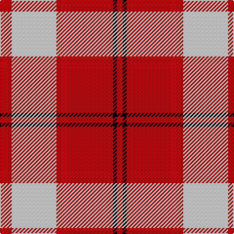

In pattern [RKRRRWRR](/patterns/rkrrrwrr/).

This was sourced from weddslist.  It is a [8 stripes tartan](/stripes/stripes8/).

Original link http://www.weddslist.com/cgi-bin/tartans/pg.pl?source=sts

## Thread count
R/6 Ra6 LN46 Ra6 R6 Ra46 K4 Ra/6

## Palette
Each colour and its ΔE from the base-6 reference it is a variant of.

| Colour | Shade | Base | ΔE (OKLab) |
|---|---|---|---|
| K | <code style="background-color:#000000;">#000000</code> `#000000` | K <code style="background-color:#000000;">#000000</code> | 0.00 |
| LN | <code style="background-color:#E0E0E0;">#E0E0E0</code> `#E0E0E0` | W <code style="background-color:#F7F7F7;">#F7F7F7</code> | 0.07 |
| R | <code style="background-color:#D00000;">#D00000</code> `#D00000` | R <code style="background-color:#CC0000;">#CC0000</code> | 0.01 |
| Ra | <code style="background-color:#C00000;">#C00000</code> `#C00000` | R <code style="background-color:#CC0000;">#CC0000</code> | 0.03 |

# Sample pattern

## Nearest tartans

The nearest existing variants by ΔTartan distance.

1. [Cameron Hose #2](/setts/s8/r6ra6w46ra6r6ra46k4ra6-k101010-rc80050-radc0000-we0e0e0/) — ΔT 0.48
1. [Longniddry Dress, Red (Dance)](/setts/s8/r70b4w4b4r8ra20w50r6-b2c2c80-rc80000-ra780028-we0e0e0/) — ΔT 0.74
1. [Hose #2](/setts/s8/r6ra6w46ra6r6ra46k4ra6-k101010-r880000-rac80000-wc0c0c0/) — ΔT 0.77
1. [Cameron Hose](/setts/s7/k6r48g6r6w48r6k6-g005020-k101010-rdc0000-we0e0e0/) — ΔT 0.85
1. [Torridon, Cherry (Dance)](/setts/s7/r6ra4b4ra60w60b4w6-b1c1c50-r880000-rab80000-wf0e0c8/) — ΔT 0.88
1. [Lennox Dress #2](/setts/s7/r8ra4r40ra8w40b4w8-b2c2c80-rc80000-ra880000-we0e0e0/) — ΔT 0.98
1. [Longniddry Burgundy (Dance)](/setts/s8/r84ra4w4ra4r10rb24w64r8-r880000-rae87878-rbc80000-we0e0e0/) — ΔT 1.05
1. [Arduaine, Red (Dance)](/setts/s7/w10k4w60r48w6r16b6-b003c64-k101010-rc8002c-wf0e0c8/) — ΔT 1.08
1. [Lennox Dress District Tartan Tartan Number: 1649. Earliest known date: 1986 Families with the surname 'Lennox' are usually considered related to Clans Stewart or MacFarlane. Some of this surname also choose to wear the distinctive and ancient 'Lennox' tartan. D W Stewart reproduced the sett from a 'lost' portrait of the Countess of Lennox dating from the 16th century. See products available Copyright © Blair Urquhart, Comrie, 2015](/setts/s7/r16ra4r48ra10w50g4w16-g604000-rc80000-raa00048-we0e0e0/) — ΔT 1.08
1. [MacPherson, dress red](/setts/s7/w8r4w50ra42w6ra16y6-r800000-rac00000-we0e0e0-yf0c000/) — ΔT 1.09

## Neighbour map

Every grey dot is one of 15726 variants placed by the first two principal components of the ΔTartan feature space (44% of its variance). Red is this tartan; blue dots are its nearest — click one to open its page.

<svg viewBox="0 0 640 380" role="img" style="max-width:100%;height:auto;border:1px solid #e0e0e0;border-radius:4px;display:block" xmlns="http://www.w3.org/2000/svg"><image href="/nn/cloud.v1.png" width="640" height="380"/><a href="/setts/s8/r6ra6w46ra6r6ra46k4ra6-k101010-rc80050-radc0000-we0e0e0/"><circle cx="295.3" cy="141.3" r="4" fill="#3465a4"><title>Cameron Hose #2</title></circle></a><a href="/setts/s8/r70b4w4b4r8ra20w50r6-b2c2c80-rc80000-ra780028-we0e0e0/"><circle cx="297.8" cy="125.3" r="4" fill="#3465a4"><title>Longniddry Dress, Red (Dance)</title></circle></a><a href="/setts/s8/r6ra6w46ra6r6ra46k4ra6-k101010-r880000-rac80000-wc0c0c0/"><circle cx="307.8" cy="151.8" r="4" fill="#3465a4"><title>Hose #2</title></circle></a><a href="/setts/s7/k6r48g6r6w48r6k6-g005020-k101010-rdc0000-we0e0e0/"><circle cx="245.0" cy="160.7" r="4" fill="#3465a4"><title>Cameron Hose</title></circle></a><a href="/setts/s7/r6ra4b4ra60w60b4w6-b1c1c50-r880000-rab80000-wf0e0c8/"><circle cx="284.6" cy="130.2" r="4" fill="#3465a4"><title>Torridon, Cherry (Dance)</title></circle></a><a href="/setts/s7/r8ra4r40ra8w40b4w8-b2c2c80-rc80000-ra880000-we0e0e0/"><circle cx="237.6" cy="161.8" r="4" fill="#3465a4"><title>Lennox Dress #2</title></circle></a><a href="/setts/s8/r84ra4w4ra4r10rb24w64r8-r880000-rae87878-rbc80000-we0e0e0/"><circle cx="301.2" cy="119.2" r="4" fill="#3465a4"><title>Longniddry Burgundy (Dance)</title></circle></a><a href="/setts/s7/w10k4w60r48w6r16b6-b003c64-k101010-rc8002c-wf0e0c8/"><circle cx="297.4" cy="145.0" r="4" fill="#3465a4"><title>Arduaine, Red (Dance)</title></circle></a><a href="/setts/s7/r16ra4r48ra10w50g4w16-g604000-rc80000-raa00048-we0e0e0/"><circle cx="254.4" cy="162.4" r="4" fill="#3465a4"><title>Lennox Dress District Tartan Tartan Number: 1649. Earliest known date: 1986 Families with the surname 'Lennox' are usually considered related to Clans Stewart or MacFarlane. Some of this surname also choose to wear the distinctive and ancient 'Lennox' tartan. D W Stewart reproduced the sett from a 'lost' portrait of the Countess of Lennox dating from the 16th century. See products available Copyright © Blair Urquhart, Comrie, 2015</title></circle></a><a href="/setts/s7/w8r4w50ra42w6ra16y6-r800000-rac00000-we0e0e0-yf0c000/"><circle cx="281.9" cy="157.0" r="4" fill="#3465a4"><title>MacPherson, dress red</title></circle></a><circle cx="286.0" cy="140.7" r="5" fill="#c00000"/></svg>

ID: /setts/s8/r6k4r46ra6r6w46r6ra6-k000000-rc00000-rad00000-we0e0e0/
