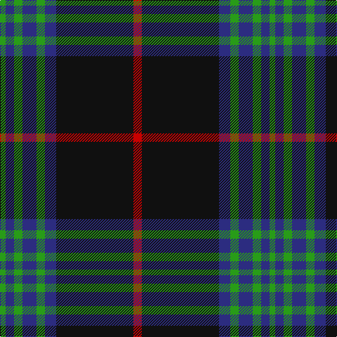

**Bands:** [GBGBGBKR](/stripes/gbgbgbkr/) · **Stripes:** [G DB G DB G DB K R](/stripes/stripes8/) G DB G DB G DB K R

This was sourced from register-of-tartans.  It is a [8 band tartan](/bands/bands8/).

Original link https://www.tartanregister.gov.uk/tartanDetails.aspx?ref=1274

## Attestations

This cloth appears in 2 source records; the oldest owns this page.

- 01/09/2001 — Frederiction Police Force (register-of-tartans, [record](https://www.tartanregister.gov.uk/tartanDetails.aspx?ref=1274))
- 2001 — Fredericton Police Force (Corporate) (tartans-authority, [record](http://www.tartansauthority.com/tartan-ferret/display/6194/))

## Register references

External register numbers recorded for this tartan.

- Scottish Register of Tartans: [1274](https://www.tartanregister.gov.uk/tartanDetails.aspx?ref=1274)
- Scottish Tartans Authority (ITI): 6194
- Scottish Tartans World Register: 2870

## Thread count
G/8 DB12 G12 DB20 G12 DB16 K110 R/12

## Palette
Each colour and its ΔE from the base-6 reference it is a variant of.

| Colour | Shade | Base | ΔE (OKLab) |
|---|---|---|---|
| DB | <code style="background-color:#2C2C80;">#2C2C80</code> `#2C2C80` | B <code style="background-color:#2A418A;">#2A418A</code> | 0.06 |
| G | <code style="background-color:#289C18;">#289C18</code> `#289C18` | G <code style="background-color:#006100;">#006100</code> | 0.19 |
| K | <code style="background-color:#101010;">#101010</code> `#101010` | K <code style="background-color:#000000;">#000000</code> | 0.17 |
| R | <code style="background-color:#C80000;">#C80000</code> `#C80000` | R <code style="background-color:#CC0000;">#CC0000</code> | 0.01 |

# Sample pattern

## Nearest tartans

The nearest existing variants by ΔTartan distance.

1. [Home (Clan)](/setts/s8/k36r3k3r3k9b36g3b2~x2/) — ΔT 1.03
1. [Gammell](/setts/s8/db32dr3db3dr3db3dr10g24m3~x2/) — ΔT 1.09
1. [Ewbank](/setts/s9/r3b14ly2k2b14k36ly2k2ly2~x2/) — ΔT 1.11
1. [New Golf Club](/setts/s9/dg4k4dg23k11r2k2r2k20w4~x2/) — ΔT 1.12
1. [Childers](/setts/s10/k4g13k4g8k44g8k4g13k4w3~x2/) — ΔT 1.19
1. [Phantom (Corporate)](/setts/s7/w3dr10k38o11dr6k2w3~x2/) — ΔT 1.21
1. [Corrie](/setts/s8/dt14o1dt1o1dt6o14w1o1~x4/) — ΔT 1.21
1. [Guthrie (Name)](/setts/s9/k1g12k12r1k1r1k12b12r1~x4/) — ΔT 1.23
1. [Todd](/setts/s9/dt40dg3k3dg12w3dg3w3dg3r3~x2/) — ΔT 1.24
1. [Coalfields Regeneration Trust, The](/setts/s7/k2r1ly1g8k15g2dp1~x2/) — ΔT 1.27

## Neighbour map

Every grey dot is one of 14313 variants placed by the first two principal components of the ΔTartan feature space (44% of its variance). Red is this tartan; blue dots are its nearest — click one to open its page.

<svg viewBox="0 0 640 380" role="img" style="max-width:100%;height:auto;border:1px solid #e0e0e0;border-radius:4px;display:block" xmlns="http://www.w3.org/2000/svg"><image href="/nn/cloud.v1.png" width="640" height="380"/><a href="/setts/s8/k36r3k3r3k9b36g3b2~x2/"><circle cx="318.7" cy="160.8" r="4" fill="#3465a4"><title>Home (Clan)</title></circle></a><a href="/setts/s8/db32dr3db3dr3db3dr10g24m3~x2/"><circle cx="262.3" cy="193.7" r="4" fill="#3465a4"><title>Gammell</title></circle></a><a href="/setts/s9/r3b14ly2k2b14k36ly2k2ly2~x2/"><circle cx="308.9" cy="143.3" r="4" fill="#3465a4"><title>Ewbank</title></circle></a><a href="/setts/s9/dg4k4dg23k11r2k2r2k20w4~x2/"><circle cx="288.0" cy="193.3" r="4" fill="#3465a4"><title>New Golf Club</title></circle></a><a href="/setts/s10/k4g13k4g8k44g8k4g13k4w3~x2/"><circle cx="329.5" cy="171.2" r="4" fill="#3465a4"><title>Childers</title></circle></a><a href="/setts/s7/w3dr10k38o11dr6k2w3~x2/"><circle cx="314.9" cy="157.0" r="4" fill="#3465a4"><title>Phantom (Corporate)</title></circle></a><a href="/setts/s8/dt14o1dt1o1dt6o14w1o1~x4/"><circle cx="325.9" cy="166.2" r="4" fill="#3465a4"><title>Corrie</title></circle></a><a href="/setts/s9/k1g12k12r1k1r1k12b12r1~x4/"><circle cx="256.3" cy="186.8" r="4" fill="#3465a4"><title>Guthrie (Name)</title></circle></a><a href="/setts/s9/dt40dg3k3dg12w3dg3w3dg3r3~x2/"><circle cx="304.5" cy="137.5" r="4" fill="#3465a4"><title>Todd</title></circle></a><a href="/setts/s7/k2r1ly1g8k15g2dp1~x2/"><circle cx="320.3" cy="157.5" r="4" fill="#3465a4"><title>Coalfields Regeneration Trust, The</title></circle></a><circle cx="321.7" cy="168.8" r="5" fill="#c00000"/></svg>

ID: /setts/s8/r6k55db8g6db10g6db6g4~x2/
