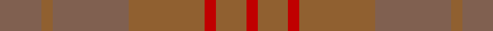

In pattern [RRRRRRRR](/patterns/rrrrrrrr/).

This was sourced from weddslist.  It is a [8 stripes tartan](/stripes/stripes8/).

Original link http://www.weddslist.com/cgi-bin/tartans/pg.pl?source=sts

## Thread count
LTa/6 LTa16 LT6 LTa40 LT40 R6 LT16 R/6

## Palette
Each colour and its ΔE from the base-6 reference it is a variant of.

| Colour | Shade | Base | ΔE (OKLab) |
|---|---|---|---|
| LT | <code style="background-color:#906030;">#906030</code> `#906030` | R <code style="background-color:#C80000;">#C80000</code> | 0.15 |
| LTa | <code style="background-color:#806050;">#806050</code> `#806050` | R <code style="background-color:#C80000;">#C80000</code> | 0.17 |
| R | <code style="background-color:#C00000;">#C00000</code> `#C00000` | R <code style="background-color:#C80000;">#C80000</code> | 0.02 |

# Sample pattern

## Nearest tartans

The nearest existing variants by ΔTartan distance.

1. [Burns' Birthplace (Commem)](/setts/s7/r12ra12r12ra12r48ra36y12-rc04c08-raac7000-ybc8c00/) — ΔT 2.45
1. [Harmony, 12](/setts/s6/g12r4g58r58g4r12-g808080-r806050/) — ΔT 2.79
1. [Unnamed Brown (Teddy Bear)](/setts/s5/r2ra14rb50ra14r2-rc00000-ra806050-rb906030/) — ΔT 3.04
1. [Wicklow Irish County Tartan Tartan Number: 2265. Earliest known date: 1995 One of a series of Irish District tartans designed by Polly Wittering of the House of Edgar, with colours reminiscent of the Country with soft warm colours dominating. See products available Copyright © Blair Urquhart, Comrie, 2015](/setts/s10/b4ba4bb4ba48bc4bb12ba6b24ba8bb4-b3c6060-ba646c84-bb644c40-bc0070a4/) — ΔT 3.45
1. [Breckon Hunting](/setts/s9/b12ba4b56g56ba4g4ba4g4ba8-b233634-ba51200f-g27371d/) — ΔT 3.48
1. [Harmony 11 #2](/setts/s6/g12ga4g58ga58g4ga12-g005020-ga503c14/) — ΔT 3.61
1. [Bute Heather, Ancient Wth'd (Fashion](/setts/s11/y10b4g16b2g16b8g8b12g36ya2y10-b5c5c5c-g707070-ya08858-yaa0a0a0/) — ΔT 3.76
1. [Loch Garth](/setts/s4/r48ra24r8y4-r806050-ra906030-yf0c000/) — ΔT 3.76
1. [ShadowHalls](/setts/s15/b4ba16k44ba4k4ba4k4b4k44bb16g4bb32k32ba32bb4-b084555-ba1a2b47-bb1e2025-g364e41-k1c1714/) — ΔT 3.89
1. [Harmony, No 13](/setts/s6/b20g2b2g20b36g10-b5480b0-g808080/) — ΔT 4.07

## Neighbour map

Every grey dot is one of 15726 variants placed by the first two principal components of the ΔTartan feature space (44% of its variance). Red is this tartan; blue dots are its nearest — click one to open its page.

<svg viewBox="0 0 640 380" role="img" style="max-width:100%;height:auto;border:1px solid #e0e0e0;border-radius:4px;display:block" xmlns="http://www.w3.org/2000/svg"><image href="/nn/cloud.v1.png" width="640" height="380"/><a href="/setts/s7/r12ra12r12ra12r48ra36y12-rc04c08-raac7000-ybc8c00/"><circle cx="514.6" cy="366.0" r="4" fill="#3465a4"><title>Burns' Birthplace (Commem)</title></circle></a><a href="/setts/s6/g12r4g58r58g4r12-g808080-r806050/"><circle cx="626.0" cy="337.9" r="4" fill="#3465a4"><title>Harmony, 12</title></circle></a><a href="/setts/s5/r2ra14rb50ra14r2-rc00000-ra806050-rb906030/"><circle cx="626.0" cy="333.2" r="4" fill="#3465a4"><title>Unnamed Brown (Teddy Bear)</title></circle></a><a href="/setts/s10/b4ba4bb4ba48bc4bb12ba6b24ba8bb4-b3c6060-ba646c84-bb644c40-bc0070a4/"><circle cx="547.2" cy="276.3" r="4" fill="#3465a4"><title>Wicklow Irish County Tartan Tartan Number: 2265. Earliest known date: 1995 One of a series of Irish District tartans designed by Polly Wittering of the House of Edgar, with colours reminiscent of the Country with soft warm colours dominating. See products available Copyright © Blair Urquhart, Comrie, 2015</title></circle></a><a href="/setts/s9/b12ba4b56g56ba4g4ba4g4ba8-b233634-ba51200f-g27371d/"><circle cx="626.0" cy="339.5" r="4" fill="#3465a4"><title>Breckon Hunting</title></circle></a><a href="/setts/s6/g12ga4g58ga58g4ga12-g005020-ga503c14/"><circle cx="619.3" cy="349.2" r="4" fill="#3465a4"><title>Harmony 11 #2</title></circle></a><a href="/setts/s11/y10b4g16b2g16b8g8b12g36ya2y10-b5c5c5c-g707070-ya08858-yaa0a0a0/"><circle cx="556.8" cy="272.2" r="4" fill="#3465a4"><title>Bute Heather, Ancient Wth'd (Fashion</title></circle></a><a href="/setts/s4/r48ra24r8y4-r806050-ra906030-yf0c000/"><circle cx="620.4" cy="337.3" r="4" fill="#3465a4"><title>Loch Garth</title></circle></a><a href="/setts/s15/b4ba16k44ba4k4ba4k4b4k44bb16g4bb32k32ba32bb4-b084555-ba1a2b47-bb1e2025-g364e41-k1c1714/"><circle cx="510.7" cy="288.5" r="4" fill="#3465a4"><title>ShadowHalls</title></circle></a><a href="/setts/s6/b20g2b2g20b36g10-b5480b0-g808080/"><circle cx="626.0" cy="357.7" r="4" fill="#3465a4"><title>Harmony, No 13</title></circle></a><circle cx="551.2" cy="358.7" r="5" fill="#c00000"/></svg>

ID: /setts/s8/r6r16ra6r40ra40rb6ra16rb6-r806050-ra906030-rbc00000/
