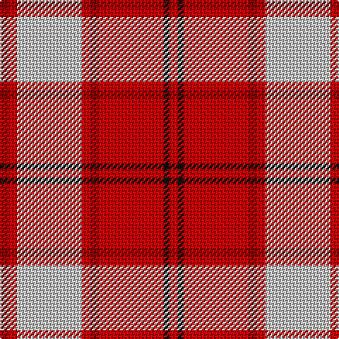

In pattern [RKRRRWRR](/patterns/rkrrrwrr/).

This was sourced from register-of-tartans.  It is a [8 stripes tartan](/stripes/stripes8/).

Original link https://www.tartanregister.gov.uk/tartanDetails.aspx?ref=1768

## Thread count
DR/6 R6 N46 R6 DR6 R46 K4 R/6

## Palette
Each colour and its ΔE from the base-6 reference it is a variant of.

| Colour | Shade | Base | ΔE (OKLab) |
|---|---|---|---|
| DR | <code style="background-color:#880000;">#880000</code> `#880000` | R <code style="background-color:#CC0000;">#CC0000</code> | 0.15 |
| K | <code style="background-color:#101010;">#101010</code> `#101010` | K <code style="background-color:#000000;">#000000</code> | 0.17 |
| N | <code style="background-color:#C0C0C0;">#C0C0C0</code> `#C0C0C0` | W <code style="background-color:#F7F7F7;">#F7F7F7</code> | 0.17 |
| R | <code style="background-color:#C80000;">#C80000</code> `#C80000` | R <code style="background-color:#CC0000;">#CC0000</code> | 0.01 |

# Sample pattern

## Nearest tartans

The nearest existing variants by ΔTartan distance.

1. [Cameron Hose #2](/setts/s8/r6ra6w46ra6r6ra46k4ra6-k101010-rc80050-radc0000-we0e0e0/) — ΔT 0.76
1. [Cameron, Hose for E](/setts/s8/r6k4r46ra6r6w46r6ra6-k000000-rc00000-rad00000-we0e0e0/) — ΔT 0.77
1. [Longniddry Dress, Red (Dance)](/setts/s8/r70b4w4b4r8ra20w50r6-b2c2c80-rc80000-ra780028-we0e0e0/) — ΔT 0.93
1. [Manx Laxey (Red)](/setts/s9/r48y4ra6g4w20r8ra6g6w4-g604000-rc80000-ra888888-we0e0e0-ye8c000/) — ΔT 1.05
1. [Manx Laxey, Red](/setts/s9/r48y4g6ra4w20r8g6ra6w4-g808080-rc00000-ra806050-we0e0e0-yf0c000/) — ΔT 1.05
1. [Glenfinnan](/setts/s10/b56r52w4b10w4r52g56r10w4r10-b780078-g289c18-rc80000-wfcfcfc/) — ΔT 1.20
1. [Longniddry Burgundy (Dance)](/setts/s8/r84ra4w4ra4r10rb24w64r8-r880000-rae87878-rbc80000-we0e0e0/) — ΔT 1.22
1. [Longniddry, dress Burgundy](/setts/s8/r84ra4w4ra4r10rb24w64r8-r900030-rad03030-rbc00000-we0e0e0/) — ΔT 1.24
1. [Lennox Dress #2](/setts/s7/r8ra4r40ra8w40b4w8-b2c2c80-rc80000-ra880000-we0e0e0/) — ΔT 1.26
1. [O'Meehan (Name)](/setts/s9/y54k8w8r128w8r8k8r8k24-k101010-rc80050-we0e0e0-ye8c000/) — ΔT 1.26

## Neighbour map

Every grey dot is one of 15726 variants placed by the first two principal components of the ΔTartan feature space (44% of its variance). Red is this tartan; blue dots are its nearest — click one to open its page.

<svg viewBox="0 0 640 380" role="img" style="max-width:100%;height:auto;border:1px solid #e0e0e0;border-radius:4px;display:block" xmlns="http://www.w3.org/2000/svg"><image href="/nn/cloud.v1.png" width="640" height="380"/><a href="/setts/s8/r6ra6w46ra6r6ra46k4ra6-k101010-rc80050-radc0000-we0e0e0/"><circle cx="295.3" cy="141.3" r="4" fill="#3465a4"><title>Cameron Hose #2</title></circle></a><a href="/setts/s8/r6k4r46ra6r6w46r6ra6-k000000-rc00000-rad00000-we0e0e0/"><circle cx="286.0" cy="140.7" r="4" fill="#3465a4"><title>Cameron, Hose for E</title></circle></a><a href="/setts/s8/r70b4w4b4r8ra20w50r6-b2c2c80-rc80000-ra780028-we0e0e0/"><circle cx="297.8" cy="125.3" r="4" fill="#3465a4"><title>Longniddry Dress, Red (Dance)</title></circle></a><a href="/setts/s9/r48y4ra6g4w20r8ra6g6w4-g604000-rc80000-ra888888-we0e0e0-ye8c000/"><circle cx="277.1" cy="124.0" r="4" fill="#3465a4"><title>Manx Laxey (Red)</title></circle></a><a href="/setts/s9/r48y4g6ra4w20r8g6ra6w4-g808080-rc00000-ra806050-we0e0e0-yf0c000/"><circle cx="281.3" cy="126.5" r="4" fill="#3465a4"><title>Manx Laxey, Red</title></circle></a><a href="/setts/s10/b56r52w4b10w4r52g56r10w4r10-b780078-g289c18-rc80000-wfcfcfc/"><circle cx="263.4" cy="152.5" r="4" fill="#3465a4"><title>Glenfinnan</title></circle></a><a href="/setts/s8/r84ra4w4ra4r10rb24w64r8-r880000-rae87878-rbc80000-we0e0e0/"><circle cx="301.2" cy="119.2" r="4" fill="#3465a4"><title>Longniddry Burgundy (Dance)</title></circle></a><a href="/setts/s8/r84ra4w4ra4r10rb24w64r8-r900030-rad03030-rbc00000-we0e0e0/"><circle cx="305.4" cy="119.7" r="4" fill="#3465a4"><title>Longniddry, dress Burgundy</title></circle></a><a href="/setts/s7/r8ra4r40ra8w40b4w8-b2c2c80-rc80000-ra880000-we0e0e0/"><circle cx="237.6" cy="161.8" r="4" fill="#3465a4"><title>Lennox Dress #2</title></circle></a><a href="/setts/s9/y54k8w8r128w8r8k8r8k24-k101010-rc80050-we0e0e0-ye8c000/"><circle cx="326.9" cy="113.0" r="4" fill="#3465a4"><title>O'Meehan (Name)</title></circle></a><circle cx="307.8" cy="151.8" r="5" fill="#c00000"/></svg>

ID: /setts/s8/r6ra6w46ra6r6ra46k4ra6-k101010-r880000-rac80000-wc0c0c0/
