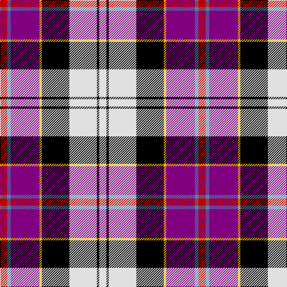

In pattern [RBBYKWKW](/stripes/rbbykwkw/).

This was sourced from weddslist.  It is a [8 stripe tartan](/stripes/stripes8/).

Original link http://www.weddslist.com/cgi-bin/tartans/pg.pl?source=sts

## Thread count
R/12 B6 P48 Y4 K46 LN46 K4 LN/12

## Palette
Each colour and the base-6 reference it is a variant of.

| Colour | Shade | Base |
|---|---|---|
| B | <code style="background-color:#5480B0;">#5480B0</code> `oklch(58.8% 0.089 251.5)` <small>#5480B0</small> | B <code style="background-color:#2A418A;">#2A418A</code> |
| K | <code style="background-color:#000000;">#000000</code> `oklch(0.0% 0.000 0.0)` <small>#000000</small> | K <code style="background-color:#000000;">#000000</code> |
| LN | <code style="background-color:#E0E0E0;">#E0E0E0</code> `oklch(90.7% 0.000 89.9)` <small>#E0E0E0</small> | W <code style="background-color:#F7F7F7;">#F7F7F7</code> |
| P | <code style="background-color:#800080;">#800080</code> `oklch(42.1% 0.193 328.4)` <small>#800080</small> | B <code style="background-color:#2A418A;">#2A418A</code> |
| R | <code style="background-color:#C00000;">#C00000</code> `oklch(50.7% 0.208 29.2)` <small>#C00000</small> | R <code style="background-color:#CC0000;">#CC0000</code> |
| Y | <code style="background-color:#F0C000;">#F0C000</code> `oklch(82.7% 0.169 90.5)` <small>#F0C000</small> | Y <code style="background-color:#F2BF00;">#F2BF00</code> |

# Sample pattern

## Nearest tartans

The nearest existing variants by ΔTartan distance, with this tartan at the top so the swatches line up against it.

ΔTartan

Tartan

Sett

—

<a href="/ttd/edit/#slug=r6t3p24ly2k23w23k2w6~x2">Culloden, Dress</a> <a class="nn-out" href="/setts/s8/r6t3p24ly2k23w23k2w6~x2/" title="open its dictionary page">↗</a>

0.63

<a href="/ttd/edit/#slug=r6t3dp24ly2k23w23k2w6~x2">Culloden Dress</a> <a class="nn-out" href="/setts/s8/r6t3dp24ly2k23w23k2w6~x2/" title="open its dictionary page">↗</a>

0.79

<a href="/ttd/edit/#slug=r6t3m20ly2k20w20k2w5~x2">Humming Bird (Fashion)</a> <a class="nn-out" href="/setts/s8/r6t3m20ly2k20w20k2w5~x2/" title="open its dictionary page">↗</a>

1.06

<a href="/ttd/edit/#slug=lp33r7dt9b7lg12r3k29~x2">Hatcher (Texas) (Personal)</a> <a class="nn-out" href="/setts/s7/lp33r7dt9b7lg12r3k29~x2/" title="open its dictionary page">↗</a>

1.07

<a href="/ttd/edit/#slug=r6db3p24w2k23y23k2y6~x2">Culloden, Grey</a> <a class="nn-out" href="/setts/s8/r6db3p24w2k23y23k2y6~x2/" title="open its dictionary page">↗</a>

1.09

<a href="/ttd/edit/#slug=r17k5w4k6ly5db31k5g6w3~x2">Dean/Dundas (Personal)</a> <a class="nn-out" href="/setts/s9/r17k5w4k6ly5db31k5g6w3~x2/" title="open its dictionary page">↗</a>

1.18

<a href="/ttd/edit/#slug=r4o2b15ly2k14w14k2w4~x2">Culloden, Stirling</a> <a class="nn-out" href="/setts/s8/r4o2b15ly2k14w14k2w4~x2/" title="open its dictionary page">↗</a>

1.19

<a href="/ttd/edit/#slug=w5k26ly4lb24dp8k3r4~x2">Pengelly, The Cornish</a> <a class="nn-out" href="/setts/s7/w5k26ly4lb24dp8k3r4~x2/" title="open its dictionary page">↗</a>

1.20

<a href="/ttd/edit/#slug=r4ly3w12k16g5db20k4w2~x2">Iowa Dress (District)</a> <a class="nn-out" href="/setts/s8/r4ly3w12k16g5db20k4w2~x2/" title="open its dictionary page">↗</a>

1.21

<a href="/ttd/edit/#slug=r5t2p16k13ly13k2w3~x2">Casey (Personal)</a> <a class="nn-out" href="/setts/s7/r5t2p16k13ly13k2w3~x2/" title="open its dictionary page">↗</a>

1.23

<a href="/ttd/edit/#slug=r3w2db27k19w27dp2ly3~x2">Christian Dress (Personal)</a> <a class="nn-out" href="/setts/s7/r3w2db27k19w27dp2ly3~x2/" title="open its dictionary page">↗</a>

## Neighbour map

Every grey dot is one of 14299 variants placed by the first two principal components of the ΔTartan feature space (44% of its variance). Red is this tartan; blue dots are its nearest — click one to open its page.

<svg viewBox="0 0 640 380" role="img" style="max-width:100%;height:auto;border:1px solid #e0e0e0;border-radius:4px;display:block" xmlns="http://www.w3.org/2000/svg"><image href="/nn/cloud.v1.png" width="640" height="380"/><a href="/setts/s8/r6t3dp24ly2k23w23k2w6~x2/"><circle cx="97.5" cy="122.4" r="4" fill="#3465a4"><title>Culloden Dress</title></circle></a><a href="/setts/s8/r6t3m20ly2k20w20k2w5~x2/"><circle cx="91.0" cy="133.3" r="4" fill="#3465a4"><title>Humming Bird (Fashion)</title></circle></a><a href="/setts/s7/lp33r7dt9b7lg12r3k29~x2/"><circle cx="58.5" cy="127.9" r="4" fill="#3465a4"><title>Hatcher (Texas) (Personal)</title></circle></a><a href="/setts/s8/r6db3p24w2k23y23k2y6~x2/"><circle cx="119.9" cy="141.0" r="4" fill="#3465a4"><title>Culloden, Grey</title></circle></a><a href="/setts/s9/r17k5w4k6ly5db31k5g6w3~x2/"><circle cx="122.5" cy="132.0" r="4" fill="#3465a4"><title>Dean/Dundas (Personal)</title></circle></a><a href="/setts/s8/r4o2b15ly2k14w14k2w4~x2/"><circle cx="62.0" cy="148.2" r="4" fill="#3465a4"><title>Culloden, Stirling</title></circle></a><a href="/setts/s7/w5k26ly4lb24dp8k3r4~x2/"><circle cx="118.6" cy="146.7" r="4" fill="#3465a4"><title>Pengelly, The Cornish</title></circle></a><a href="/setts/s8/r4ly3w12k16g5db20k4w2~x2/"><circle cx="68.7" cy="148.9" r="4" fill="#3465a4"><title>Iowa Dress (District)</title></circle></a><a href="/setts/s7/r5t2p16k13ly13k2w3~x2/"><circle cx="62.7" cy="159.1" r="4" fill="#3465a4"><title>Casey (Personal)</title></circle></a><a href="/setts/s7/r3w2db27k19w27dp2ly3~x2/"><circle cx="119.5" cy="124.1" r="4" fill="#3465a4"><title>Christian Dress (Personal)</title></circle></a><circle cx="98.3" cy="125.6" r="5" fill="#c00000"/></svg>

ID: /setts/s8/r6t3p24ly2k23w23k2w6~x2/
