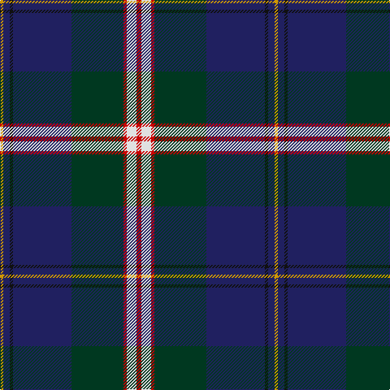

In pattern [RWRGBKBY](/patterns/rwrgbkby/).

This was sourced from register-of-tartans.  It is a [8 stripes tartan](/stripes/stripes8/).

Original link https://www.tartanregister.gov.uk/tartanDetails.aspx?ref=543

## Attestations

This cloth appears in 2 source records; the oldest owns this page.

- 01/01/1966 — Canadian Centennial (register-of-tartans, [record](https://www.tartanregister.gov.uk/tartanDetails.aspx?ref=543))
- 1966 — Canadian Centennial (Commemorative) (tartans-authority, [record](http://www.tartansauthority.com/tartan-ferret/display/1704/))

## Thread count
DY/4 DB8 K4 DB72 DG64 R4 LN12 R/6

## Palette
Each colour and its ΔE from the base-6 reference it is a variant of.

| Colour | Shade | Base | ΔE (OKLab) |
|---|---|---|---|
| DB | <code style="background-color:#202060;">#202060</code> `#202060` | B <code style="background-color:#2C4084;">#2C4084</code> | 0.11 |
| DG | <code style="background-color:#003820;">#003820</code> `#003820` | G <code style="background-color:#006400;">#006400</code> | 0.16 |
| DY | <code style="background-color:#D09800;">#D09800</code> `#D09800` | Y <code style="background-color:#E8C000;">#E8C000</code> | 0.11 |
| K | <code style="background-color:#101010;">#101010</code> `#101010` | K <code style="background-color:#000000;">#000000</code> | 0.17 |
| LN | <code style="background-color:#E0E0E0;">#E0E0E0</code> `#E0E0E0` | W <code style="background-color:#F4F4F0;">#F4F4F0</code> | 0.06 |
| R | <code style="background-color:#C80000;">#C80000</code> `#C80000` | R <code style="background-color:#C80000;">#C80000</code> | 0.00 |

# Sample pattern

## Nearest tartans

The nearest existing variants by ΔTartan distance.

1. [Scotland’s Golf Coast](/setts/s9/y4w2b32ba4b4ba6b16g40ya4-b141e46-ba780078-g285800-wffffff-y48a4c0-yae0a126/) — ΔT 0.76
1. [State Seal of Ohio (Fashion)](/setts/s9/b120y6b10ya10b18ba40y8g64w8-b2c2c80-ba441800-g006818-we8ccb8-ya08858-yabc8c00/) — ΔT 0.85
1. [Unidentified (ex Tony Murray)](/setts/s9/w4b40g4ga4g4ga10g16y4r2-b38409c-g003820-ga285800-rc80000-wfcfcfc-yc4bc68/) — ΔT 0.92
1. [Hunnisett/Edinchip (Name)](/setts/s11/b76w4b4k20g4y4g44k6r6k6r6-b202060-g006818-k101010-rc80000-we0e0e0-ye8c000/) — ΔT 0.92
1. [Milne-Murtagh (2009)](/setts/s7/r10g4k60ga52gb4ga4ka8-g6e7f86-ga696969-gb6b5613-k101010-ka08033b-rc33f7b/) — ΔT 0.92
1. [Scottish Association for Neurological Sciences](/setts/s9/b46y4b4y4b6k16ba66w11r6-b141e46-ba505050-k101010-rdc0000-wc0c0c0-ye8c000/) — ΔT 0.93
1. [Italian National](/setts/s6/r6w4g10k70b80y6-b2c2c80-g289c18-k101010-rc80000-wfcfcfc-ye8c000/) — ΔT 0.95
1. [Heirloom Dark Alba (Fashion)](/setts/s9/k8y4k68b20ya8b8ba8b46w6-b202060-ba780078-k101010-we0e0e0-ybc8c00-yaa0a0a0/) — ΔT 0.95
1. [Canadian Centennial District Tartan Tartan Number: 1704. Earliest known date: 1966 This tartan was approved by the Centennial Commission. The six colours represent the wealth of Canada in her people and her natural resources. See products available Copyright © Blair Urquhart, Comrie, 2015](/setts/s8/r6w12r4g64b72k4b8y4-b2c2c80-g006818-k101010-rc80000-we0e0e0-ye8c000/) — ΔT 0.96
1. [Pipers' Trail, The](/setts/s6/w4b54k53ba4bb8y4-b003c64-ba5a008c-bb1870a4-k101010-wffffff-ye0a126/) — ΔT 0.97

## Neighbour map

Every grey dot is one of 15726 variants placed by the first two principal components of the ΔTartan feature space (44% of its variance). Red is this tartan; blue dots are its nearest — click one to open its page.

<svg viewBox="0 0 640 380" role="img" style="max-width:100%;height:auto;border:1px solid #e0e0e0;border-radius:4px;display:block" xmlns="http://www.w3.org/2000/svg"><image href="/nn/cloud.v1.png" width="640" height="380"/><a href="/setts/s9/y4w2b32ba4b4ba6b16g40ya4-b141e46-ba780078-g285800-wffffff-y48a4c0-yae0a126/"><circle cx="253.4" cy="131.5" r="4" fill="#3465a4"><title>Scotland’s Golf Coast</title></circle></a><a href="/setts/s9/b120y6b10ya10b18ba40y8g64w8-b2c2c80-ba441800-g006818-we8ccb8-ya08858-yabc8c00/"><circle cx="280.7" cy="127.1" r="4" fill="#3465a4"><title>State Seal of Ohio (Fashion)</title></circle></a><a href="/setts/s9/w4b40g4ga4g4ga10g16y4r2-b38409c-g003820-ga285800-rc80000-wfcfcfc-yc4bc68/"><circle cx="231.6" cy="119.6" r="4" fill="#3465a4"><title>Unidentified (ex Tony Murray)</title></circle></a><a href="/setts/s11/b76w4b4k20g4y4g44k6r6k6r6-b202060-g006818-k101010-rc80000-we0e0e0-ye8c000/"><circle cx="234.5" cy="105.0" r="4" fill="#3465a4"><title>Hunnisett/Edinchip (Name)</title></circle></a><a href="/setts/s7/r10g4k60ga52gb4ga4ka8-g6e7f86-ga696969-gb6b5613-k101010-ka08033b-rc33f7b/"><circle cx="238.9" cy="144.9" r="4" fill="#3465a4"><title>Milne-Murtagh (2009)</title></circle></a><a href="/setts/s9/b46y4b4y4b6k16ba66w11r6-b141e46-ba505050-k101010-rdc0000-wc0c0c0-ye8c000/"><circle cx="210.6" cy="124.4" r="4" fill="#3465a4"><title>Scottish Association for Neurological Sciences</title></circle></a><a href="/setts/s6/r6w4g10k70b80y6-b2c2c80-g289c18-k101010-rc80000-wfcfcfc-ye8c000/"><circle cx="255.7" cy="140.4" r="4" fill="#3465a4"><title>Italian National</title></circle></a><a href="/setts/s9/k8y4k68b20ya8b8ba8b46w6-b202060-ba780078-k101010-we0e0e0-ybc8c00-yaa0a0a0/"><circle cx="252.4" cy="141.1" r="4" fill="#3465a4"><title>Heirloom Dark Alba (Fashion)</title></circle></a><a href="/setts/s8/r6w12r4g64b72k4b8y4-b2c2c80-g006818-k101010-rc80000-we0e0e0-ye8c000/"><circle cx="242.8" cy="120.1" r="4" fill="#3465a4"><title>Canadian Centennial District Tartan Tartan Number: 1704. Earliest known date: 1966 This tartan was approved by the Centennial Commission. The six colours represent the wealth of Canada in her people and her natural resources. See products available Copyright © Blair Urquhart, Comrie, 2015</title></circle></a><a href="/setts/s6/w4b54k53ba4bb8y4-b003c64-ba5a008c-bb1870a4-k101010-wffffff-ye0a126/"><circle cx="240.4" cy="165.6" r="4" fill="#3465a4"><title>Pipers' Trail, The</title></circle></a><circle cx="258.1" cy="128.6" r="5" fill="#c00000"/></svg>

ID: /setts/s8/r6w12r4g64b72k4b8y4-b202060-g003820-k101010-rc80000-we0e0e0-yd09800/
