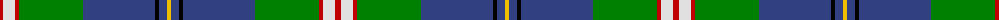

In pattern [RWRGBKBY](/patterns/rwrgbkby/).

This was sourced from weddslist.  It is a [8 stripes tartan](/stripes/stripes8/).

Original link http://www.weddslist.com/cgi-bin/tartans/pg.pl?source=sts

## Thread count
R/6 LN12 R4 G64 B72 K4 B8 Y/4

## Palette
Each colour and its ΔE from the base-6 reference it is a variant of.

| Colour | Shade | Base | ΔE (OKLab) |
|---|---|---|---|
| B | <code style="background-color:#304080;">#304080</code> `#304080` | B <code style="background-color:#2C4084;">#2C4084</code> | 0.01 |
| G | <code style="background-color:#008000;">#008000</code> `#008000` | G <code style="background-color:#006400;">#006400</code> | 0.09 |
| K | <code style="background-color:#000000;">#000000</code> `#000000` | K <code style="background-color:#000000;">#000000</code> | 0.00 |
| LN | <code style="background-color:#E0E0E0;">#E0E0E0</code> `#E0E0E0` | W <code style="background-color:#F4F4F0;">#F4F4F0</code> | 0.06 |
| R | <code style="background-color:#C00000;">#C00000</code> `#C00000` | R <code style="background-color:#C80000;">#C80000</code> | 0.02 |
| Y | <code style="background-color:#F0C000;">#F0C000</code> `#F0C000` | Y <code style="background-color:#E8C000;">#E8C000</code> | 0.01 |

# Sample pattern

## Nearest tartans

The nearest existing variants by ΔTartan distance.

1. [Nova Scotia](/setts/s9/w4b40g4ga4g4ga8g16y4r2-b304080-g003000-ga30a010-rc00000-we0e0e0-yf0c000/) — ΔT 0.63
1. [Nova Scotia (Province)](/setts/s9/w4b40g4ga4g4ga8g16y4r2-b38409c-g006818-ga289c18-rc80000-wffffff-ye8c000/) — ΔT 0.64
1. [Nova Scotia (District)](/setts/s9/w4b40g4ga4g4ga8g16y4r2-b38409c-g006818-ga289c18-rc80000-wfcfcfc-ye8c000/) — ΔT 0.64
1. [Blue Blas Alba (Fashion)](/setts/s9/g8y4g78b20r8b8ra8b50w6-b14283c-g789484-r888888-ra901c38-we0e0e0-ye8c000/) — ΔT 0.67
1. [Blue Blas Alba](/setts/s9/g8y4g78b20r8b8ra8b50w6-b14283c-g789484-r888888-ra901c38-wffffff-ye8c000/) — ΔT 0.67
1. [Canadian Centennial District Tartan Tartan Number: 1704. Earliest known date: 1966 This tartan was approved by the Centennial Commission. The six colours represent the wealth of Canada in her people and her natural resources. See products available Copyright © Blair Urquhart, Comrie, 2015](/setts/s8/r6w12r4g64b72k4b8y4-b2c2c80-g006818-k101010-rc80000-we0e0e0-ye8c000/) — ΔT 0.67
1. [Kleto, Susan (Personal)](/setts/s9/w2b32y2r6y2g12ga4g12w2-b2c2c80-g006818-ga289c18-ra00000-wfcfcfc-yfccc00/) — ΔT 0.79
1. [Vipont](/setts/s7/r8g28k6w6g24b72wa8-b304080-g008000-k000000-rc00000-wc0a0e0-wae0e0e0/) — ΔT 0.91
1. [Nova Scotia Canadian District Tartan Tartan Number: 1713. Earliest known date: 1956 Mrs Douglas Murray designed a panel for a historical display showing a shepherd tending his flock on the hills of Cape Breton. To avoid trouble amongst the clansfolk of Nova Scotia she designed a new tartan for the shepherds kilt. See products available Copyright © Blair Urquhart, Comrie, 2015](/setts/s9/w4b40g4ga4g4ga8g16y4r2-b2c2c80-g003820-ga289c18-rc80000-we0e0e0-ye8c000/) — ΔT 0.96
1. [German MacLeod](/setts/s8/w4k2g26k12b54k4r4y4-b1474b4-g006818-k101010-rc80000-w98c8e8-ye8c000/) — ΔT 1.00

## Neighbour map

Every grey dot is one of 15726 variants placed by the first two principal components of the ΔTartan feature space (44% of its variance). Red is this tartan; blue dots are its nearest — click one to open its page.

<svg viewBox="0 0 640 380" role="img" style="max-width:100%;height:auto;border:1px solid #e0e0e0;border-radius:4px;display:block" xmlns="http://www.w3.org/2000/svg"><image href="/nn/cloud.v1.png" width="640" height="380"/><a href="/setts/s9/w4b40g4ga4g4ga8g16y4r2-b304080-g003000-ga30a010-rc00000-we0e0e0-yf0c000/"><circle cx="226.0" cy="112.4" r="4" fill="#3465a4"><title>Nova Scotia</title></circle></a><a href="/setts/s9/w4b40g4ga4g4ga8g16y4r2-b38409c-g006818-ga289c18-rc80000-wffffff-ye8c000/"><circle cx="225.2" cy="111.1" r="4" fill="#3465a4"><title>Nova Scotia (Province)</title></circle></a><a href="/setts/s9/w4b40g4ga4g4ga8g16y4r2-b38409c-g006818-ga289c18-rc80000-wfcfcfc-ye8c000/"><circle cx="225.7" cy="111.3" r="4" fill="#3465a4"><title>Nova Scotia (District)</title></circle></a><a href="/setts/s9/g8y4g78b20r8b8ra8b50w6-b14283c-g789484-r888888-ra901c38-we0e0e0-ye8c000/"><circle cx="245.2" cy="114.7" r="4" fill="#3465a4"><title>Blue Blas Alba (Fashion)</title></circle></a><a href="/setts/s9/g8y4g78b20r8b8ra8b50w6-b14283c-g789484-r888888-ra901c38-wffffff-ye8c000/"><circle cx="241.7" cy="113.1" r="4" fill="#3465a4"><title>Blue Blas Alba</title></circle></a><a href="/setts/s8/r6w12r4g64b72k4b8y4-b2c2c80-g006818-k101010-rc80000-we0e0e0-ye8c000/"><circle cx="242.8" cy="120.1" r="4" fill="#3465a4"><title>Canadian Centennial District Tartan Tartan Number: 1704. Earliest known date: 1966 This tartan was approved by the Centennial Commission. The six colours represent the wealth of Canada in her people and her natural resources. See products available Copyright © Blair Urquhart, Comrie, 2015</title></circle></a><a href="/setts/s9/w2b32y2r6y2g12ga4g12w2-b2c2c80-g006818-ga289c18-ra00000-wfcfcfc-yfccc00/"><circle cx="193.4" cy="118.9" r="4" fill="#3465a4"><title>Kleto, Susan (Personal)</title></circle></a><a href="/setts/s7/r8g28k6w6g24b72wa8-b304080-g008000-k000000-rc00000-wc0a0e0-wae0e0e0/"><circle cx="216.7" cy="151.9" r="4" fill="#3465a4"><title>Vipont</title></circle></a><a href="/setts/s9/w4b40g4ga4g4ga8g16y4r2-b2c2c80-g003820-ga289c18-rc80000-we0e0e0-ye8c000/"><circle cx="226.8" cy="112.7" r="4" fill="#3465a4"><title>Nova Scotia Canadian District Tartan Tartan Number: 1713. Earliest known date: 1956 Mrs Douglas Murray designed a panel for a historical display showing a shepherd tending his flock on the hills of Cape Breton. To avoid trouble amongst the clansfolk of Nova Scotia she designed a new tartan for the shepherds kilt. See products available Copyright © Blair Urquhart, Comrie, 2015</title></circle></a><a href="/setts/s8/w4k2g26k12b54k4r4y4-b1474b4-g006818-k101010-rc80000-w98c8e8-ye8c000/"><circle cx="257.6" cy="108.6" r="4" fill="#3465a4"><title>German MacLeod</title></circle></a><circle cx="238.1" cy="118.1" r="5" fill="#c00000"/></svg>

ID: /setts/s8/r6w12r4g64b72k4b8y4-b304080-g008000-k000000-rc00000-we0e0e0-yf0c000/
