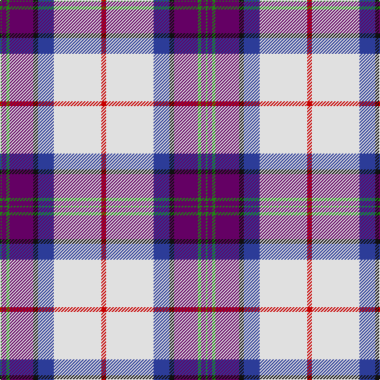

In pattern [GBGBKBWR](/patterns/gbgbkbwr/).

This was sourced from register-of-tartans.  It is a [8 stripes tartan](/stripes/stripes8/).

Original link https://www.tartanregister.gov.uk/tartanDetails.aspx?ref=5786

## Thread count
G/2 P6 G4 P30 K6 B20 LN60 R/6

## Palette
Each colour and its ΔE from the base-6 reference it is a variant of.

| Colour | Shade | Base | ΔE (OKLab) |
|---|---|---|---|
| B | <code style="background-color:#2C3C98;">#2C3C98</code> `#2C3C98` | B <code style="background-color:#2C4084;">#2C4084</code> | 0.04 |
| G | <code style="background-color:#208414;">#208414</code> `#208414` | G <code style="background-color:#006400;">#006400</code> | 0.10 |
| K | <code style="background-color:#101010;">#101010</code> `#101010` | K <code style="background-color:#000000;">#000000</code> | 0.17 |
| LN | <code style="background-color:#E0E0E0;">#E0E0E0</code> `#E0E0E0` | W <code style="background-color:#F4F4F0;">#F4F4F0</code> | 0.06 |
| P | <code style="background-color:#640064;">#640064</code> `#640064` | B <code style="background-color:#2C4084;">#2C4084</code> | 0.15 |
| R | <code style="background-color:#C80000;">#C80000</code> `#C80000` | R <code style="background-color:#C80000;">#C80000</code> | 0.00 |

# Sample pattern

## Nearest tartans

The nearest existing variants by ΔTartan distance.

1. [S.O.B.H.D. (Corporate)](/setts/s8/r6w60b20k6ba30g4ba6g2-b2c3c98-ba640064-g208414-k101010-rc80000-wf0e4cc/) — ΔT 0.33
1. [MacBeth Dress (Dance)](/setts/s10/w100k2b28g28w4b4w4k8y4ba60-b780078-ba2c2c80-g006818-k101010-we0e0e0-ye8c000/) — ΔT 1.15
1. [Pride of Scotland Dress (Dance)](/setts/s11/g18r4ra4k6ra36r2b4g4b38w66b4-b2c2c80-g006818-k101010-ra00048-ra981c70-we0e0e0/) — ΔT 1.17
1. [Edgar-Feyen (Personal)](/setts/s6/w72k4b16g16ba40y8-b2c2c80-ba780078-g006818-k101010-we0e0e0-yd87c00/) — ΔT 1.20
1. [Hebridean Arisaid, Red/White (Dance)](/setts/s9/w74k8b24g24w4y4r46w8r12-b30308c-g006818-k101010-r800028-we0e0e0-ye08070/) — ΔT 1.23
1. [Scotland's Charity Air Ambulance](/setts/s9/w4b54k2g6k2ba20k2r48w4-b3850c8-ba646464-g289c18-k101010-rff0000-wffffff/) — ΔT 1.25
1. [Edinburgh Dress District Tartan Tartan Number: 1461. Earliest known date: Edinburgh One of a number of dress tartans produced by Hugh Macpherson, a kiltmaker in Edinburgh, intended for dancing and other informal occassions. The 'dress' version of clan tartan is usually created by substituting white for one of the 'ground' colours. See products available Copyright © Blair Urquhart, Comrie, 2015](/setts/s10/w8k4w60g6b6g6b14ba28g6r6-b780078-ba2c2c80-g006818-k101010-rc80000-we0e0e0/) — ΔT 1.27
1. [Dignan](/setts/s7/y8r4b64k20ba8w44ba4-b5480b0-ba800080-k000000-rc00000-we0e0e0-yf0c000/) — ΔT 1.29
1. [Baudoux et amis picards](/setts/s11/y8b14y8b52g6k2g6w18r4w8r4-b271b86-g3b522f-k120a01-rf4758c-wf7f1e8-yd3cc20/) — ΔT 1.30
1. [Edinburgh Dress (Dance)](/setts/s10/w8k4w60g6b6g6b14ba28g6r6-b780078-ba2c2c80-g006818-k101010-rc80000-wfcfcfc/) — ΔT 1.37

## Neighbour map

Every grey dot is one of 15726 variants placed by the first two principal components of the ΔTartan feature space (44% of its variance). Red is this tartan; blue dots are its nearest — click one to open its page.

<svg viewBox="0 0 640 380" role="img" style="max-width:100%;height:auto;border:1px solid #e0e0e0;border-radius:4px;display:block" xmlns="http://www.w3.org/2000/svg"><image href="/nn/cloud.v1.png" width="640" height="380"/><a href="/setts/s8/r6w60b20k6ba30g4ba6g2-b2c3c98-ba640064-g208414-k101010-rc80000-wf0e4cc/"><circle cx="200.5" cy="76.1" r="4" fill="#3465a4"><title>S.O.B.H.D. (Corporate)</title></circle></a><a href="/setts/s10/w100k2b28g28w4b4w4k8y4ba60-b780078-ba2c2c80-g006818-k101010-we0e0e0-ye8c000/"><circle cx="216.5" cy="43.8" r="4" fill="#3465a4"><title>MacBeth Dress (Dance)</title></circle></a><a href="/setts/s11/g18r4ra4k6ra36r2b4g4b38w66b4-b2c2c80-g006818-k101010-ra00048-ra981c70-we0e0e0/"><circle cx="157.8" cy="59.5" r="4" fill="#3465a4"><title>Pride of Scotland Dress (Dance)</title></circle></a><a href="/setts/s6/w72k4b16g16ba40y8-b2c2c80-ba780078-g006818-k101010-we0e0e0-yd87c00/"><circle cx="181.7" cy="122.5" r="4" fill="#3465a4"><title>Edgar-Feyen (Personal)</title></circle></a><a href="/setts/s9/w74k8b24g24w4y4r46w8r12-b30308c-g006818-k101010-r800028-we0e0e0-ye08070/"><circle cx="162.0" cy="99.4" r="4" fill="#3465a4"><title>Hebridean Arisaid, Red/White (Dance)</title></circle></a><a href="/setts/s9/w4b54k2g6k2ba20k2r48w4-b3850c8-ba646464-g289c18-k101010-rff0000-wffffff/"><circle cx="200.7" cy="76.1" r="4" fill="#3465a4"><title>Scotland's Charity Air Ambulance</title></circle></a><a href="/setts/s10/w8k4w60g6b6g6b14ba28g6r6-b780078-ba2c2c80-g006818-k101010-rc80000-we0e0e0/"><circle cx="178.6" cy="91.4" r="4" fill="#3465a4"><title>Edinburgh Dress District Tartan Tartan Number: 1461. Earliest known date: Edinburgh One of a number of dress tartans produced by Hugh Macpherson, a kiltmaker in Edinburgh, intended for dancing and other informal occassions. The 'dress' version of clan tartan is usually created by substituting white for one of the 'ground' colours. See products available Copyright © Blair Urquhart, Comrie, 2015</title></circle></a><a href="/setts/s7/y8r4b64k20ba8w44ba4-b5480b0-ba800080-k000000-rc00000-we0e0e0-yf0c000/"><circle cx="155.8" cy="116.9" r="4" fill="#3465a4"><title>Dignan</title></circle></a><a href="/setts/s11/y8b14y8b52g6k2g6w18r4w8r4-b271b86-g3b522f-k120a01-rf4758c-wf7f1e8-yd3cc20/"><circle cx="214.9" cy="75.7" r="4" fill="#3465a4"><title>Baudoux et amis picards</title></circle></a><a href="/setts/s10/w8k4w60g6b6g6b14ba28g6r6-b780078-ba2c2c80-g006818-k101010-rc80000-wfcfcfc/"><circle cx="169.7" cy="86.1" r="4" fill="#3465a4"><title>Edinburgh Dress (Dance)</title></circle></a><circle cx="201.8" cy="77.8" r="5" fill="#c00000"/></svg>

ID: /setts/s8/r6w60b20k6ba30g4ba6g2-b2c3c98-ba640064-g208414-k101010-rc80000-we0e0e0/
