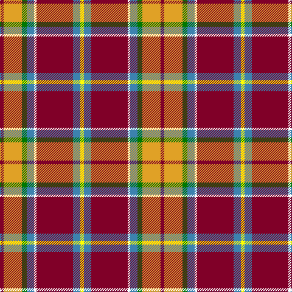

In pattern [RYGBWRBY](/patterns/rygbwrby/).

This was sourced from register-of-tartans.  It is a [8 stripes tartan](/stripes/stripes8/).

Original link https://www.tartanregister.gov.uk/tartanDetails.aspx?ref=10876

## Thread count
DR/6 Ya30 G8 B12 W4 DR60 B12 Y/6

## Palette
Each colour and its ΔE from the base-6 reference it is a variant of.

| Colour | Shade | Base | ΔE (OKLab) |
|---|---|---|---|
| B | <code style="background-color:#3C82AF;">#3C82AF</code> `#3C82AF` | B <code style="background-color:#2A418A;">#2A418A</code> | 0.19 |
| DR | <code style="background-color:#800028;">#800028</code> `#800028` | R <code style="background-color:#CC0000;">#CC0000</code> | 0.17 |
| G | <code style="background-color:#007800;">#007800</code> `#007800` | G <code style="background-color:#006100;">#006100</code> | 0.07 |
| W | <code style="background-color:#FFFFFF;">#FFFFFF</code> `#FFFFFF` | W <code style="background-color:#F7F7F7;">#F7F7F7</code> | 0.02 |
| Y | <code style="background-color:#FFFF00;">#FFFF00</code> `#FFFF00` | Y <code style="background-color:#F2BF00;">#F2BF00</code> | 0.16 |
| Ya | <code style="background-color:#E0A126;">#E0A126</code> `#E0A126` | Y <code style="background-color:#F2BF00;">#F2BF00</code> | 0.08 |

# Sample pattern

## Nearest tartans

The nearest existing variants by ΔTartan distance.

1. [Round Table Sweden](/setts/s8/r6y30g8b12w4r60b12ya6-b003c64-g006818-ra00000-wfcfcfc-yd09800-yafccc00/) — ΔT 0.67
1. [Hogeboom (Personal)](/setts/s9/b8g6b18ba28y16ba4r70ra4r6-b5c8ca8-ba003c64-g006818-rc80000-rae87878-yfccc00/) — ΔT 0.70
1. [Hewitt (Name)](/setts/s7/r60b24k6g24y4g6w4-b2c2c80-g006818-k101010-rc80000-we0e0e0-ye8c000/) — ΔT 0.74
1. [Hewitt](/setts/s7/r60b24k12g24y4g6w4-b2c4084-g005020-k101010-rdc0000-we0e0e0-ye8c000/) — ΔT 0.83
1. [Scottish American Society of Michigan (Official)](/setts/s6/r96b32y10g34w16k6-b5f749c-g23321b-k000000-rb62531-wf9f5ef-ye0a126/) — ΔT 0.89
1. [Scottish American Soc. of Michigan](/setts/s6/r96b32y10g34w16ga6-b1474b4-g006818-ga604000-rc80000-we0e0e0-ybc8c00/) — ΔT 0.95
1. [Edinburgh Napier University (Corp.)](/setts/s8/b8w8b8w10k16g4r38y2-b5c8ca8-g289c18-k101010-rc80000-wf0e4cc-ybc8c00/) — ΔT 1.01
1. [Gillespie Family Tartan Tartan Number: 1361. Earliest known date: pre 1992 Scott Adie were retailers from c.1860 See products available Copyright © Blair Urquhart, Comrie, 2015](/setts/s9/r52b4k12y4g16r4k8b4w4-b5c8ca8-g006818-k101010-rc80000-we0e0e0-ye8c000/) — ΔT 1.06
1. [Ogg of Tarragann](/setts/s12/k4b12w2r28k2r28w2k12g20y2g4y4-b237f97-g14492d-k101010-rcb2610-wffffff-ybe8f2c/) — ΔT 1.11
1. [Ogg of Tarragann (Personal)](/setts/s12/k4b12w2r28k2r28w2k12g20y2g4y4-b5c8ca8-g006818-k101010-rc80000-we0e0e0-ybc8c00/) — ΔT 1.13

## Neighbour map

Every grey dot is one of 15726 variants placed by the first two principal components of the ΔTartan feature space (44% of its variance). Red is this tartan; blue dots are its nearest — click one to open its page.

<svg viewBox="0 0 640 380" role="img" style="max-width:100%;height:auto;border:1px solid #e0e0e0;border-radius:4px;display:block" xmlns="http://www.w3.org/2000/svg"><image href="/nn/cloud.v1.png" width="640" height="380"/><a href="/setts/s8/r6y30g8b12w4r60b12ya6-b003c64-g006818-ra00000-wfcfcfc-yd09800-yafccc00/"><circle cx="228.2" cy="120.6" r="4" fill="#3465a4"><title>Round Table Sweden</title></circle></a><a href="/setts/s9/b8g6b18ba28y16ba4r70ra4r6-b5c8ca8-ba003c64-g006818-rc80000-rae87878-yfccc00/"><circle cx="234.0" cy="104.0" r="4" fill="#3465a4"><title>Hogeboom (Personal)</title></circle></a><a href="/setts/s7/r60b24k6g24y4g6w4-b2c2c80-g006818-k101010-rc80000-we0e0e0-ye8c000/"><circle cx="228.6" cy="129.5" r="4" fill="#3465a4"><title>Hewitt (Name)</title></circle></a><a href="/setts/s7/r60b24k12g24y4g6w4-b2c4084-g005020-k101010-rdc0000-we0e0e0-ye8c000/"><circle cx="205.4" cy="131.5" r="4" fill="#3465a4"><title>Hewitt</title></circle></a><a href="/setts/s6/r96b32y10g34w16k6-b5f749c-g23321b-k000000-rb62531-wf9f5ef-ye0a126/"><circle cx="230.5" cy="135.6" r="4" fill="#3465a4"><title>Scottish American Society of Michigan (Official)</title></circle></a><a href="/setts/s6/r96b32y10g34w16ga6-b1474b4-g006818-ga604000-rc80000-we0e0e0-ybc8c00/"><circle cx="242.0" cy="140.3" r="4" fill="#3465a4"><title>Scottish American Soc. of Michigan</title></circle></a><a href="/setts/s8/b8w8b8w10k16g4r38y2-b5c8ca8-g289c18-k101010-rc80000-wf0e4cc-ybc8c00/"><circle cx="159.1" cy="108.8" r="4" fill="#3465a4"><title>Edinburgh Napier University (Corp.)</title></circle></a><a href="/setts/s9/r52b4k12y4g16r4k8b4w4-b5c8ca8-g006818-k101010-rc80000-we0e0e0-ye8c000/"><circle cx="247.8" cy="107.4" r="4" fill="#3465a4"><title>Gillespie Family Tartan Tartan Number: 1361. Earliest known date: pre 1992 Scott Adie were retailers from c.1860 See products available Copyright © Blair Urquhart, Comrie, 2015</title></circle></a><a href="/setts/s12/k4b12w2r28k2r28w2k12g20y2g4y4-b237f97-g14492d-k101010-rcb2610-wffffff-ybe8f2c/"><circle cx="199.1" cy="112.8" r="4" fill="#3465a4"><title>Ogg of Tarragann</title></circle></a><a href="/setts/s12/k4b12w2r28k2r28w2k12g20y2g4y4-b5c8ca8-g006818-k101010-rc80000-we0e0e0-ybc8c00/"><circle cx="200.6" cy="112.5" r="4" fill="#3465a4"><title>Ogg of Tarragann (Personal)</title></circle></a><circle cx="214.6" cy="116.1" r="5" fill="#c00000"/></svg>

ID: /setts/s8/r6y30g8b12w4r60b12ya6-b3c82af-g007800-r800028-wffffff-ye0a126-yaffff00/
