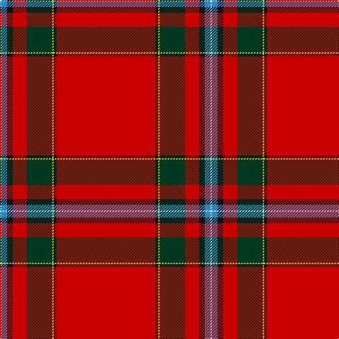

**Bands:** [RKYGRKBW](/stripes/rkygrkbw/) · **Stripes:** [R K LY DG R K T W](/stripes/stripes8/) R K LY DG R K T W

This was sourced from register-of-tartans.  It is a [8 band tartan](/bands/bands8/).

Original link https://www.tartanregister.gov.uk/tartanDetails.aspx?ref=2470

## Attestations

This cloth appears in 2 source records; the oldest owns this page.

- 01/01/2003 — MacIngust (register-of-tartans, [record](https://www.tartanregister.gov.uk/tartanDetails.aspx?ref=2470))
- pre 2003 — MacIngust (Clan?) (tartans-authority, [record](http://www.tartansauthority.com/tartan-ferret/display/5912/))

## Register references

External register numbers recorded for this tartan.

- Scottish Register of Tartans: [2470](https://www.tartanregister.gov.uk/tartanDetails.aspx?ref=2470)
- Scottish Tartans Authority (ITI): 5912

## Thread count
R/140 K4 Y2 DG36 R20 K8 B8 LN/2

## Palette
Each colour and its ΔE from the base-6 reference it is a variant of.

| Colour | Shade | Base | ΔE (OKLab) |
|---|---|---|---|
| B | <code style="background-color:#2888C4;">#2888C4</code> `#2888C4` | B <code style="background-color:#2A418A;">#2A418A</code> | 0.21 |
| DG | <code style="background-color:#003820;">#003820</code> `#003820` | G <code style="background-color:#006100;">#006100</code> | 0.15 |
| K | <code style="background-color:#101010;">#101010</code> `#101010` | K <code style="background-color:#000000;">#000000</code> | 0.17 |
| LN | <code style="background-color:#E0E0E0;">#E0E0E0</code> `#E0E0E0` | W <code style="background-color:#F7F7F7;">#F7F7F7</code> | 0.07 |
| R | <code style="background-color:#C80000;">#C80000</code> `#C80000` | R <code style="background-color:#CC0000;">#CC0000</code> | 0.01 |
| Y | <code style="background-color:#E8C000;">#E8C000</code> `#E8C000` | Y <code style="background-color:#F2BF00;">#F2BF00</code> | 0.02 |

# Sample pattern

## Nearest tartans

The nearest existing variants by ΔTartan distance.

1. [Prince Charles Cloak](/setts/s8/r48db3ly1dg14r8db3lb4lr1/) — ΔT 0.89
1. [Zamzam (Personal)](/setts/s8/r70b1r2g12k2g1k10w1~x2/) — ΔT 0.92
1. [MacAulay (MacGregor)](/setts/s9/r96db1dg24db1r10db1dg12k1w4~x2/) — ΔT 1.03
1. [Inverness Cathedral (Corporate)](/setts/s9/r72db6ly1db12k4w1n4w1k5~x2/) — ΔT 1.03
1. [MacAulay of Ardincaple (Clan)](/setts/s9/r50db3g6db1r3db1g8k1lb3~x2/) — ΔT 1.10
1. [Royal Stewart - 1819](/setts/s12/r134db10k14ly2k3w3k3g21r11k3r4w2/) — ΔT 1.12
1. [Brodie](/setts/s8/r48lr4db4k4r12db4r1ly4~x2/) — ΔT 1.12
1. [Brodie](/setts/s8/r48lr4db4k4r12db4r1ly4/) — ΔT 1.12
1. [Prince Charles Cloak](/setts/s8/r48db3ly1dg14r8db3b4lr1~x2/) — ΔT 1.16
1. [Prince Charles Cloak](/setts/s8/r48db3ly1dg14r8db3b4lr1/) — ΔT 1.16

## Neighbour map

Every grey dot is one of 14299 variants placed by the first two principal components of the ΔTartan feature space (44% of its variance). Red is this tartan; blue dots are its nearest — click one to open its page.

<svg viewBox="0 0 640 380" role="img" style="max-width:100%;height:auto;border:1px solid #e0e0e0;border-radius:4px;display:block" xmlns="http://www.w3.org/2000/svg"><image href="/nn/cloud.v1.png" width="640" height="380"/><a href="/setts/s8/r48db3ly1dg14r8db3lb4lr1/"><circle cx="444.4" cy="60.8" r="4" fill="#3465a4"><title>Prince Charles Cloak</title></circle></a><a href="/setts/s8/r70b1r2g12k2g1k10w1~x2/"><circle cx="527.3" cy="67.7" r="4" fill="#3465a4"><title>Zamzam (Personal)</title></circle></a><a href="/setts/s9/r96db1dg24db1r10db1dg12k1w4~x2/"><circle cx="513.7" cy="61.6" r="4" fill="#3465a4"><title>MacAulay (MacGregor)</title></circle></a><a href="/setts/s9/r72db6ly1db12k4w1n4w1k5~x2/"><circle cx="467.4" cy="43.0" r="4" fill="#3465a4"><title>Inverness Cathedral (Corporate)</title></circle></a><a href="/setts/s9/r50db3g6db1r3db1g8k1lb3~x2/"><circle cx="506.7" cy="66.7" r="4" fill="#3465a4"><title>MacAulay of Ardincaple (Clan)</title></circle></a><a href="/setts/s12/r134db10k14ly2k3w3k3g21r11k3r4w2/"><circle cx="485.3" cy="23.1" r="4" fill="#3465a4"><title>Royal Stewart - 1819</title></circle></a><a href="/setts/s8/r48lr4db4k4r12db4r1ly4~x2/"><circle cx="517.7" cy="81.3" r="4" fill="#3465a4"><title>Brodie</title></circle></a><a href="/setts/s8/r48lr4db4k4r12db4r1ly4/"><circle cx="517.7" cy="81.3" r="4" fill="#3465a4"><title>Brodie</title></circle></a><a href="/setts/s8/r48db3ly1dg14r8db3b4lr1~x2/"><circle cx="471.9" cy="80.6" r="4" fill="#3465a4"><title>Prince Charles Cloak</title></circle></a><a href="/setts/s8/r48db3ly1dg14r8db3b4lr1/"><circle cx="471.9" cy="80.6" r="4" fill="#3465a4"><title>Prince Charles Cloak</title></circle></a><circle cx="503.7" cy="60.4" r="5" fill="#c00000"/></svg>

ID: /setts/s8/r70k2ly1dg18r10k4t4w1~x2/
