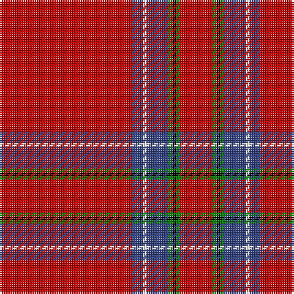

In pattern [RBWBGKGR](/patterns/rbwbgkgr/).

This was sourced from weddslist.  It is a [8 stripes tartan](/stripes/stripes8/).

Original link http://www.weddslist.com/cgi-bin/tartans/pg.pl?source=sts

## Thread count
R/72 B6 LN2 B12 G2 K2 G2 R/18

## Palette
Each colour and its ΔE from the base-6 reference it is a variant of.

| Colour | Shade | Base | ΔE (OKLab) |
|---|---|---|---|
| B | <code style="background-color:#304080;">#304080</code> `#304080` | B <code style="background-color:#2A418A;">#2A418A</code> | 0.02 |
| G | <code style="background-color:#008000;">#008000</code> `#008000` | G <code style="background-color:#006100;">#006100</code> | 0.10 |
| K | <code style="background-color:#000000;">#000000</code> `#000000` | K <code style="background-color:#000000;">#000000</code> | 0.00 |
| LN | <code style="background-color:#E0E0E0;">#E0E0E0</code> `#E0E0E0` | W <code style="background-color:#F7F7F7;">#F7F7F7</code> | 0.07 |
| R | <code style="background-color:#C00000;">#C00000</code> `#C00000` | R <code style="background-color:#CC0000;">#CC0000</code> | 0.03 |

# Sample pattern

## Nearest tartans

The nearest existing variants by ΔTartan distance.

1. [Inverness District Tartan Tartan Number: 1438. Earliest known date: 1822 Made for Augustus, Earl of Inverness, sometime prior to 1822. Logan used this sett to illustrate his method of recording tartans in his book, 'The Scottish Gael..', published in 1831. The territorial designation of this Royal tartan makes it appropriate for use as a district tartan in the town and county of Inverness. The white stripe is sometimes rendered in yellow. See products available Copyright © Blair Urquhart, Comrie, 2015](/setts/s8/r72b6w2b12g2k2g2r18-b2c2c80-g006818-k101010-rc80000-we0e0e0/) — ΔT 0.21
1. [Inverness - 1829 (District)](/setts/s8/r144b12w4b24g4k4g4r36-b2c2c80-g006818-k101010-rc80000-wfcfcfc/) — ΔT 0.29
1. [Inverness](/setts/s8/r228b20w6b32y6k6y6r56-b304080-k000000-rc00000-we0e0e0-yf0c000/) — ΔT 0.33
1. [Inverness #2](/setts/s8/r228b20w6b32y6k6y6r56-b2c4084-k101010-rdc0000-we0e0e0-ye8c000/) — ΔT 0.78
1. [Princess Elizabeth (Royal)](/setts/s8/r144k12w4k22y4b4y4r36-b2c2c80-k101010-rc80000-wc0c0c0-ye8c000/) — ΔT 0.82
1. [Princess Elizabeth Royal Family Tartan Tartan Number: 1613. Earliest known date: pre 2003 Also Earl of Inverness See products available Copyright © Blair Urquhart, Comrie, 2015](/setts/s8/r84k8w2k12y2b2y2r24-b2c2c80-k101010-rc80000-we0e0e0-ye8c000/) — ΔT 0.91
1. [Hackston (Green stripe) (Portrait)](/setts/s8/r102y4k22ya6r22ya6r22g6-g006818-k101010-rc80000-yb8b8b8-yabc8c00/) — ΔT 0.96
1. [Inverness Earl of... District Tartan Tartan Number: 1446. Earliest known date: 1831 The sett used by James Logan to illustrate his method of recording the threads and colours of tartan patterns. It appears in the first edition of 'The Scottish Gael' and is therefore the first published illustration of a tartan sett. The problems of printing tartan were very much apparent and the illustration showed differences in each volume produced. See products available Copyright © Blair Urquhart, Comrie, 2015](/setts/s8/r84b8y2b12g2b2g2r24-b2c2c80-g006818-rc80000-ye8c000/) — ΔT 0.99
1. [Junor (Personal)](/setts/s9/r144b12y4b22ba4b4ba4r18k4-b1c0070-ba2888c4-k101010-rc80000-ye8c000/) — ΔT 1.01
1. [Brodie of that Ilk & the Burn Clan Tartan Tartan Number: 1684. Earliest known date: 1856 Peters' book, 'The Baronage of Angus and Mearns' (1856), provides the full title of this tartan which also appears in the manuscript prepared for the Vestiarium Scoticum. Peters did not give any clue to the origin of the tartan. See products available Copyright © Blair Urquhart, Comrie, 2015](/setts/s8/r96w8b8k8r24b8r2y8-b2c2c80-k101010-rc80000-we0e0e0-ye8c000/) — ΔT 1.08

## Neighbour map

Every grey dot is one of 15726 variants placed by the first two principal components of the ΔTartan feature space (44% of its variance). Red is this tartan; blue dots are its nearest — click one to open its page.

<svg viewBox="0 0 640 380" role="img" style="max-width:100%;height:auto;border:1px solid #e0e0e0;border-radius:4px;display:block" xmlns="http://www.w3.org/2000/svg"><image href="/nn/cloud.v1.png" width="640" height="380"/><a href="/setts/s8/r72b6w2b12g2k2g2r18-b2c2c80-g006818-k101010-rc80000-we0e0e0/"><circle cx="561.6" cy="94.3" r="4" fill="#3465a4"><title>Inverness District Tartan Tartan Number: 1438. Earliest known date: 1822 Made for Augustus, Earl of Inverness, sometime prior to 1822. Logan used this sett to illustrate his method of recording tartans in his book, 'The Scottish Gael..', published in 1831. The territorial designation of this Royal tartan makes it appropriate for use as a district tartan in the town and county of Inverness. The white stripe is sometimes rendered in yellow. See products available Copyright © Blair Urquhart, Comrie, 2015</title></circle></a><a href="/setts/s8/r144b12w4b24g4k4g4r36-b2c2c80-g006818-k101010-rc80000-wfcfcfc/"><circle cx="558.1" cy="92.7" r="4" fill="#3465a4"><title>Inverness - 1829 (District)</title></circle></a><a href="/setts/s8/r228b20w6b32y6k6y6r56-b304080-k000000-rc00000-we0e0e0-yf0c000/"><circle cx="575.2" cy="90.9" r="4" fill="#3465a4"><title>Inverness</title></circle></a><a href="/setts/s8/r228b20w6b32y6k6y6r56-b2c4084-k101010-rdc0000-we0e0e0-ye8c000/"><circle cx="573.0" cy="85.1" r="4" fill="#3465a4"><title>Inverness #2</title></circle></a><a href="/setts/s8/r144k12w4k22y4b4y4r36-b2c2c80-k101010-rc80000-wc0c0c0-ye8c000/"><circle cx="553.0" cy="86.8" r="4" fill="#3465a4"><title>Princess Elizabeth (Royal)</title></circle></a><a href="/setts/s8/r84k8w2k12y2b2y2r24-b2c2c80-k101010-rc80000-we0e0e0-ye8c000/"><circle cx="569.0" cy="82.4" r="4" fill="#3465a4"><title>Princess Elizabeth Royal Family Tartan Tartan Number: 1613. Earliest known date: pre 2003 Also Earl of Inverness See products available Copyright © Blair Urquhart, Comrie, 2015</title></circle></a><a href="/setts/s8/r102y4k22ya6r22ya6r22g6-g006818-k101010-rc80000-yb8b8b8-yabc8c00/"><circle cx="524.7" cy="116.5" r="4" fill="#3465a4"><title>Hackston (Green stripe) (Portrait)</title></circle></a><a href="/setts/s8/r84b8y2b12g2b2g2r24-b2c2c80-g006818-rc80000-ye8c000/"><circle cx="611.9" cy="108.3" r="4" fill="#3465a4"><title>Inverness Earl of... District Tartan Tartan Number: 1446. Earliest known date: 1831 The sett used by James Logan to illustrate his method of recording the threads and colours of tartan patterns. It appears in the first edition of 'The Scottish Gael' and is therefore the first published illustration of a tartan sett. The problems of printing tartan were very much apparent and the illustration showed differences in each volume produced. See products available Copyright © Blair Urquhart, Comrie, 2015</title></circle></a><a href="/setts/s9/r144b12y4b22ba4b4ba4r18k4-b1c0070-ba2888c4-k101010-rc80000-ye8c000/"><circle cx="528.3" cy="72.0" r="4" fill="#3465a4"><title>Junor (Personal)</title></circle></a><a href="/setts/s8/r96w8b8k8r24b8r2y8-b2c2c80-k101010-rc80000-we0e0e0-ye8c000/"><circle cx="522.4" cy="77.1" r="4" fill="#3465a4"><title>Brodie of that Ilk &amp; the Burn Clan Tartan Tartan Number: 1684. Earliest known date: 1856 Peters' book, 'The Baronage of Angus and Mearns' (1856), provides the full title of this tartan which also appears in the manuscript prepared for the Vestiarium Scoticum. Peters did not give any clue to the origin of the tartan. See products available Copyright © Blair Urquhart, Comrie, 2015</title></circle></a><circle cx="563.9" cy="96.8" r="5" fill="#c00000"/></svg>

ID: /setts/s8/r72b6w2b12g2k2g2r18-b304080-g008000-k000000-rc00000-we0e0e0/
