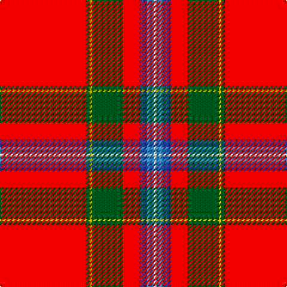

This page is one **sett** — a single exact thread-count. It belongs to the [tartan](/tartans/r72g3y2g26r14b6ba6ln2/)
(the same proportion at any scale), whose colour order is pattern [RGYGRBBW](/stripes/rgygrbbw/).

Sourced from register-of-tartans.  It is a [8 stripe tartan](/stripes/stripes8/).

Original link https://www.tartanregister.gov.uk/tartanDetails.aspx?ref=4019

## Register references

External register numbers recorded for this tartan.

- Scottish Register of Tartans: [4019](https://www.tartanregister.gov.uk/tartanDetails.aspx?ref=4019)
- Scottish Tartans World Register: 1553

## Thread count
R/72 G3 Y2 G26 R14 B6 Ba6 LN/2

## Palette
Each colour and the base-6 reference it is a variant of.

| Colour | Shade | Base |
|---|---|---|
| B | <code style="background-color:#2C4084;">#2C4084</code> `oklch(39.4% 0.117 268.3)` <small>#2C4084</small> | B <code style="background-color:#2A418A;">#2A418A</code> |
| Ba | <code style="background-color:#3C82AF;">#3C82AF</code> `oklch(58.1% 0.099 239.8)` <small>#3C82AF</small> | B <code style="background-color:#2A418A;">#2A418A</code> |
| G | <code style="background-color:#005020;">#005020</code> `oklch(37.7% 0.105 149.6)` <small>#005020</small> | G <code style="background-color:#006100;">#006100</code> |
| LN | <code style="background-color:#E0E0E0;">#E0E0E0</code> `oklch(90.7% 0.000 89.9)` <small>#E0E0E0</small> | W <code style="background-color:#F7F7F7;">#F7F7F7</code> |
| R | <code style="background-color:#DC0000;">#DC0000</code> `oklch(56.2% 0.230 29.2)` <small>#DC0000</small> | R <code style="background-color:#CC0000;">#CC0000</code> |
| Y | <code style="background-color:#E8C000;">#E8C000</code> `oklch(81.9% 0.168 93.7)` <small>#E8C000</small> | Y <code style="background-color:#F2BF00;">#F2BF00</code> |

# Sample pattern

## Nearest tartans

The nearest existing variants by ΔTartan distance, with this tartan at the top so the swatches line up against it.

ΔTartan

Tartan

Sett

—

<a href="/ttd/edit/#slug=r72dg3ly2dg26r14db6t6w2">Stuart/Stewart of Fingask</a> <a class="nn-out" href="/setts/s8/r72dg3ly2dg26r14db6t6w2/" title="open its dictionary page">↗</a>

0.44

<a href="/ttd/edit/#slug=r72g3ly2g26r14db6t6w2">Stewart of Fingask - 1745 (Clan?)</a> <a class="nn-out" href="/setts/s8/r72g3ly2g26r14db6t6w2/" title="open its dictionary page">↗</a>

0.67

<a href="/ttd/edit/#slug=r36w1db3ly1dg16r8db3t2w1~x2">Perthshire or Drummond of Perth</a> <a class="nn-out" href="/setts/s9/r36w1db3ly1dg16r8db3t2w1~x2/" title="open its dictionary page">↗</a>

0.69

<a href="/ttd/edit/#slug=r38ly1db3w1g13r6db3t3w1~x2">Drummond, Ancient</a> <a class="nn-out" href="/setts/s9/r38ly1db3w1g13r6db3t3w1~x2/" title="open its dictionary page">↗</a>

0.71

<a href="/ttd/edit/#slug=r48db3ly1dg14r8db3lb4lr1">Prince Charles Cloak</a> <a class="nn-out" href="/setts/s8/r48db3ly1dg14r8db3lb4lr1/" title="open its dictionary page">↗</a>

0.71

<a href="/ttd/edit/#slug=r48db3lo2g14r8db3t4w3~x2">Drummond of Fingask</a> <a class="nn-out" href="/setts/s8/r48db3lo2g14r8db3t4w3~x2/" title="open its dictionary page">↗</a>

0.73

<a href="/ttd/edit/#slug=r36w1db3ly1g16r8db3b2w1~x2">Drummond of Perth (Clan)</a> <a class="nn-out" href="/setts/s9/r36w1db3ly1g16r8db3b2w1~x2/" title="open its dictionary page">↗</a>

0.84

<a href="/ttd/edit/#slug=r36w1db3ly1g16r8db3t2w1~x2">Drummond of Perth</a> <a class="nn-out" href="/setts/s9/r36w1db3ly1g16r8db3t2w1~x2/" title="open its dictionary page">↗</a>

0.98

<a href="/ttd/edit/#slug=r64k10ly4m5w2k2db3ly4~x2">Conroy Family Tartan Tartan Number: 1626. Earliest known date: 1986 See products available Copyright © Blair Urquhart, Comrie, 2015</a> <a class="nn-out" href="/setts/s8/r64k10ly4m5w2k2db3ly4~x2/" title="open its dictionary page">↗</a>

1.18

<a href="/ttd/edit/#slug=r48db3ly1dg14r8db3b4lr1~x2">Prince Charles Cloak</a> <a class="nn-out" href="/setts/s8/r48db3ly1dg14r8db3b4lr1~x2/" title="open its dictionary page">↗</a>

1.18

<a href="/ttd/edit/#slug=r48db3ly1dg14r8db3b4lr1">Prince Charles Cloak</a> <a class="nn-out" href="/setts/s8/r48db3ly1dg14r8db3b4lr1/" title="open its dictionary page">↗</a>

## Neighbour map

Every grey dot is one of 14299 variants placed by the first two principal components of the ΔTartan feature space (44% of its variance). Red is this tartan; blue dots are its nearest — click one to open its page.

<svg viewBox="0 0 640 380" role="img" style="max-width:100%;height:auto;border:1px solid #e0e0e0;border-radius:4px;display:block" xmlns="http://www.w3.org/2000/svg"><image href="/nn/cloud.v1.png" width="640" height="380"/><a href="/setts/s8/r72g3ly2g26r14db6t6w2/"><circle cx="431.8" cy="84.5" r="4" fill="#3465a4"><title>Stewart of Fingask - 1745 (Clan?)</title></circle></a><a href="/setts/s9/r36w1db3ly1dg16r8db3t2w1~x2/"><circle cx="398.3" cy="75.5" r="4" fill="#3465a4"><title>Perthshire or Drummond of Perth</title></circle></a><a href="/setts/s9/r38ly1db3w1g13r6db3t3w1~x2/"><circle cx="412.0" cy="69.8" r="4" fill="#3465a4"><title>Drummond, Ancient</title></circle></a><a href="/setts/s8/r48db3ly1dg14r8db3lb4lr1/"><circle cx="444.4" cy="60.8" r="4" fill="#3465a4"><title>Prince Charles Cloak</title></circle></a><a href="/setts/s8/r48db3lo2g14r8db3t4w3~x2/"><circle cx="402.4" cy="91.5" r="4" fill="#3465a4"><title>Drummond of Fingask</title></circle></a><a href="/setts/s9/r36w1db3ly1g16r8db3b2w1~x2/"><circle cx="394.0" cy="74.4" r="4" fill="#3465a4"><title>Drummond of Perth (Clan)</title></circle></a><a href="/setts/s9/r36w1db3ly1g16r8db3t2w1~x2/"><circle cx="394.5" cy="75.7" r="4" fill="#3465a4"><title>Drummond of Perth</title></circle></a><a href="/setts/s8/r64k10ly4m5w2k2db3ly4~x2/"><circle cx="437.7" cy="60.0" r="4" fill="#3465a4"><title>Conroy Family Tartan Tartan Number: 1626. Earliest known date: 1986 See products available Copyright © Blair Urquhart, Comrie, 2015</title></circle></a><a href="/setts/s8/r48db3ly1dg14r8db3b4lr1~x2/"><circle cx="471.9" cy="80.6" r="4" fill="#3465a4"><title>Prince Charles Cloak</title></circle></a><a href="/setts/s8/r48db3ly1dg14r8db3b4lr1/"><circle cx="471.9" cy="80.6" r="4" fill="#3465a4"><title>Prince Charles Cloak</title></circle></a><circle cx="424.0" cy="77.6" r="5" fill="#c00000"/></svg>

ID: /setts/s8/r72dg3ly2dg26r14db6t6w2/
