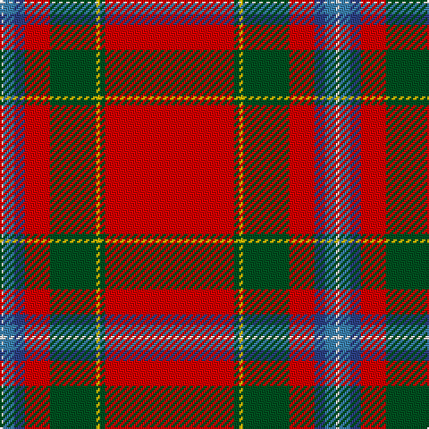

In pattern [RGYGRBBW](/patterns/rgygrbbw/).

This was sourced from register-of-tartans.  It is a [8 stripes tartan](/stripes/stripes8/).

Original link https://www.tartanregister.gov.uk/tartanDetails.aspx?ref=4019

## Thread count
LN/2 Ba6 B6 R14 G26 Y2 G3 R/72

## Palette
Each colour and its ΔE from the base-6 reference it is a variant of.

| Colour | Shade | Base | ΔE (OKLab) |
|---|---|---|---|
| B | <code style="background-color:#2C4084;">#2C4084</code> `#2C4084` | B <code style="background-color:#2A418A;">#2A418A</code> | 0.01 |
| Ba | <code style="background-color:#3C82AF;">#3C82AF</code> `#3C82AF` | B <code style="background-color:#2A418A;">#2A418A</code> | 0.19 |
| G | <code style="background-color:#005020;">#005020</code> `#005020` | G <code style="background-color:#006100;">#006100</code> | 0.07 |
| LN | <code style="background-color:#E0E0E0;">#E0E0E0</code> `#E0E0E0` | W <code style="background-color:#F7F7F7;">#F7F7F7</code> | 0.07 |
| R | <code style="background-color:#DC0000;">#DC0000</code> `#DC0000` | R <code style="background-color:#CC0000;">#CC0000</code> | 0.03 |
| Y | <code style="background-color:#E8C000;">#E8C000</code> `#E8C000` | Y <code style="background-color:#F2BF00;">#F2BF00</code> | 0.02 |

# Sample pattern

## Nearest tartans

The nearest existing variants by ΔTartan distance.

1. [Stewart of Fingask - 1745 (Clan?)](/setts/s8/r72g3y2g26r14b6ba6w2-b2c2c80-ba5c8ca8-g006818-rc80000-we0e0e0-ye8c000/) — ΔT 0.43
1. [Stewart of Fingask](/setts/s8/r72g3y2g26r14b6ba6w2-b304080-ba5480b0-g008000-rc00000-we0e0e0-yf0c000/) — ΔT 0.59
1. [Perthshire or Drummond of Perth](/setts/s9/r72w2b6y2g32r16b6ba4w2-b2c2c80-ba5c8ca8-g285800-rc80000-we0e0e0-ye8c000/) — ΔT 0.67
1. [Drummond, Ancient](/setts/s9/r76y2b6w2g26r12b6ba6w2-b304080-ba5480b0-g008000-rc00000-we0e0e0-yf0c000/) — ΔT 0.68
1. [Prince Charles Cloak](/setts/s8/r96b6y2g28r16b6w8ya2-b00004c-g004c00-rc80000-wd0d0d0-yc8c800-yab0b0b0/) — ΔT 0.70
1. [Drummond of Fingask](/setts/s8/r96b6y4g28r16b6ba8w6-b1c0070-ba2888c4-g007844-rc80000-we0e0e0-ybc8c00/) — ΔT 0.71
1. [Drummond of Perth (Logan) Clan Tartan Tartan Number: 1669. Earliest known date: 1831 D.C.Stewart says, "The uncertainty attending the attribution of tartans to clans is well exemplified when we come to the tartans of Drummond, Fraser and Grant. Logan gives a distinctive pattern for each." See products available Copyright © Blair Urquhart, Comrie, 2015](/setts/s9/r72w2b6y2g32r16b6ba4w2-b2c2c80-ba5c8ca8-g006818-rc80000-we0e0e0-ye8c000/) — ΔT 0.71
1. [Drummond of Perth (Clan)](/setts/s9/r72w2b6y2g32r16b6ba4w2-b2c2c80-ba1870a4-g006818-rc80000-we0e0e0-ye8c000/) — ΔT 0.72
1. [Drummond of Perth](/setts/s9/r72w2b6y2g32r16b6ba4w2-b304080-ba5480b0-g008000-rc00000-we0e0e0-yf0c000/) — ΔT 0.84
1. [Conroy Family Tartan Tartan Number: 1626. Earliest known date: 1986 See products available Copyright © Blair Urquhart, Comrie, 2015](/setts/s8/r128k20y8ra10w4k4b6y8-b2c2c80-k101010-rc80000-raa00048-we0e0e0-ye8c000/) — ΔT 0.97

## Neighbour map

Every grey dot is one of 15726 variants placed by the first two principal components of the ΔTartan feature space (44% of its variance). Red is this tartan; blue dots are its nearest — click one to open its page.

<svg viewBox="0 0 640 380" role="img" style="max-width:100%;height:auto;border:1px solid #e0e0e0;border-radius:4px;display:block" xmlns="http://www.w3.org/2000/svg"><image href="/nn/cloud.v1.png" width="640" height="380"/><a href="/setts/s8/r72g3y2g26r14b6ba6w2-b2c2c80-ba5c8ca8-g006818-rc80000-we0e0e0-ye8c000/"><circle cx="430.9" cy="84.1" r="4" fill="#3465a4"><title>Stewart of Fingask - 1745 (Clan?)</title></circle></a><a href="/setts/s8/r72g3y2g26r14b6ba6w2-b304080-ba5480b0-g008000-rc00000-we0e0e0-yf0c000/"><circle cx="429.6" cy="84.7" r="4" fill="#3465a4"><title>Stewart of Fingask</title></circle></a><a href="/setts/s9/r72w2b6y2g32r16b6ba4w2-b2c2c80-ba5c8ca8-g285800-rc80000-we0e0e0-ye8c000/"><circle cx="396.7" cy="75.0" r="4" fill="#3465a4"><title>Perthshire or Drummond of Perth</title></circle></a><a href="/setts/s9/r76y2b6w2g26r12b6ba6w2-b304080-ba5480b0-g008000-rc00000-we0e0e0-yf0c000/"><circle cx="410.3" cy="69.3" r="4" fill="#3465a4"><title>Drummond, Ancient</title></circle></a><a href="/setts/s8/r96b6y2g28r16b6w8ya2-b00004c-g004c00-rc80000-wd0d0d0-yc8c800-yab0b0b0/"><circle cx="443.5" cy="61.9" r="4" fill="#3465a4"><title>Prince Charles Cloak</title></circle></a><a href="/setts/s8/r96b6y4g28r16b6ba8w6-b1c0070-ba2888c4-g007844-rc80000-we0e0e0-ybc8c00/"><circle cx="401.6" cy="92.0" r="4" fill="#3465a4"><title>Drummond of Fingask</title></circle></a><a href="/setts/s9/r72w2b6y2g32r16b6ba4w2-b2c2c80-ba5c8ca8-g006818-rc80000-we0e0e0-ye8c000/"><circle cx="392.6" cy="74.0" r="4" fill="#3465a4"><title>Drummond of Perth (Logan) Clan Tartan Tartan Number: 1669. Earliest known date: 1831 D.C.Stewart says, &quot;The uncertainty attending the attribution of tartans to clans is well exemplified when we come to the tartans of Drummond, Fraser and Grant. Logan gives a distinctive pattern for each.&quot; See products available Copyright © Blair Urquhart, Comrie, 2015</title></circle></a><a href="/setts/s9/r72w2b6y2g32r16b6ba4w2-b2c2c80-ba1870a4-g006818-rc80000-we0e0e0-ye8c000/"><circle cx="392.3" cy="74.1" r="4" fill="#3465a4"><title>Drummond of Perth (Clan)</title></circle></a><a href="/setts/s9/r72w2b6y2g32r16b6ba4w2-b304080-ba5480b0-g008000-rc00000-we0e0e0-yf0c000/"><circle cx="392.8" cy="75.2" r="4" fill="#3465a4"><title>Drummond of Perth</title></circle></a><a href="/setts/s8/r128k20y8ra10w4k4b6y8-b2c2c80-k101010-rc80000-raa00048-we0e0e0-ye8c000/"><circle cx="437.2" cy="61.7" r="4" fill="#3465a4"><title>Conroy Family Tartan Tartan Number: 1626. Earliest known date: 1986 See products available Copyright © Blair Urquhart, Comrie, 2015</title></circle></a><circle cx="423.4" cy="78.2" r="5" fill="#c00000"/></svg>

ID: /setts/s8/r72g3y2g26r14b6ba6w2-b2c4084-ba3c82af-g005020-rdc0000-we0e0e0-ye8c000/
