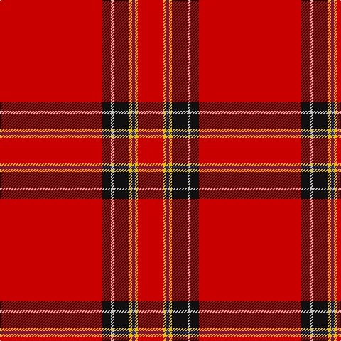

This page is one **sett** — a single exact thread-count. It belongs to the [tartan](/tartans/r72k6n2k11y2db2y2r18/)
(the same proportion at any scale), whose colour order is pattern [RKWKYBYR](/stripes/rkwkybyr/).

Sourced from tartans-authority.  It is a [8 stripe tartan](/stripes/stripes8/).

Original link http://www.tartansauthority.com/tartan-ferret/display/1613/

2 attestations — the source records this cloth was collapsed from (oldest owns this page)

<ul>
<li>pre 2002 — Princess Elizabeth (Royal) (tartans-authority, <a href="http://www.tartansauthority.com/tartan-ferret/display/1613/">record</a>)</li>
<li>undated — Princess Elizabeth (register-of-tartans, <a href="https://www.tartanregister.gov.uk/tartanDetails.aspx?ref=3402">record</a>)</li>
</ul>

## Register references

External register numbers recorded for this tartan.

- Scottish Register of Tartans: [3402](https://www.tartanregister.gov.uk/tartanDetails.aspx?ref=3402)
- Scottish Tartans Authority (ITI): 1613
- Scottish Tartans World Register: 1613

## Thread count
R/144 K12 N4 K22 Y4 DB4 Y4 R/36

## Palette
Each colour and the base-6 reference it is a variant of.

| Colour | Shade | Base |
|---|---|---|
| DB | <code style="background-color:#2C2C80;">#2C2C80</code> `oklch(35.0% 0.138 276.6)` <small>#2C2C80</small> | B <code style="background-color:#2A418A;">#2A418A</code> |
| K | <code style="background-color:#101010;">#101010</code> `oklch(17.3% 0.000 89.9)` <small>#101010</small> | K <code style="background-color:#000000;">#000000</code> |
| N | <code style="background-color:#C0C0C0;">#C0C0C0</code> `oklch(80.8% 0.000 89.9)` <small>#C0C0C0</small> | W <code style="background-color:#F7F7F7;">#F7F7F7</code> |
| R | <code style="background-color:#C80000;">#C80000</code> `oklch(52.3% 0.215 29.2)` <small>#C80000</small> | R <code style="background-color:#CC0000;">#CC0000</code> |
| Y | <code style="background-color:#E8C000;">#E8C000</code> `oklch(81.9% 0.168 93.7)` <small>#E8C000</small> | Y <code style="background-color:#F2BF00;">#F2BF00</code> |

# Sample pattern

## Nearest tartans

The nearest existing variants by ΔTartan distance, with this tartan at the top so the swatches line up against it.

ΔTartan

Tartan

Sett

—

<a href="/ttd/edit/#slug=r72k6lb2k11ly2db2ly2r18~x2">Princess Elizabeth (Royal)</a> <a class="nn-out" href="/setts/s8/r72k6lb2k11ly2db2ly2r18~x2/" title="open its dictionary page">↗</a>

0.66

<a href="/ttd/edit/#slug=r36db3w1db6g1k1g1r9~x4">Inverness - 1829 (District)</a> <a class="nn-out" href="/setts/s8/r36db3w1db6g1k1g1r9~x4/" title="open its dictionary page">↗</a>

0.76

<a href="/ttd/edit/#slug=r114db10w3db16ly3k3ly3r28~x2">Inverness #2</a> <a class="nn-out" href="/setts/s8/r114db10w3db16ly3k3ly3r28~x2/" title="open its dictionary page">↗</a>

0.83

<a href="/ttd/edit/#slug=r36db3w1db6g1k1g1r9~x2">Inverness</a> <a class="nn-out" href="/setts/s8/r36db3w1db6g1k1g1r9~x2/" title="open its dictionary page">↗</a>

0.93

<a href="/ttd/edit/#slug=r42k4w1k6ly1db1ly1r12~x2">Princess Elizabeth</a> <a class="nn-out" href="/setts/s8/r42k4w1k6ly1db1ly1r12~x2/" title="open its dictionary page">↗</a>

0.94

<a href="/ttd/edit/#slug=r51lr2k11lo3r11lo3r11g3~x2">Hackston (Green stripe) (Portrait)</a> <a class="nn-out" href="/setts/s8/r51lr2k11lo3r11lo3r11g3~x2/" title="open its dictionary page">↗</a>

0.98

<a href="/ttd/edit/#slug=r48w3k3g2ly6g2r6~x4">Ferguson the Astronomer</a> <a class="nn-out" href="/setts/s7/r48w3k3g2ly6g2r6~x4/" title="open its dictionary page">↗</a>

0.99

<a href="/ttd/edit/#slug=r72db6ly2db11t2db2t2r9k2~x2">Junor (Personal)</a> <a class="nn-out" href="/setts/s9/r72db6ly2db11t2db2t2r9k2~x2/" title="open its dictionary page">↗</a>

1.05

<a href="/ttd/edit/#slug=r56w2k12ly3r12ly3r12g3~x2">Hackston, or Halkerston</a> <a class="nn-out" href="/setts/s8/r56w2k12ly3r12ly3r12g3~x2/" title="open its dictionary page">↗</a>

1.10

<a href="/ttd/edit/#slug=r100db10w5db14ly4db8ly4r24">Earl of Inverness (Royal)</a> <a class="nn-out" href="/setts/s8/r100db10w5db14ly4db8ly4r24/" title="open its dictionary page">↗</a>

1.10

<a href="/ttd/edit/#slug=r45k3ly4k3r45k1dp2k1r2g8r2~x2">O'Malley (Name?)</a> <a class="nn-out" href="/setts/s11/r45k3ly4k3r45k1dp2k1r2g8r2~x2/" title="open its dictionary page">↗</a>

## Neighbour map

Every grey dot is one of 14299 variants placed by the first two principal components of the ΔTartan feature space (44% of its variance). Red is this tartan; blue dots are its nearest — click one to open its page.

<svg viewBox="0 0 640 380" role="img" style="max-width:100%;height:auto;border:1px solid #e0e0e0;border-radius:4px;display:block" xmlns="http://www.w3.org/2000/svg"><image href="/nn/cloud.v1.png" width="640" height="380"/><a href="/setts/s8/r36db3w1db6g1k1g1r9~x4/"><circle cx="557.0" cy="91.9" r="4" fill="#3465a4"><title>Inverness - 1829 (District)</title></circle></a><a href="/setts/s8/r114db10w3db16ly3k3ly3r28~x2/"><circle cx="571.3" cy="83.5" r="4" fill="#3465a4"><title>Inverness #2</title></circle></a><a href="/setts/s8/r36db3w1db6g1k1g1r9~x2/"><circle cx="563.0" cy="96.6" r="4" fill="#3465a4"><title>Inverness</title></circle></a><a href="/setts/s8/r42k4w1k6ly1db1ly1r12~x2/"><circle cx="544.7" cy="72.2" r="4" fill="#3465a4"><title>Princess Elizabeth</title></circle></a><a href="/setts/s8/r51lr2k11lo3r11lo3r11g3~x2/"><circle cx="522.8" cy="115.3" r="4" fill="#3465a4"><title>Hackston (Green stripe) (Portrait)</title></circle></a><a href="/setts/s7/r48w3k3g2ly6g2r6~x4/"><circle cx="518.9" cy="98.7" r="4" fill="#3465a4"><title>Ferguson the Astronomer</title></circle></a><a href="/setts/s9/r72db6ly2db11t2db2t2r9k2~x2/"><circle cx="528.2" cy="70.6" r="4" fill="#3465a4"><title>Junor (Personal)</title></circle></a><a href="/setts/s8/r56w2k12ly3r12ly3r12g3~x2/"><circle cx="499.5" cy="95.7" r="4" fill="#3465a4"><title>Hackston, or Halkerston</title></circle></a><a href="/setts/s8/r100db10w5db14ly4db8ly4r24/"><circle cx="484.7" cy="99.6" r="4" fill="#3465a4"><title>Earl of Inverness (Royal)</title></circle></a><a href="/setts/s11/r45k3ly4k3r45k1dp2k1r2g8r2~x2/"><circle cx="593.5" cy="73.7" r="4" fill="#3465a4"><title>O'Malley (Name?)</title></circle></a><circle cx="551.5" cy="84.7" r="5" fill="#c00000"/></svg>

ID: /setts/s8/r72k6lb2k11ly2db2ly2r18~x2/
