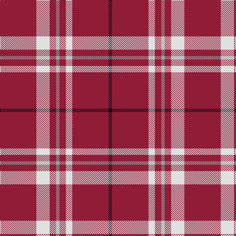

This page is one **sett** — a single exact thread-count. It belongs to the [tartan](/tartans/r74w27r13lr7r13w13r74k7/)
(the same proportion at any scale), whose colour order is pattern [KRWRYRWR](/stripes/krwryrwr/).

Sourced from tartans-authority.  It is a [8 stripe tartan](/stripes/stripes8/).

Original link http://www.tartansauthority.com/tartan-ferret/display/7829/

## Also known as

This cloth is also recorded under:

- Cornell #2

2 attestations — the source records this cloth was collapsed from (oldest owns this page)

<ul>
<li>pre 2008 — Cornell (Corporate) (tartans-authority, <a href="http://www.tartansauthority.com/tartan-ferret/display/7829/">record</a>)</li>
<li>undated — Cornell #2 (register-of-tartans, <a href="https://www.tartanregister.gov.uk/tartanDetails.aspx?ref=5783">record</a>)</li>
</ul>

## Register references

External register numbers recorded for this tartan.

- Scottish Register of Tartans: [5783](https://www.tartanregister.gov.uk/tartanDetails.aspx?ref=5783)
- Scottish Tartans Authority (ITI): 7829

## Thread count
DR/74 LN27 DR13 N7 DR13 LN13 DR74 K/7

## Palette

Palette: <strong>Tartan Register</strong>
<table><thead><tr><th>Colour</th><th>Threads</th><th>Shade</th><th>Base</th><th>OKLCh</th></tr></thead><tbody><tr><td>DR/</td><td style="text-align:right;font-variant-numeric:tabular-nums">74</td><td><code style="background-color:#901C38;">#901C38</code> <small style="color:#888">#901C38</small></td><td>R <code style="background-color:#CC0000;">#CC0000</code></td><td><small style="color:#888">oklch(43.2% 0.150 13.1)</small></td></tr><tr><td>LN</td><td style="text-align:right;font-variant-numeric:tabular-nums">27</td><td><code style="background-color:#E0E0E0;">#E0E0E0</code> <small style="color:#888">#E0E0E0</small></td><td>W <code style="background-color:#F7F7F7;">#F7F7F7</code></td><td><small style="color:#888">oklch(90.7% 0.000 89.9)</small></td></tr><tr><td>DR</td><td style="text-align:right;font-variant-numeric:tabular-nums">13</td><td><code style="background-color:#901C38;">#901C38</code> <small style="color:#888">#901C38</small></td><td>R <code style="background-color:#CC0000;">#CC0000</code></td><td><small style="color:#888">oklch(43.2% 0.150 13.1)</small></td></tr><tr><td>N</td><td style="text-align:right;font-variant-numeric:tabular-nums">7</td><td><code style="background-color:#A0A0A0;">#A0A0A0</code> <small style="color:#888">#A0A0A0</small></td><td>Y <code style="background-color:#F2BF00;">#F2BF00</code></td><td><small style="color:#888">oklch(70.6% 0.000 89.9)</small></td></tr><tr><td>DR</td><td style="text-align:right;font-variant-numeric:tabular-nums">13</td><td><code style="background-color:#901C38;">#901C38</code> <small style="color:#888">#901C38</small></td><td>R <code style="background-color:#CC0000;">#CC0000</code></td><td><small style="color:#888">oklch(43.2% 0.150 13.1)</small></td></tr><tr><td>LN</td><td style="text-align:right;font-variant-numeric:tabular-nums">13</td><td><code style="background-color:#E0E0E0;">#E0E0E0</code> <small style="color:#888">#E0E0E0</small></td><td>W <code style="background-color:#F7F7F7;">#F7F7F7</code></td><td><small style="color:#888">oklch(90.7% 0.000 89.9)</small></td></tr><tr><td>DR</td><td style="text-align:right;font-variant-numeric:tabular-nums">74</td><td><code style="background-color:#901C38;">#901C38</code> <small style="color:#888">#901C38</small></td><td>R <code style="background-color:#CC0000;">#CC0000</code></td><td><small style="color:#888">oklch(43.2% 0.150 13.1)</small></td></tr><tr><td>K/</td><td style="text-align:right;font-variant-numeric:tabular-nums">7</td><td><code style="background-color:#101010;">#101010</code> <small style="color:#888">#101010</small></td><td>K <code style="background-color:#000000;">#000000</code></td><td><small style="color:#888">oklch(17.3% 0.000 89.9)</small></td></tr></tbody></table>

# Sample pattern

## Nearest tartans

The nearest existing variants by ΔTartan distance, with this tartan at the top so the swatches line up against it.

ΔTartan

Tartan

Sett

—

<a href="/ttd/edit/#slug=r74w27r13lr7r13w13r74k7">Cornell (Corporate)</a> <a class="nn-out" href="/setts/s8/r74w27r13lr7r13w13r74k7/" title="open its dictionary page">↗</a>

1.27

<a href="/ttd/edit/#slug=dg2r28db6r5db2r2db2r11lb2">Rose</a> <a class="nn-out" href="/setts/s9/dg2r28db6r5db2r2db2r11lb2/" title="open its dictionary page">↗</a>

1.37

<a href="/ttd/edit/#slug=g4r32db9r6db2r3db2r12w3~x2">Rose</a> <a class="nn-out" href="/setts/s9/g4r32db9r6db2r3db2r12w3~x2/" title="open its dictionary page">↗</a>

1.52

<a href="/ttd/edit/#slug=dg2r28db6r5db2r2db2r11lr2~x2">Rose</a> <a class="nn-out" href="/setts/s9/dg2r28db6r5db2r2db2r11lr2~x2/" title="open its dictionary page">↗</a>

1.52

<a href="/ttd/edit/#slug=dg2r28db6r5db2r2db2r11lr2">Rose</a> <a class="nn-out" href="/setts/s9/dg2r28db6r5db2r2db2r11lr2/" title="open its dictionary page">↗</a>

1.66

<a href="/ttd/edit/#slug=r27w3r6w2dg3~x4">Martin, Robert N (Personal)</a> <a class="nn-out" href="/setts/s5/r27w3r6w2dg3~x4/" title="open its dictionary page">↗</a>

1.74

<a href="/ttd/edit/#slug=r15dt5k2dt5r15p3r15w2~x2">Goodwillie (Fashion)</a> <a class="nn-out" href="/setts/s8/r15dt5k2dt5r15p3r15w2~x2/" title="open its dictionary page">↗</a>

1.79

<a href="/ttd/edit/#slug=m8w4m50k12m4k15mi5~x2">Instakilt, Pink (Fashion)</a> <a class="nn-out" href="/setts/s7/m8w4m50k12m4k15mi5~x2/" title="open its dictionary page">↗</a>

1.82

<a href="/setts/s8/r35lb3r8ly2dg11~x2/">Highlands of Wyomissing (Corporate)</a>

1.91

<a href="/ttd/edit/#slug=r64k8w3k8w3b4w3r18~x2">Inverness - 2000 (Fashion)</a> <a class="nn-out" href="/setts/s8/r64k8w3k8w3b4w3r18~x2/" title="open its dictionary page">↗</a>

1.95

<a href="/ttd/edit/#slug=r30g12k5w2t6r30">Sinclair</a> <a class="nn-out" href="/setts/s6/r30g12k5w2t6r30/" title="open its dictionary page">↗</a>

## Neighbour map

Every grey dot is one of 14359 variants placed by the first two principal components of the ΔTartan feature space (44% of its variance). Red is this tartan; blue dots are its nearest — click one to open its page.

<svg viewBox="0 0 640 380" role="img" style="max-width:100%;height:auto;border:1px solid #e0e0e0;border-radius:4px;display:block" xmlns="http://www.w3.org/2000/svg"><image href="/nn/cloud.v1.png" width="640" height="380"/><a href="/setts/s9/dg2r28db6r5db2r2db2r11lb2/"><circle cx="490.3" cy="143.5" r="4" fill="#3465a4"><title>Rose</title></circle></a><a href="/setts/s9/g4r32db9r6db2r3db2r12w3~x2/"><circle cx="461.9" cy="145.7" r="4" fill="#3465a4"><title>Rose</title></circle></a><a href="/setts/s9/dg2r28db6r5db2r2db2r11lr2~x2/"><circle cx="506.4" cy="156.9" r="4" fill="#3465a4"><title>Rose</title></circle></a><a href="/setts/s9/dg2r28db6r5db2r2db2r11lr2/"><circle cx="506.4" cy="156.9" r="4" fill="#3465a4"><title>Rose</title></circle></a><a href="/setts/s5/r27w3r6w2dg3~x4/"><circle cx="547.8" cy="196.1" r="4" fill="#3465a4"><title>Martin, Robert N (Personal)</title></circle></a><a href="/setts/s8/r15dt5k2dt5r15p3r15w2~x2/"><circle cx="395.9" cy="194.2" r="4" fill="#3465a4"><title>Goodwillie (Fashion)</title></circle></a><a href="/setts/s7/m8w4m50k12m4k15mi5~x2/"><circle cx="364.5" cy="154.4" r="4" fill="#3465a4"><title>Instakilt, Pink (Fashion)</title></circle></a><a href="/setts/s8/r35lb3r8ly2dg11~x2/"><circle cx="446.9" cy="151.5" r="4" fill="#3465a4"><title>Highlands of Wyomissing (Corporate)</title></circle></a><a href="/setts/s8/r64k8w3k8w3b4w3r18~x2/"><circle cx="482.9" cy="126.7" r="4" fill="#3465a4"><title>Inverness - 2000 (Fashion)</title></circle></a><a href="/setts/s6/r30g12k5w2t6r30/"><circle cx="399.3" cy="169.7" r="4" fill="#3465a4"><title>Sinclair</title></circle></a><circle cx="449.4" cy="174.1" r="5" fill="#c00000"/></svg>

ID: /setts/s8/r74w27r13lr7r13w13r74k7/
