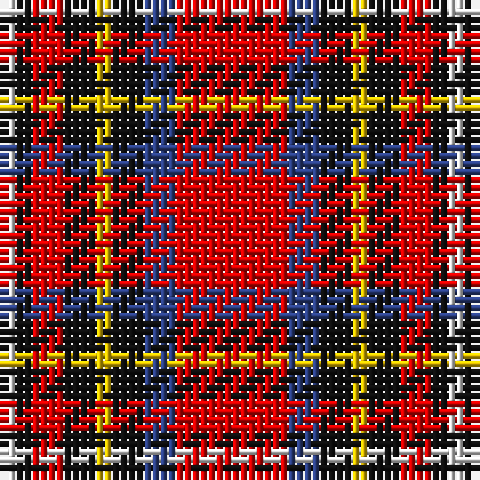

In pattern [RBKYKRKW](/stripes/rbkykrkw/).

This was sourced from register-of-tartans.  It is a [8 stripe tartan](/stripes/stripes8/).

Original link https://www.tartanregister.gov.uk/tartanDetails.aspx?ref=3612

## Also known as

This cloth is also recorded under:

- Royal Stuart/Stewart

## Attestations

This cloth appears in 2 source records; the oldest owns this page.

- undated — Royal Stuart/Stewart (register-of-tartans, [record](https://www.tartanregister.gov.uk/tartanDetails.aspx?ref=3612))
- undated — Royal Stewart (weddslist, [record](http://www.weddslist.com/cgi-bin/tartans/pg.pl?source=sts))

## Register references

External register numbers recorded for this tartan.

- Scottish Register of Tartans: [3612](https://www.tartanregister.gov.uk/tartanDetails.aspx?ref=3612)
- Scottish Tartans World Register: 1369

## Thread count
R/14 B4 K4 Y2 K4 R4 K2 LN/2

## Palette
Each colour and the base-6 reference it is a variant of.

| Colour | Shade | Base |
|---|---|---|
| B | <code style="background-color:#2C4084;">#2C4084</code> `oklch(39.4% 0.117 268.3)` <small>#2C4084</small> | B <code style="background-color:#2A418A;">#2A418A</code> |
| K | <code style="background-color:#101010;">#101010</code> `oklch(17.3% 0.000 89.9)` <small>#101010</small> | K <code style="background-color:#000000;">#000000</code> |
| LN | <code style="background-color:#E0E0E0;">#E0E0E0</code> `oklch(90.7% 0.000 89.9)` <small>#E0E0E0</small> | W <code style="background-color:#F7F7F7;">#F7F7F7</code> |
| R | <code style="background-color:#DC0000;">#DC0000</code> `oklch(56.2% 0.230 29.2)` <small>#DC0000</small> | R <code style="background-color:#CC0000;">#CC0000</code> |
| Y | <code style="background-color:#E8C000;">#E8C000</code> `oklch(81.9% 0.168 93.7)` <small>#E8C000</small> | Y <code style="background-color:#F2BF00;">#F2BF00</code> |

# Sample pattern

## Nearest tartans

The nearest existing variants by ΔTartan distance.

1. [Mangles, Peter and Annette (Personal)](/setts/s7/r20k5g5r5w5n3g3~x4/) — ΔT 0.74
1. [Blaylock](/setts/s10/k4w2db8w3r16k2r5ly2r5w2~x2/) — ΔT 0.83
1. [Mangles, Peter and Annette (Personal](/setts/s7/r20k5dg5r5w5o3dg3~x4/) — ΔT 0.84
1. [Carlow County Crest (Fashion)](/setts/s10/w15g8k12g14r64k12r16k10ly8k14/) — ΔT 0.97
1. [Hoffman Texas German](/setts/s7/k23r27db3r5w3k14ly6~x2/) — ΔT 1.01
1. [Mangles, Peter and Annette Family/Personal Tartan Tartan Number: 10844. Earliest known date: 02/05/2013 The colours were chosen to represent the organisation and the location where Peter and Annette first met in Liverpool. In addition the red is representative of the city of Aberdeen (Scotland) and the black and grey is representative of the granite used extensively throughout Aberdeen See products available Copyright © Blair Urquhart, Comrie, 2015](/setts/s7/r20k5g5r5w5lr3g3~x4/) — ΔT 1.02
1. [MIT1951](/setts/s10/r24r5lr7dt2lr4dt14r11dt3r3w4~x2/) — ΔT 1.14
1. [Castle Stewart (District)](/setts/s9/lo7k3db4k3r21k2r4k2w4~x2/) — ΔT 1.15
1. [Craigmoor (Fashion)](/setts/s8/k1r7k2r1k2do1g3ly1~x4/) — ΔT 1.20
1. [Thermos Un-named (aretefact)](/setts/s6/k6r20w2r9w3lb2~x2/) — ΔT 1.21

## Neighbour map

Every grey dot is one of 14299 variants placed by the first two principal components of the ΔTartan feature space (44% of its variance). Red is this tartan; blue dots are its nearest — click one to open its page.

<svg viewBox="0 0 640 380" role="img" style="max-width:100%;height:auto;border:1px solid #e0e0e0;border-radius:4px;display:block" xmlns="http://www.w3.org/2000/svg"><image href="/nn/cloud.v1.png" width="640" height="380"/><a href="/setts/s7/r20k5g5r5w5n3g3~x4/"><circle cx="222.4" cy="170.4" r="4" fill="#3465a4"><title>Mangles, Peter and Annette (Personal)</title></circle></a><a href="/setts/s10/k4w2db8w3r16k2r5ly2r5w2~x2/"><circle cx="212.1" cy="146.6" r="4" fill="#3465a4"><title>Blaylock</title></circle></a><a href="/setts/s7/r20k5dg5r5w5o3dg3~x4/"><circle cx="230.9" cy="175.2" r="4" fill="#3465a4"><title>Mangles, Peter and Annette (Personal</title></circle></a><a href="/setts/s10/w15g8k12g14r64k12r16k10ly8k14/"><circle cx="189.9" cy="150.0" r="4" fill="#3465a4"><title>Carlow County Crest (Fashion)</title></circle></a><a href="/setts/s7/k23r27db3r5w3k14ly6~x2/"><circle cx="207.4" cy="173.1" r="4" fill="#3465a4"><title>Hoffman Texas German</title></circle></a><a href="/setts/s7/r20k5g5r5w5lr3g3~x4/"><circle cx="227.8" cy="171.4" r="4" fill="#3465a4"><title>Mangles, Peter and Annette Family/Personal Tartan Tartan Number: 10844. Earliest known date: 02/05/2013 The colours were chosen to represent the organisation and the location where Peter and Annette first met in Liverpool. In addition the red is representative of the city of Aberdeen (Scotland) and the black and grey is representative of the granite used extensively throughout Aberdeen See products available Copyright © Blair Urquhart, Comrie, 2015</title></circle></a><a href="/setts/s10/r24r5lr7dt2lr4dt14r11dt3r3w4~x2/"><circle cx="232.2" cy="143.0" r="4" fill="#3465a4"><title>MIT1951</title></circle></a><a href="/setts/s9/lo7k3db4k3r21k2r4k2w4~x2/"><circle cx="238.4" cy="145.9" r="4" fill="#3465a4"><title>Castle Stewart (District)</title></circle></a><a href="/setts/s8/k1r7k2r1k2do1g3ly1~x4/"><circle cx="191.4" cy="178.8" r="4" fill="#3465a4"><title>Craigmoor (Fashion)</title></circle></a><a href="/setts/s6/k6r20w2r9w3lb2~x2/"><circle cx="226.7" cy="162.2" r="4" fill="#3465a4"><title>Thermos Un-named (aretefact)</title></circle></a><circle cx="208.3" cy="168.5" r="5" fill="#c00000"/></svg>

ID: /setts/s8/r7db2k2ly1k2r2k1w1~x2/
