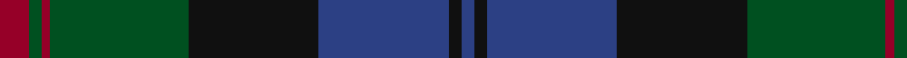

In pattern [BKBKGRGR](/stripes/bkbkgrgr/).

This was sourced from register-of-tartans.  It is a [8 stripe tartan](/stripes/stripes8/).

Original link https://www.tartanregister.gov.uk/tartanDetails.aspx?ref=169

## Register references

External register numbers recorded for this tartan.

- Scottish Register of Tartans: [169](https://www.tartanregister.gov.uk/tartanDetails.aspx?ref=169)
- Scottish Tartans World Register: 273

## Thread count
DR/7 G3 DR2 G33 K31 B31 K3 B/3

## Palette
Each colour and its ΔE from the base-6 reference it is a variant of.

| Colour | Shade | Base | ΔE (OKLab) |
|---|---|---|---|
| B | <code style="background-color:#2C4084;">#2C4084</code> `#2C4084` | B <code style="background-color:#2A418A;">#2A418A</code> | 0.01 |
| DR | <code style="background-color:#960028;">#960028</code> `#960028` | R <code style="background-color:#CC0000;">#CC0000</code> | 0.12 |
| G | <code style="background-color:#005020;">#005020</code> `#005020` | G <code style="background-color:#006100;">#006100</code> | 0.07 |
| K | <code style="background-color:#101010;">#101010</code> `#101010` | K <code style="background-color:#000000;">#000000</code> | 0.17 |

# Sample pattern

## Nearest tartans

The nearest existing variants by ΔTartan distance.

1. [Aitchison Family (Kinghorn) (Personal)](/setts/s9/k2db3k2db18k11db2k11g25p2~x2/) — ΔT 0.86
1. [Grampian (District)](/setts/s8/y24r2y3db14dt24r2dt3db3~x2/) — ΔT 0.93
1. [Dunedin Chapter](/setts/s10/db32dg2db2dg14k2dg14k2dg2k15r2~x2/) — ΔT 1.01
1. [Lochaber #2](/setts/s8/dg3r1dg18k20r1db18t1dg2~x4/) — ΔT 1.04
1. [Baird (Old) Clan Tartan Tartan Number: 273. Earliest known date: c.1906 This tartan is first recorded in Johnston's work of 1906, and the sample from the Highland Society of London probably dates from the same period. In both these early references the triple stripes are rendered in red. Today, however, they are generally woven in purple. The name originates from 'bard' meaning poet. The Bairds owned estates in Aberdeenshire which were later purchased by the Gordons. See products available Copyright © Blair Urquhart, Comrie, 2015](/setts/s8/m7g3m2g33k31db31k3db3/) — ΔT 1.06
1. [Ferguson of Balquhidder](/setts/s6/k2dg12k12r1db12dg2~x2/) — ΔT 1.11
1. [Unidentified No 59](/setts/s6/t1db11k11dg11k2t1~x2/) — ΔT 1.13
1. [Louise of Lorne](/setts/s11/k1r1dg6k1dg1k1dg1k6db9k1db1~x2/) — ΔT 1.22
1. [Dundas #2](/setts/s7/k4db16k12g12r1g2k2~x2/) — ΔT 1.23
1. [MacDonald #3](/setts/s12/dg16r2dg2r5dg29k31r2db29r5db2r2db16~x2/) — ΔT 1.27

## Neighbour map

Every grey dot is one of 14299 variants placed by the first two principal components of the ΔTartan feature space (44% of its variance). Red is this tartan; blue dots are its nearest — click one to open its page.

<svg viewBox="0 0 640 380" role="img" style="max-width:100%;height:auto;border:1px solid #e0e0e0;border-radius:4px;display:block" xmlns="http://www.w3.org/2000/svg"><image href="/nn/cloud.v1.png" width="640" height="380"/><a href="/setts/s9/k2db3k2db18k11db2k11g25p2~x2/"><circle cx="247.5" cy="212.4" r="4" fill="#3465a4"><title>Aitchison Family (Kinghorn) (Personal)</title></circle></a><a href="/setts/s8/y24r2y3db14dt24r2dt3db3~x2/"><circle cx="277.8" cy="220.4" r="4" fill="#3465a4"><title>Grampian (District)</title></circle></a><a href="/setts/s10/db32dg2db2dg14k2dg14k2dg2k15r2~x2/"><circle cx="302.9" cy="197.1" r="4" fill="#3465a4"><title>Dunedin Chapter</title></circle></a><a href="/setts/s8/dg3r1dg18k20r1db18t1dg2~x4/"><circle cx="263.4" cy="180.3" r="4" fill="#3465a4"><title>Lochaber #2</title></circle></a><a href="/setts/s8/m7g3m2g33k31db31k3db3/"><circle cx="226.8" cy="192.2" r="4" fill="#3465a4"><title>Baird (Old) Clan Tartan Tartan Number: 273. Earliest known date: c.1906 This tartan is first recorded in Johnston's work of 1906, and the sample from the Highland Society of London probably dates from the same period. In both these early references the triple stripes are rendered in red. Today, however, they are generally woven in purple. The name originates from 'bard' meaning poet. The Bairds owned estates in Aberdeenshire which were later purchased by the Gordons. See products available Copyright © Blair Urquhart, Comrie, 2015</title></circle></a><a href="/setts/s6/k2dg12k12r1db12dg2~x2/"><circle cx="250.1" cy="250.9" r="4" fill="#3465a4"><title>Ferguson of Balquhidder</title></circle></a><a href="/setts/s6/t1db11k11dg11k2t1~x2/"><circle cx="243.5" cy="250.4" r="4" fill="#3465a4"><title>Unidentified No 59</title></circle></a><a href="/setts/s11/k1r1dg6k1dg1k1dg1k6db9k1db1~x2/"><circle cx="244.6" cy="208.9" r="4" fill="#3465a4"><title>Louise of Lorne</title></circle></a><a href="/setts/s7/k4db16k12g12r1g2k2~x2/"><circle cx="248.7" cy="216.6" r="4" fill="#3465a4"><title>Dundas #2</title></circle></a><a href="/setts/s12/dg16r2dg2r5dg29k31r2db29r5db2r2db16~x2/"><circle cx="223.4" cy="176.6" r="4" fill="#3465a4"><title>MacDonald #3</title></circle></a><circle cx="256.0" cy="208.5" r="5" fill="#c00000"/></svg>

ID: /setts/s8/r7dg3r2dg33k31db31k3db3/
