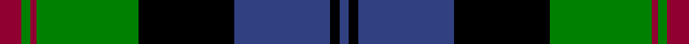

In pattern [BKBKGRGR](/stripes/bkbkgrgr/).

This was sourced from weddslist.  It is a [8 stripe tartan](/stripes/stripes8/).

Original link http://www.weddslist.com/cgi-bin/tartans/pg.pl?source=sts

## Thread count
DR/7 G3 DR2 G33 K31 B31 K3 B/3

## Palette
Each colour and the base-6 reference it is a variant of.

| Colour | Shade | Base |
|---|---|---|
| B | <code style="background-color:#304080;">#304080</code> `oklch(39.4% 0.109 270.2)` <small>#304080</small> | B <code style="background-color:#2A418A;">#2A418A</code> |
| DR | <code style="background-color:#900030;">#900030</code> `oklch(41.6% 0.166 13.6)` <small>#900030</small> | R <code style="background-color:#CC0000;">#CC0000</code> |
| G | <code style="background-color:#008000;">#008000</code> `oklch(52.0% 0.177 142.5)` <small>#008000</small> | G <code style="background-color:#006100;">#006100</code> |
| K | <code style="background-color:#000000;">#000000</code> `oklch(0.0% 0.000 0.0)` <small>#000000</small> | K <code style="background-color:#000000;">#000000</code> |

# Sample pattern

## Nearest tartans

The nearest existing variants by ΔTartan distance.

1. [Gordon 3](/setts/s10/db56k6db6k6db6k44g44ly4g5ly8/) — ΔT 0.78
1. [Blair](/setts/s7/db4r1db18k20g18r1g4~x2/) — ΔT 0.83
1. [Hebridean Old](/setts/s9/k2db3g16b1k13b1db18k2db2~x2/) — ΔT 0.89
1. [Rangers F.C.](/setts/s11/r3g16k12db34k12g2k2g2k2g7r3~x2/) — ΔT 0.89
1. [Dress Watch](/setts/s8/db4k3db18k18g18db1g2w4~x2/) — ΔT 0.93
1. [MacDonald 4](/setts/s12/db17r2db2r6db32r2k34g32r6g2r2g17~x2/) — ΔT 0.94
1. [MacDonald 5](/setts/s12/db16r2db2r5db29r2k31g29r5g2r2g16~x2/) — ΔT 0.94
1. [Common Kilt](/setts/s8/r3k2db25k28g25k2r1db2~x2/) — ΔT 0.96
1. [MacDonald 3](/setts/s12/db12r2db2r5db26r2k29g27r5g2r2g12~x2/) — ΔT 0.96
1. [Lochaber District](/setts/s8/g2r1g16k12r1t16g1t2~x2/) — ΔT 0.97

## Neighbour map

Every grey dot is one of 14299 variants placed by the first two principal components of the ΔTartan feature space (44% of its variance). Red is this tartan; blue dots are its nearest — click one to open its page.

<svg viewBox="0 0 640 380" role="img" style="max-width:100%;height:auto;border:1px solid #e0e0e0;border-radius:4px;display:block" xmlns="http://www.w3.org/2000/svg"><image href="/nn/cloud.v1.png" width="640" height="380"/><a href="/setts/s10/db56k6db6k6db6k44g44ly4g5ly8/"><circle cx="185.6" cy="156.3" r="4" fill="#3465a4"><title>Gordon 3</title></circle></a><a href="/setts/s7/db4r1db18k20g18r1g4~x2/"><circle cx="205.4" cy="184.8" r="4" fill="#3465a4"><title>Blair</title></circle></a><a href="/setts/s9/k2db3g16b1k13b1db18k2db2~x2/"><circle cx="220.6" cy="160.3" r="4" fill="#3465a4"><title>Hebridean Old</title></circle></a><a href="/setts/s11/r3g16k12db34k12g2k2g2k2g7r3~x2/"><circle cx="187.7" cy="141.5" r="4" fill="#3465a4"><title>Rangers F.C.</title></circle></a><a href="/setts/s8/db4k3db18k18g18db1g2w4~x2/"><circle cx="197.3" cy="180.0" r="4" fill="#3465a4"><title>Dress Watch</title></circle></a><a href="/setts/s12/db17r2db2r6db32r2k34g32r6g2r2g17~x2/"><circle cx="174.9" cy="147.8" r="4" fill="#3465a4"><title>MacDonald 4</title></circle></a><a href="/setts/s12/db16r2db2r5db29r2k31g29r5g2r2g16~x2/"><circle cx="172.4" cy="151.8" r="4" fill="#3465a4"><title>MacDonald 5</title></circle></a><a href="/setts/s8/r3k2db25k28g25k2r1db2~x2/"><circle cx="224.9" cy="145.9" r="4" fill="#3465a4"><title>Common Kilt</title></circle></a><a href="/setts/s12/db12r2db2r5db26r2k29g27r5g2r2g12~x2/"><circle cx="164.8" cy="152.1" r="4" fill="#3465a4"><title>MacDonald 3</title></circle></a><a href="/setts/s8/g2r1g16k12r1t16g1t2~x2/"><circle cx="209.1" cy="166.5" r="4" fill="#3465a4"><title>Lochaber District</title></circle></a><circle cx="179.2" cy="169.9" r="5" fill="#c00000"/></svg>

ID: /setts/s8/r7g3r2g33k31db31k3db3/
