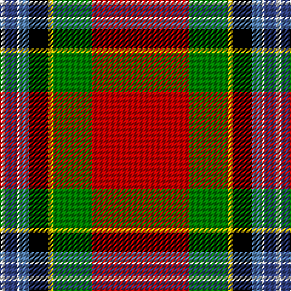

In pattern [RGYKBWBW](/patterns/rgykbwbw/).

This was sourced from weddslist.  It is a [8 stripes tartan](/stripes/stripes8/).

Original link http://www.weddslist.com/cgi-bin/tartans/pg.pl?source=sts

## Thread count
LN/4 B10 LN2 Ba8 K16 Y4 G32 R/80

## Palette
Each colour and its ΔE from the base-6 reference it is a variant of.

| Colour | Shade | Base | ΔE (OKLab) |
|---|---|---|---|
| B | <code style="background-color:#304080;">#304080</code> `#304080` | B <code style="background-color:#2C4084;">#2C4084</code> | 0.01 |
| Ba | <code style="background-color:#5480B0;">#5480B0</code> `#5480B0` | B <code style="background-color:#2C4084;">#2C4084</code> | 0.20 |
| G | <code style="background-color:#008000;">#008000</code> `#008000` | G <code style="background-color:#006400;">#006400</code> | 0.09 |
| K | <code style="background-color:#000000;">#000000</code> `#000000` | K <code style="background-color:#000000;">#000000</code> | 0.00 |
| LN | <code style="background-color:#E0E0E0;">#E0E0E0</code> `#E0E0E0` | W <code style="background-color:#F4F4F0;">#F4F4F0</code> | 0.06 |
| R | <code style="background-color:#C00000;">#C00000</code> `#C00000` | R <code style="background-color:#C80000;">#C80000</code> | 0.02 |
| Y | <code style="background-color:#F0C000;">#F0C000</code> `#F0C000` | Y <code style="background-color:#E8C000;">#E8C000</code> | 0.01 |

# Sample pattern

## Nearest tartans

The nearest existing variants by ΔTartan distance.

1. [Ancient Caledonian Society](/setts/s8/r80g32y4k16ga8w2b10w4-b2c2c80-g006818-ga789484-k101010-rc80000-wf8f8f8-ye8c000/) — ΔT 0.44
1. [Caledonian Society Ancient Artifact Tartan Tartan Number: 1554. Earliest known date: 1847 Coat at Banff museum. The MacPherson of MacPherson's Rant was hanged at Banff market cross. See products available Copyright © Blair Urquhart, Comrie, 2015](/setts/s8/r80g32y4k16b8w2ba10w4-b5c8ca8-ba2c2c80-g006818-k101010-rc80000-we0e0e0-ye8c000/) — ΔT 0.51
1. [King (Austria) (Personal)](/setts/s9/w4r4b28g32y4k4g4r70g2-b2c2c80-g006818-k101010-rc80000-we0e0e0-ye8c000/) — ΔT 1.18
1. [MacGill](/setts/s13/r96g32k16w6y6r4ra6w6b16k2r8y8w6-b304080-g008000-k000000-rc00000-ra806050-we0e0e0-yf0c000/) — ΔT 1.19
1. [Tartan Army Whisky](/setts/s8/r52g10ga14ra4b18y2ya2ga8-b441800-g007800-ga004028-rff0000-raa00000-yd87c00-yadc943c/) — ΔT 1.31
1. [Follower's, Plaid](/setts/s11/r96b16k20y4k6w4g50r20k6r6w4-b5480b0-g008000-k000000-rc00000-we0e0e0-yf0c000/) — ΔT 1.35
1. [Royal Stewart](/setts/s11/r128b24k32y4k8w6g64r16k8r6w4-b5480b0-g003000-k000000-rc00000-we0e0e0-yf0c000/) — ΔT 1.35
1. [Followers' Plaid](/setts/s11/r96b16k20y4k6w4g50r20k6r6w4-b5c8ca8-g006818-k101010-rc80000-wfcfcfc-ye8c000/) — ΔT 1.40
1. [Follower's Plaid Artifact Tartan Tartan Number: 1376. Earliest known date: 1745 Red pivot = 192 threads in original. W & Y are silk. Sindex title See products available Copyright © Blair Urquhart, Comrie, 2015](/setts/s11/r96b16k20y4k6w4g50r20k6r6w4-b5c8ca8-g006818-k101010-rc80000-we0e0e0-ye8c000/) — ΔT 1.43
1. [Celtic Nations (Fashion)](/setts/s12/b6r4b4r70y4b6k4b10k8g26k2w6-b2c2c80-g006818-k101010-rc80000-wfcfcfc-ybc8c00/) — ΔT 1.43

## Neighbour map

Every grey dot is one of 15726 variants placed by the first two principal components of the ΔTartan feature space (44% of its variance). Red is this tartan; blue dots are its nearest — click one to open its page.

<svg viewBox="0 0 640 380" role="img" style="max-width:100%;height:auto;border:1px solid #e0e0e0;border-radius:4px;display:block" xmlns="http://www.w3.org/2000/svg"><image href="/nn/cloud.v1.png" width="640" height="380"/><a href="/setts/s8/r80g32y4k16ga8w2b10w4-b2c2c80-g006818-ga789484-k101010-rc80000-wf8f8f8-ye8c000/"><circle cx="272.3" cy="56.7" r="4" fill="#3465a4"><title>Ancient Caledonian Society</title></circle></a><a href="/setts/s8/r80g32y4k16b8w2ba10w4-b5c8ca8-ba2c2c80-g006818-k101010-rc80000-we0e0e0-ye8c000/"><circle cx="274.8" cy="58.1" r="4" fill="#3465a4"><title>Caledonian Society Ancient Artifact Tartan Tartan Number: 1554. Earliest known date: 1847 Coat at Banff museum. The MacPherson of MacPherson's Rant was hanged at Banff market cross. See products available Copyright © Blair Urquhart, Comrie, 2015</title></circle></a><a href="/setts/s9/w4r4b28g32y4k4g4r70g2-b2c2c80-g006818-k101010-rc80000-we0e0e0-ye8c000/"><circle cx="286.1" cy="76.1" r="4" fill="#3465a4"><title>King (Austria) (Personal)</title></circle></a><a href="/setts/s13/r96g32k16w6y6r4ra6w6b16k2r8y8w6-b304080-g008000-k000000-rc00000-ra806050-we0e0e0-yf0c000/"><circle cx="256.7" cy="14.0" r="4" fill="#3465a4"><title>MacGill</title></circle></a><a href="/setts/s8/r52g10ga14ra4b18y2ya2ga8-b441800-g007800-ga004028-rff0000-raa00000-yd87c00-yadc943c/"><circle cx="234.8" cy="77.4" r="4" fill="#3465a4"><title>Tartan Army Whisky</title></circle></a><a href="/setts/s11/r96b16k20y4k6w4g50r20k6r6w4-b5480b0-g008000-k000000-rc00000-we0e0e0-yf0c000/"><circle cx="263.7" cy="72.1" r="4" fill="#3465a4"><title>Follower's, Plaid</title></circle></a><a href="/setts/s11/r128b24k32y4k8w6g64r16k8r6w4-b5480b0-g003000-k000000-rc00000-we0e0e0-yf0c000/"><circle cx="262.9" cy="61.5" r="4" fill="#3465a4"><title>Royal Stewart</title></circle></a><a href="/setts/s11/r96b16k20y4k6w4g50r20k6r6w4-b5c8ca8-g006818-k101010-rc80000-wfcfcfc-ye8c000/"><circle cx="278.8" cy="76.5" r="4" fill="#3465a4"><title>Followers' Plaid</title></circle></a><a href="/setts/s11/r96b16k20y4k6w4g50r20k6r6w4-b5c8ca8-g006818-k101010-rc80000-we0e0e0-ye8c000/"><circle cx="282.1" cy="78.0" r="4" fill="#3465a4"><title>Follower's Plaid Artifact Tartan Tartan Number: 1376. Earliest known date: 1745 Red pivot = 192 threads in original. W &amp; Y are silk. Sindex title See products available Copyright © Blair Urquhart, Comrie, 2015</title></circle></a><a href="/setts/s12/b6r4b4r70y4b6k4b10k8g26k2w6-b2c2c80-g006818-k101010-rc80000-wfcfcfc-ybc8c00/"><circle cx="276.3" cy="50.0" r="4" fill="#3465a4"><title>Celtic Nations (Fashion)</title></circle></a><circle cx="260.4" cy="53.5" r="5" fill="#c00000"/></svg>

ID: /setts/s8/r80g32y4k16b8w2ba10w4-b5480b0-ba304080-g008000-k000000-rc00000-we0e0e0-yf0c000/
