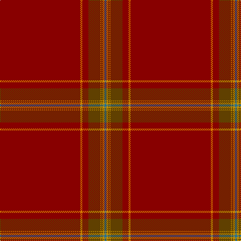

This page is one **sett** — a single exact thread-count. It belongs to the [tartan](/tartans/r80lo2r6dy12loi1dy1loi2b2/)
(the same proportion at any scale), whose colour order is pattern [BYGYGRYR](/stripes/bygygryr/).

Sourced from tartans-authority.  It is a [8 stripe tartan](/stripes/stripes8/).

Original link http://www.tartansauthority.com/tartan-ferret/display/7698/

2 attestations — the source records this cloth was collapsed from (oldest owns this page)

<ul>
<li>July 2008 — Alegre-Wood (Personal) (tartans-authority, <a href="http://www.tartansauthority.com/tartan-ferret/display/7698/">record</a>)</li>
<li>undated — Alegre-Wood (Personal) (register-of-tartans, <a href="https://www.tartanregister.gov.uk/tartanDetails.aspx?ref=5695">record</a>)</li>
</ul>

## Register references

External register numbers recorded for this tartan.

- Scottish Register of Tartans: [5695](https://www.tartanregister.gov.uk/tartanDetails.aspx?ref=5695)
- Scottish Tartans Authority (ITI): 7698

## Thread count
DR/160 O4 DR12 T24 DY2 T2 DY4 B/4

## Palette

Palette: <strong>Tartan Register</strong>
<table><thead><tr><th>Colour</th><th>Threads</th><th>Shade</th><th>Base</th><th>OKLCh</th></tr></thead><tbody><tr><td>DR/</td><td style="text-align:right;font-variant-numeric:tabular-nums">160</td><td><code style="background-color:#880000;">#880000</code> <small style="color:#888">#880000</small></td><td>R <code style="background-color:#CC0000;">#CC0000</code></td><td><small style="color:#888">oklch(39.4% 0.162 29.2)</small></td></tr><tr><td>O</td><td style="text-align:right;font-variant-numeric:tabular-nums">4</td><td><code style="background-color:#D87C00;">#D87C00</code> <small style="color:#888">#D87C00</small></td><td>Y <code style="background-color:#F2BF00;">#F2BF00</code></td><td><small style="color:#888">oklch(67.3% 0.155 61.8)</small></td></tr><tr><td>DR</td><td style="text-align:right;font-variant-numeric:tabular-nums">12</td><td><code style="background-color:#880000;">#880000</code> <small style="color:#888">#880000</small></td><td>R <code style="background-color:#CC0000;">#CC0000</code></td><td><small style="color:#888">oklch(39.4% 0.162 29.2)</small></td></tr><tr><td>T</td><td style="text-align:right;font-variant-numeric:tabular-nums">24</td><td><code style="background-color:#604000;">#604000</code> <small style="color:#888">#604000</small></td><td>G <code style="background-color:#006100;">#006100</code></td><td><small style="color:#888">oklch(39.8% 0.083 76.8)</small></td></tr><tr><td>DY</td><td style="text-align:right;font-variant-numeric:tabular-nums">2</td><td><code style="background-color:#BC8C00;">#BC8C00</code> <small style="color:#888">#BC8C00</small></td><td>Y <code style="background-color:#F2BF00;">#F2BF00</code></td><td><small style="color:#888">oklch(66.8% 0.137 84.1)</small></td></tr><tr><td>T</td><td style="text-align:right;font-variant-numeric:tabular-nums">2</td><td><code style="background-color:#604000;">#604000</code> <small style="color:#888">#604000</small></td><td>G <code style="background-color:#006100;">#006100</code></td><td><small style="color:#888">oklch(39.8% 0.083 76.8)</small></td></tr><tr><td>DY</td><td style="text-align:right;font-variant-numeric:tabular-nums">4</td><td><code style="background-color:#BC8C00;">#BC8C00</code> <small style="color:#888">#BC8C00</small></td><td>Y <code style="background-color:#F2BF00;">#F2BF00</code></td><td><small style="color:#888">oklch(66.8% 0.137 84.1)</small></td></tr><tr><td>B/</td><td style="text-align:right;font-variant-numeric:tabular-nums">4</td><td><code style="background-color:#1870A4;">#1870A4</code> <small style="color:#888">#1870A4</small></td><td>B <code style="background-color:#2A418A;">#2A418A</code></td><td><small style="color:#888">oklch(52.2% 0.113 241.2)</small></td></tr></tbody></table>

# Sample pattern

## Nearest tartans

The nearest existing variants by ΔTartan distance, with this tartan at the top so the swatches line up against it.

ΔTartan

Tartan

Sett

—

<a href="/ttd/edit/#slug=r80lo2r6dy12loi1dy1loi2b2~x2">Alegre-Wood (Personal)</a> <a class="nn-out" href="/setts/s8/r80lo2r6dy12loi1dy1loi2b2~x2/" title="open its dictionary page">↗</a>

2.22

<a href="/ttd/edit/#slug=r2dt1ri6r1ri2dg2ri24dt6ri2~x2">Fitzgibbon Red</a> <a class="nn-out" href="/setts/s9/r2dt1ri6r1ri2dg2ri24dt6ri2~x2/" title="open its dictionary page">↗</a>

2.71

<a href="/ttd/edit/#slug=oi32dy8oi1dy1lb1oi1lb1o1oi1dy1oii1oi4dy1~x4">Parma</a> <a class="nn-out" href="/setts/s13/oi32dy8oi1dy1lb1oi1lb1o1oi1dy1oii1oi4dy1~x4/" title="open its dictionary page">↗</a>

2.90

<a href="/ttd/edit/#slug=o96db8o8w3o8g3o8r3~x2">Burnett, of Leys hunting</a> <a class="nn-out" href="/setts/s8/o96db8o8w3o8g3o8r3~x2/" title="open its dictionary page">↗</a>

3.02

<a href="/ttd/edit/#slug=ri92db10ri8w3ri8g4ri8r4~x2">Burnett of Leys Hunting</a> <a class="nn-out" href="/setts/s8/ri92db10ri8w3ri8g4ri8r4~x2/" title="open its dictionary page">↗</a>

3.04

<a href="/ttd/edit/#slug=r2k1ri6r1ri2g2ri24k6ri2~x2">Fitzgibbon Red (Name)</a> <a class="nn-out" href="/setts/s9/r2k1ri6r1ri2g2ri24k6ri2~x2/" title="open its dictionary page">↗</a>

3.04

<a href="/setts/s8/dr90k1ki2t10ki5r2k2t2~x2/">Lock in Northumberland</a>

3.07

<a href="/ttd/edit/#slug=ri75db6ri6w2ri6g2ri6r2~x2">Burnett of Leys Htg (Clan)</a> <a class="nn-out" href="/setts/s8/ri75db6ri6w2ri6g2ri6r2~x2/" title="open its dictionary page">↗</a>

3.11

<a href="/ttd/edit/#slug=dy45lb2r4ly1o2n2~x4">Windy Meadows (Fashion)</a> <a class="nn-out" href="/setts/s6/dy45lb2r4ly1o2n2~x4/" title="open its dictionary page">↗</a>

3.16

<a href="/ttd/edit/#slug=y80lg1y2lo8y2lg1y2r15k1r3lb2~x2">Drovers' Tryst (Corporate)</a> <a class="nn-out" href="/setts/s11/y80lg1y2lo8y2lg1y2r15k1r3lb2~x2/" title="open its dictionary page">↗</a>

3.18

<a href="/ttd/edit/#slug=r29o1r2o1r60lo2r2db10gi2g1gi2db10r2lo2~x2">Burrell (Personal)</a> <a class="nn-out" href="/setts/s14/r29o1r2o1r60lo2r2db10gi2g1gi2db10r2lo2~x2/" title="open its dictionary page">↗</a>

## Neighbour map

Every grey dot is one of 14359 variants placed by the first two principal components of the ΔTartan feature space (44% of its variance). Red is this tartan; blue dots are its nearest — click one to open its page.

<svg viewBox="0 0 640 380" role="img" style="max-width:100%;height:auto;border:1px solid #e0e0e0;border-radius:4px;display:block" xmlns="http://www.w3.org/2000/svg"><image href="/nn/cloud.v1.png" width="640" height="380"/><a href="/setts/s9/r2dt1ri6r1ri2dg2ri24dt6ri2~x2/"><circle cx="600.7" cy="178.4" r="4" fill="#3465a4"><title>Fitzgibbon Red</title></circle></a><a href="/setts/s13/oi32dy8oi1dy1lb1oi1lb1o1oi1dy1oii1oi4dy1~x4/"><circle cx="610.1" cy="127.8" r="4" fill="#3465a4"><title>Parma</title></circle></a><a href="/setts/s8/o96db8o8w3o8g3o8r3~x2/"><circle cx="626.0" cy="154.7" r="4" fill="#3465a4"><title>Burnett, of Leys hunting</title></circle></a><a href="/setts/s8/ri92db10ri8w3ri8g4ri8r4~x2/"><circle cx="626.0" cy="126.1" r="4" fill="#3465a4"><title>Burnett of Leys Hunting</title></circle></a><a href="/setts/s9/r2k1ri6r1ri2g2ri24k6ri2~x2/"><circle cx="563.3" cy="160.7" r="4" fill="#3465a4"><title>Fitzgibbon Red (Name)</title></circle></a><a href="/setts/s8/dr90k1ki2t10ki5r2k2t2~x2/"><circle cx="626.0" cy="104.3" r="4" fill="#3465a4"><title>Lock in Northumberland</title></circle></a><a href="/setts/s8/ri75db6ri6w2ri6g2ri6r2~x2/"><circle cx="626.0" cy="119.0" r="4" fill="#3465a4"><title>Burnett of Leys Htg (Clan)</title></circle></a><a href="/setts/s6/dy45lb2r4ly1o2n2~x4/"><circle cx="616.4" cy="119.9" r="4" fill="#3465a4"><title>Windy Meadows (Fashion)</title></circle></a><a href="/setts/s11/y80lg1y2lo8y2lg1y2r15k1r3lb2~x2/"><circle cx="565.6" cy="67.9" r="4" fill="#3465a4"><title>Drovers' Tryst (Corporate)</title></circle></a><a href="/setts/s14/r29o1r2o1r60lo2r2db10gi2g1gi2db10r2lo2~x2/"><circle cx="565.6" cy="63.1" r="4" fill="#3465a4"><title>Burrell (Personal)</title></circle></a><circle cx="626.0" cy="134.8" r="5" fill="#c00000"/></svg>

ID: /setts/s8/r80lo2r6dy12loi1dy1loi2b2~x2/
