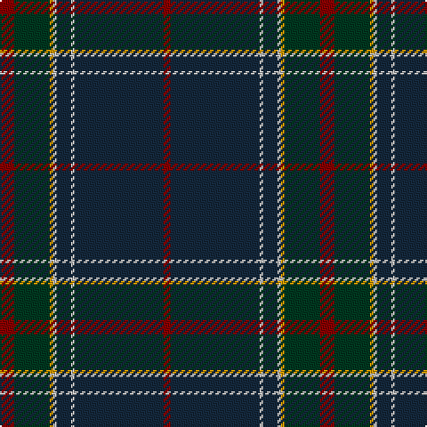

In pattern [RBWBWYGR](/patterns/rbwbwygr/).

This was sourced from register-of-tartans.  It is a [8 stripes tartan](/stripes/stripes8/).

Original link https://www.tartanregister.gov.uk/tartanDetails.aspx?ref=3469

## Attestations

This cloth appears in 2 source records; the oldest owns this page.

- 01/01/1997 — Raymond of Doune (register-of-tartans, [record](https://www.tartanregister.gov.uk/tartanDetails.aspx?ref=3469))
- 1997 — Raymond of Doune (Corporate) (tartans-authority, [record](http://www.tartansauthority.com/tartan-ferret/display/5437/))

## Thread count
DR/8 DG20 DY2 N2 DN8 N2 DN50 DR/4

## Palette
Each colour and its ΔE from the base-6 reference it is a variant of.

| Colour | Shade | Base | ΔE (OKLab) |
|---|---|---|---|
| DG | <code style="background-color:#003820;">#003820</code> `#003820` | G <code style="background-color:#006400;">#006400</code> | 0.16 |
| DN | <code style="background-color:#14283C;">#14283C</code> `#14283C` | B <code style="background-color:#2C4084;">#2C4084</code> | 0.14 |
| DR | <code style="background-color:#880000;">#880000</code> `#880000` | R <code style="background-color:#C80000;">#C80000</code> | 0.14 |
| DY | <code style="background-color:#D09800;">#D09800</code> `#D09800` | Y <code style="background-color:#E8C000;">#E8C000</code> | 0.11 |
| N | <code style="background-color:#C0C0C0;">#C0C0C0</code> `#C0C0C0` | W <code style="background-color:#F4F4F0;">#F4F4F0</code> | 0.16 |

# Sample pattern

ID: /setts/s8/r8g20y2w2b8w2b50r4-b14283c-g003820-r880000-wc0c0c0-yd09800/
