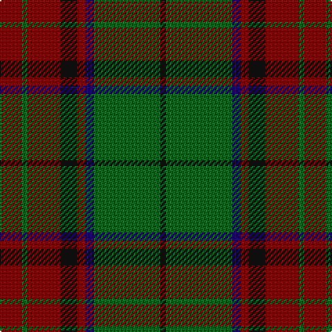

In pattern [KGBRKRGR](/stripes/kgbrkrgr/).

This was sourced from tartans-authority.  It is a [8 stripe tartan](/stripes/stripes8/).

Original link http://www.tartansauthority.com/tartan-ferret/display/3391/

## Attestations

This cloth appears in 2 source records; the oldest owns this page.

- pre 2002 — McInery (Personal) (tartans-authority, [record](http://www.tartansauthority.com/tartan-ferret/display/3391/))
- undated — McInery (Personal) (register-of-tartans, [record](https://www.tartanregister.gov.uk/tartanDetails.aspx?ref=5202))

## Register references

External register numbers recorded for this tartan.

- Scottish Register of Tartans: [5202](https://www.tartanregister.gov.uk/tartanDetails.aspx?ref=5202)
- Scottish Tartans Authority (ITI): 3391

## Thread count
DR/16 G4 DR24 K12 DR6 DB6 G48 K/4

## Palette
Each colour and its ΔE from the base-6 reference it is a variant of.

| Colour | Shade | Base | ΔE (OKLab) |
|---|---|---|---|
| DB | <code style="background-color:#1C0070;">#1C0070</code> `#1C0070` | B <code style="background-color:#2A418A;">#2A418A</code> | 0.14 |
| DR | <code style="background-color:#880000;">#880000</code> `#880000` | R <code style="background-color:#CC0000;">#CC0000</code> | 0.15 |
| G | <code style="background-color:#006818;">#006818</code> `#006818` | G <code style="background-color:#006100;">#006100</code> | 0.02 |
| K | <code style="background-color:#101010;">#101010</code> `#101010` | K <code style="background-color:#000000;">#000000</code> | 0.17 |

# Sample pattern

## Nearest tartans

The nearest existing variants by ΔTartan distance.

1. [(2) Cook](/setts/s7/dg12b6dg6r15k1r1k2~x2/) — ΔT 0.69
1. [Loch Rannoch Trade Tartan Tartan Number: 1735. Earliest known date: 1975 Nothing See products available Copyright © Blair Urquhart, Comrie, 2015](/setts/s8/do24g2do5lo14g2lo5dy17do2~x2/) — ΔT 0.82
1. [MacKillen](/setts/s9/k4lo15dg5k3dg7k3dg30r20dg3~x2/) — ΔT 0.86
1. [Strathspey (Fashion)](/setts/s6/g3r22t5g10k10g2~x2/) — ΔT 1.01
1. [Unidentified Plaid #15](/setts/s10/r4t3r32db30r4dg32r3dg32r3dg3~x2/) — ΔT 1.04
1. [Crantock](/setts/s8/y24dp3y3dp3y3dp7dg20r3~x2/) — ΔT 1.12
1. [Canadian Autumn](/setts/s6/g4r28db6g10k10g3~x2/) — ΔT 1.13
1. [Montrose (Macnaughton variation)](/setts/s9/db1k1r12g12k6db5r12k1db1~x4/) — ΔT 1.13
1. [Cook (Name)](/setts/s7/dg12g6dg6r15k1r1k2~x2/) — ΔT 1.14
1. [Fraser Green](/setts/s6/lb2dr12g6dr1n6dr1~x4/) — ΔT 1.14

## Neighbour map

Every grey dot is one of 14299 variants placed by the first two principal components of the ΔTartan feature space (44% of its variance). Red is this tartan; blue dots are its nearest — click one to open its page.

<svg viewBox="0 0 640 380" role="img" style="max-width:100%;height:auto;border:1px solid #e0e0e0;border-radius:4px;display:block" xmlns="http://www.w3.org/2000/svg"><image href="/nn/cloud.v1.png" width="640" height="380"/><a href="/setts/s7/dg12b6dg6r15k1r1k2~x2/"><circle cx="275.1" cy="210.6" r="4" fill="#3465a4"><title>(2) Cook</title></circle></a><a href="/setts/s8/do24g2do5lo14g2lo5dy17do2~x2/"><circle cx="277.6" cy="206.2" r="4" fill="#3465a4"><title>Loch Rannoch Trade Tartan Tartan Number: 1735. Earliest known date: 1975 Nothing See products available Copyright © Blair Urquhart, Comrie, 2015</title></circle></a><a href="/setts/s9/k4lo15dg5k3dg7k3dg30r20dg3~x2/"><circle cx="269.2" cy="196.4" r="4" fill="#3465a4"><title>MacKillen</title></circle></a><a href="/setts/s6/g3r22t5g10k10g2~x2/"><circle cx="251.9" cy="225.9" r="4" fill="#3465a4"><title>Strathspey (Fashion)</title></circle></a><a href="/setts/s10/r4t3r32db30r4dg32r3dg32r3dg3~x2/"><circle cx="266.1" cy="183.6" r="4" fill="#3465a4"><title>Unidentified Plaid #15</title></circle></a><a href="/setts/s8/y24dp3y3dp3y3dp7dg20r3~x2/"><circle cx="268.4" cy="215.3" r="4" fill="#3465a4"><title>Crantock</title></circle></a><a href="/setts/s6/g4r28db6g10k10g3~x2/"><circle cx="267.8" cy="226.5" r="4" fill="#3465a4"><title>Canadian Autumn</title></circle></a><a href="/setts/s9/db1k1r12g12k6db5r12k1db1~x4/"><circle cx="272.7" cy="198.4" r="4" fill="#3465a4"><title>Montrose (Macnaughton variation)</title></circle></a><a href="/setts/s7/dg12g6dg6r15k1r1k2~x2/"><circle cx="253.2" cy="191.0" r="4" fill="#3465a4"><title>Cook (Name)</title></circle></a><a href="/setts/s6/lb2dr12g6dr1n6dr1~x4/"><circle cx="288.5" cy="212.1" r="4" fill="#3465a4"><title>Fraser Green</title></circle></a><circle cx="281.4" cy="201.2" r="5" fill="#c00000"/></svg>

ID: /setts/s8/r8g2r12k6r3db3g24k2~x2/
